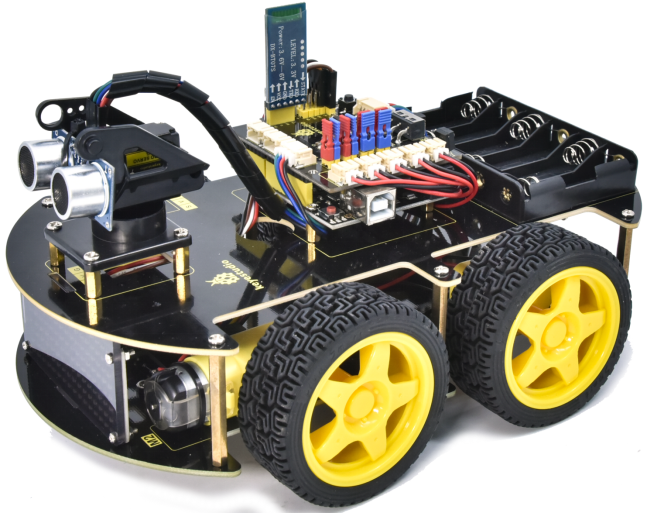
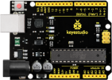
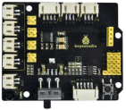
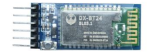
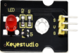
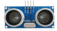

# About keyestudio

Keyestudio is the best-selling brand of KEYES Corporation. Our products include Arduino development boards, expansion boards, sensors and modules, Raspberry Pi, micro:bit expansion boards as well as smart cars, which are committed to learning about Arduino, Raspberry Pi as well as micro:bit for customers of any level. 

Notably, all of our products are in line with international quality standards and are greatly appreciated in a broad menu of different markets across the world. 

Welcome to check out more contents from our official website:

**[http://www.keyestudio.com](http://www.keyestudio.com)**

# References and After-sales Service

1. Download Profile：**https://fs.keyestudio.com/KS0559**

2. If you find any parts missing or encounter any troubles, please feel free to contact us: **[service@keyestudio.com](http://m.138.gz.cn/webadmin/~CAmsnCrrNXhTAySKCerrIfWjjZuuWVfI/~/usr/mod_edituser.jsp?;uid=service@keyestudio.com;;clearCache=)**.

3. We will update projects and products continuously according to your sincere advice.

# Warning

1. This product contains tiny parts(screws, copper pillars). Therefore, keep it out of reach of children under 8 please.

2. This product consists of conductive parts (control board and electronic module). Please operate according to the requirements of tutorial. Otherwise, improper operation may cause parts to overheat and be damaged. Do not touch or immediately disconnect the circuit power.

# Copyright

The keyestudio trademark and logo are the copyright of KEYES DIY ROBOT co.,LTD. All products under keyestudio brand can’t be copied, sold and resold by anyone or any companies without authorization. 

If you’re interested in our products, please contact with our sales representatives: **[fennie@keyestudio.com](http://m.138.gz.cn/webadmin/~CAmsnCrrNXhTAySKCerrIfWjjZuuWVfI/~/usr/mod_edituser.jsp?;uid=fennie@keyestudio.com;;clearCache=)**

# 4WD BT Multi-purpose Car V2.0 Kit 

## Product Introduction

The newly upgraded 4WD Multi-purpose car is one of the most popular Arduino sets. It not only has a beautiful appearance but also powerful functions. In addition to the usual functions of line tracking, obstacle avoidance and remote control, it also uses facial expressions to make lovely expressions. Furthermore, you empower to expand your own projects, or add other sensors to complete your exploration. 

Most of the components are connected via screws and copper pillars, thereby you can build your own robot through a few simple assembly steps. 

What’s more, the basic knowledge such as line tracking, obstacle avoidance sensors, ultrasonic ranging, Bluetooth communication, motor drivers as well as IR remote controls are accessible for us to learn.  

This product boasts 17 learning projects, from simple to complex, which will guide you to make an Arduino robot. 

## Features

1. Multi-purpose function: Obstacle avoidance, following, IR remote control, Bluetooth control, confined with a circle, gravity control as well as facial emoticons display.

2. Simple assembly: No soldering circuit required, simple assembly.

3. [Sturdy construction](javascript:;): 4WD construction, 4 premium motors and wheels.

4. High extension: It can expand other sensors and modules via a motor driver expansion board

5. Multiple controls: IR remote control, App control(iOS and Android system)

6. Basic programming：C language code of Arduino IDE.

## **Specification**

- Working voltage: 5V
- Input voltage: 6-9V
- Maximum output current: 2A
- Maximum power dissipation: 25W (T=75℃)
- Motor speed: 5V 200 rpm
- Motor drive mode: DRV8833 motor driver
- Ultrasonic induction angle: <15 degrees
- Ultrasonic detection distance: 2cm-400cm
- Infrared remote control distance: 10M (measured)
- Bluetooth remote control distance: 50M(measured)
- Bluetooth control: support Android and iOS system

 

## **Kit List**

| NO.  |                 NAME                 | QTY  |                             PIC                              |
| :--: | :----------------------------------: | :--: | :----------------------------------------------------------: |
|  1   |     V4.0 Board (UNO compatible)      |  1   |  |
|  2   |     Motor Driver Expansion Board     |  1   |  |
|  3   |           Bluetooth Module           |  1   |  |
|  4   |            Red LED Module            |  1   |  |
|  5   |          Ultrasonic Sensor           |  1   |  |
|  6   |         Line Tracking Sensor         |  1   |  |
|  7   |            8*16 LED Board            |  1   |  |
|  8   |         4Pin Connection Wire         |  1   |                                                              |
|  9   |                Servo                 |  1   |  |
|  10  |          IR Remote Control           |  1   |  |
|  11  |              USB Cable               |  1   |  |
|  12  |         18650 Battery Holder         |  1   |  |
|  13  |         6 AA Battery Holder          |  1   |  |
|  14  |             Cradle Head              |  1   |  |
|  15  |   150MM JST-PH2.0MM-5P 24AWG Wire    |  1   |  |
|  16  | 150MM PH2.0mm-4P to 2.54 Dupont Wire |  1   |  |
|  17  |            Acrylic Board             |  1   |  |
|  18  |              Top Board               |  1   |  |
|  19  |              Base Board              |  1   |  |
|  20  |             Fixed Parts              |  4   |  |
|  21  |                Wheels                |  4   |  |
|  22  |   M3*10MM Dual-pass Copper Pillar    |  10  |  |
|  23  |   M3*40MM Dual-pass Copper Pillar    |  4   |  |
|  24  |       M3*30MM Round Head Screw       |  8   |  |
|  25  |       M3*6MM Round Head Screw        |  40  |  |
|  26  |         M3 Nickle-plated Nut         |  16  |  |
|  27  |       M2*8MM Round Head Screw        |  6   |  |
|  28  |       M3*8MM Round Head Screw        |  4   |   |
|  29  |         M2 Nickle-plated Nut         |  6   |  |
|  30  |       M3*10MM Flat Head Screw        |  3   |  |
|  31  |                Motor                 |  4   |  |
|  32  |             Screwdriver              |  1   |  |
|  33  |              Black Tie               |  6   |  |
|  34  |             Winding Pipe             |  1   |  |
|  35  |      20CM 3pin F-F Dupont Cable      |  1   |  |
|  36  |           Decorative Card            |  1   |  |
|  37  |           Blue Jumper Cap            |  4   |  |
|  38  |            Red Jumper Cap            |  4   |  |

## Projects

Project 1: LED Blink

Project 2: Adjust LED Brightness

Project 3 : Line Tracking Sensor 

Project 4: Servo Control

Project 5: Ultrasonic Sensor

Project 6: IR Reception

Project 7: Bluetooth Remote Control 

Project 8: Motor Driving and Speed Control 

Project 9: Facial Expression LED Board 

Project 10: Restricting Smart Car 

Project 11: Line Tracking Smart Car

Project 12: Ultrasonic Following Smart Car

Project 13: Ultrasonic Obstacle Avoidance Smart Car

Project 14: IR Remote Control Smart Car

Project 15: Bluetooth Control Smart Car

Project 16: Bluetooth Speed Control Smart Car

Project 17: Multi-purpose Bluetooth Smart Car
