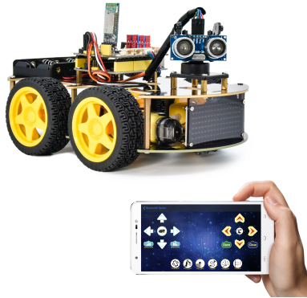
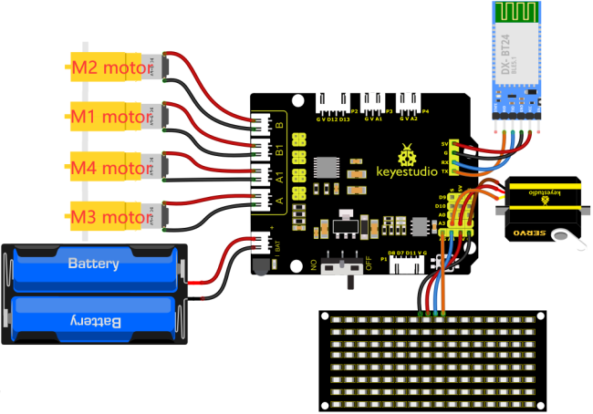

# Project 15 Bluetooth Control Smart Car



### **1.Description**

We’ve learned the basic knowledge of Bluetooth. 

And in this lesson, we will make a Bluetooth control smart car. In this project, we aim to regard the mobile phone as the transmitter (host), and the smart car connected to the BT24 Bluetooth module (slave) as the receiver and use the mobile APP to control the smart car via the Bluetooth. 


### **2.APP Control Button**

|                             Key                              |           Control Character            | Function                                                     |
| :----------------------------------------------------------: | :------------------------------------: | ------------------------------------------------------------ |
|  |                                        | Pair the DX-BT24 5.1 Bluetooth module                        |
|  |                                        | Disconnect Bluetooth                                         |
|  |        Press: F<br />Release: S        | Press the button, the car goes front; release to stop        |
|  |        Press: L<br />Release: S        | Press the button, the car turns left; release to stop        |
|  |        Press: R<br />Release: S        | Press the button, the car turns right; release to stop       |
|  |        Press: B<br />Release: S        | Press the button, the car goes back; release to stop         |
|  |        Press: a<br />Release: S        | Click to speed up，255(maximum)                              |
|  |        Press: d<br />Release: S        | Click to slow down，0(minimum)                               |
|  |                                        | Click to start the mobile phone gravity sensing; click again to exit |
|  | Click to send X, click again to send S | Start line tracking function; click again to exit            |
|  | Click to send Y, click again to send S | Start obstacle avoidance function, click again to exit       |
|  | Click to send U, click again to send S | Start ultrasonic follow function; click again to exit        |
|  | Click to send G, click again to send S | Start restricting function; click again to exit              |


### **3.Flow Chart**


### **4.Wiring Diagram**



1. GND, VCC, SDA and SCL of the 8*8 LED board are connected to G（GND), V（VCC), A4 and A5 of the expansion board.
2. The RXD, TXD, GND and VCC of the Bluetooth module are respectively connected to TX, RX, G and 5V on the 8833 motor driver expansion board, while the STATE and BRK pins of the Bluetooth module do not need to be connected. 
3. The servo is connected to G, V and A3. The brown wire is interfaced with Gnd(G), the red wire is interfaced with 5V(V) and the orange wire is interfaced with A3.
4. The power is connected to the BAT port


### **5.Test Code**

```c
//*******************************************************************************
/*
keyestudio 4wd BT Car 
lesson 15
Bluetooth Control Car
http://www.keyestudio.com
*/ 
#define SCL_Pin  A5  //Set the clock pin to A5
#define SDA_Pin  A4  //Set data pin to A4
//Array, used to store the data of pattern, can be calculated by yourself or obtained from the modulus tool
unsigned char start01[] = {0x01,0x02,0x04,0x08,0x10,0x20,0x40,0x80,0x80,0x40,0x20,0x10,0x08,0x04,0x02,0x01};
unsigned char front[] = {0x00,0x00,0x00,0x00,0x00,0x24,0x12,0x09,0x12,0x24,0x00,0x00,0x00,0x00,0x00,0x00};
unsigned char back[] = {0x00,0x00,0x00,0x00,0x00,0x24,0x48,0x90,0x48,0x24,0x00,0x00,0x00,0x00,0x00,0x00};
unsigned char left[] = {0x00,0x00,0x00,0x00,0x00,0x00,0x44,0x28,0x10,0x44,0x28,0x10,0x44,0x28,0x10,0x00};
unsigned char right[] = {0x00,0x10,0x28,0x44,0x10,0x28,0x44,0x10,0x28,0x44,0x00,0x00,0x00,0x00,0x00,0x00};
unsigned char STOP01[] = {0x2E,0x2A,0x3A,0x00,0x02,0x3E,0x02,0x00,0x3E,0x22,0x3E,0x00,0x3E,0x0A,0x0E,0x00};
unsigned char clear[] = {0x00,0x00,0x00,0x00,0x00,0x00,0x00,0x00,0x00,0x00,0x00,0x00,0x00,0x00,0x00,0x00};

int left_ctrl = 2;//define the direction control pins of group B motor
int left_pwm = 5;//define the PWM control pins of group B motor
int right_ctrl = 4;//define the direction control pins of group A motor
int right_pwm = 6;//define the PWM control pins of group A motor

const int servopin = A3;//set the pin of servo to A3 

char BLE_val;

void setup() {
  Serial.begin(9600);//
  pinMode(left_ctrl,OUTPUT);//set direction control pins of group B motor to OUTPUT
  pinMode(left_pwm,OUTPUT);//set PWM control pins of group B motor to OUTPUT
  pinMode(right_ctrl,OUTPUT);//set direction control pins of group A motor to OUTPUT
  pinMode(right_pwm,OUTPUT);//set PWM control pins of group A motor to OUTPUT
  servopulse(servopin,90);//the angle of servo is 90 degree
  delay(300);
  pinMode(SCL_Pin,OUTPUT);// Set the clock pin to output
  pinMode(SDA_Pin,OUTPUT);//Set the data pin to output
  matrix_display(clear);
  matrix_display(start01); //display start01 expression pattern
}

void loop() {
   if(Serial.available()>0) {
    BLE_val = Serial.read();
    Serial.println(BLE_val);
  } 
    switch(BLE_val)
    {
      case 'F' : car_front(); //Receive 'F',the car goes forward
      matrix_display(clear);
      matrix_display(front);   
      break;
      
      case 'B' : car_back(); //Receive 'B',the car goes back
      matrix_display(clear);
      matrix_display(back); 
      break;

      case 'L' : car_left(); //Receive 'L',the car left rotates
      matrix_display(clear);
      matrix_display(left); 
      break;
     
      case 'R' : car_right();//Receive 'R',the car right rotates
      matrix_display(clear);
      matrix_display(right);  
      break;
     
      case 'S' : car_Stop();//Receive 'S',the car stops
      matrix_display(clear);
      matrix_display(STOP01); 
      break;
}
}

void car_front()//define the state of going front
{
  digitalWrite(left_ctrl,HIGH);
  analogWrite(left_pwm,155);
  digitalWrite(right_ctrl,HIGH);
  analogWrite(right_pwm,155);
}
void car_back()//define the status of going back
{
  digitalWrite(left_ctrl,LOW);
  analogWrite(left_pwm,100);
  digitalWrite(right_ctrl,LOW);
  analogWrite(right_pwm,100);
}
void car_left()//set the status of left turning
{
  digitalWrite(left_ctrl, LOW);
  analogWrite(left_pwm, 100);  
  digitalWrite(right_ctrl, HIGH);
  analogWrite(right_pwm, 155);
}
void car_right()//set the status of right turning
{
  digitalWrite(left_ctrl, HIGH);
  analogWrite(left_pwm, 155);
  digitalWrite(right_ctrl, LOW);
  analogWrite(right_pwm, 100);
}
void car_Stop()//define the state of stop
{
  digitalWrite(left_ctrl,LOW);
  analogWrite(left_pwm,0);
  digitalWrite(right_ctrl,LOW);
  analogWrite(right_pwm,0);
}

void servopulse(int servopin,int myangle)//Steering gear running angle
{
  for(int i=0; i<30; i++)
  {
    int pulsewidth = (myangle*11)+500;
    digitalWrite(servopin,HIGH);
    delayMicroseconds(pulsewidth);
    digitalWrite(servopin,LOW);
    delay(20-pulsewidth/1000);
  }  
}

//this function is used for dot matrix display
void matrix_display(unsigned char matrix_value[])
{
  IIC_start();  //the function that calls the data transfer start condition
  IIC_send(0xc0);  //select address

  for (int i = 0; i < 16; i++) //the pattern data is 16 bytes
  {
    IIC_send(matrix_value[i]); //Transmit the data of the pattern
  }
  IIC_end();   //End pattern data transmission
  IIC_start();
  IIC_send(0x8A);  //Display control, select 4/16 pulse width
  IIC_end();
}
//Conditions under which data transmission begins
void IIC_start()
{
  digitalWrite(SDA_Pin, HIGH);
  digitalWrite(SCL_Pin, HIGH);
  delayMicroseconds(3);
  digitalWrite(SDA_Pin, LOW);
  delayMicroseconds(3);
  digitalWrite(SCL_Pin, LOW);
}
//Indicates the end of data transmission
void IIC_end()
{
  digitalWrite(SCL_Pin, LOW);
  digitalWrite(SDA_Pin, LOW);
  delayMicroseconds(3);
  digitalWrite(SCL_Pin, HIGH);
  delayMicroseconds(3);
  digitalWrite(SDA_Pin, HIGH);
  delayMicroseconds(3);
}
//transmit data
void IIC_send(unsigned char send_data)
{
  for (byte mask = 0x01; mask != 0; mask <<= 1) //Each byte has 8 bits and is checked bit by bit starting at the lowest level
  {
    if (send_data & mask) { //Sets the high and low levels of SDA_Pin depending on whether each bit of the byte is a 1 or a 0
      digitalWrite(SDA_Pin, HIGH);
    } else {
      digitalWrite(SDA_Pin, LOW);
    }
    delayMicroseconds(3);
    digitalWrite(SCL_Pin, HIGH); //Pull the clock pin SCL_Pin high to stop data transmission
    delayMicroseconds(3);
    digitalWrite(SCL_Pin, LOW); //pull the clock pin SCL_Pin low to change the SIGNAL of SDA 
  }
}
//*******************************************************************************
```


### **6.Test Result**

After successfully uploading the code to the V4.0 board, connect the wirings according to the wiring diagram, power on the external power then turn the DIP switch to ON. 

Inset the BT module and open your cellphone to connect the Bluetooth to control the smart car. The can will move forward, backward, turn left and right and stop. Also the 8*8 LED board will show the corresponding patterns

Remove the BT module when you are uploading the code, otherwise you will fail to upload it.
