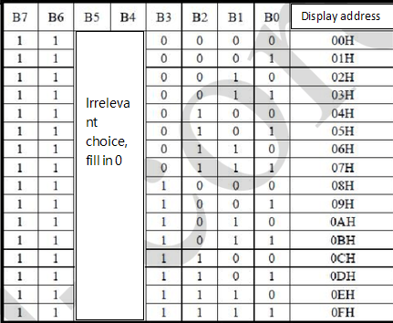
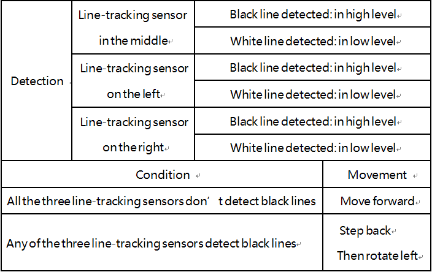
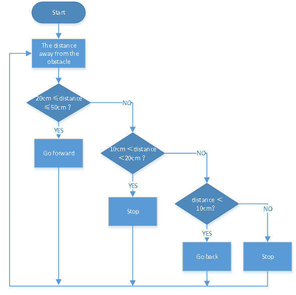
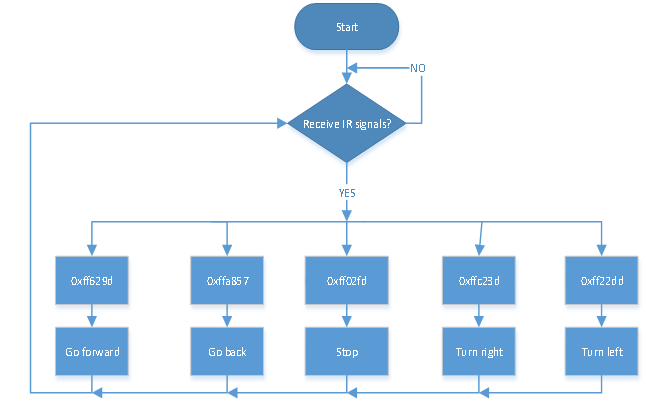
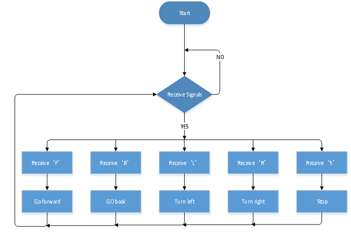

# Arduino Tutorial

## 1. Get Started With Arduino 

 1.1. Install the Arduino IDE


When you get control board, you need to download Arduino IDE and driver firstly.

You could download Arduino IDE from the official website:
[https://www.arduino.cc/](https://www.arduino.cc/), click the **SOFTWARE** on the browse bar, click“DOWNLOADS” to enter download page, as shown below:


There are various versions of IDE for Arduino such as Windows，Mac as well as Linux(as shown below). Just download a version compatible with your system.


Here we will show you how to download and install the windows version of Arduino IDE.

There are two versions of IDE for Windows system. You can choose between the installer (.exe) and the Zip file. For installer, it can be directly downloaded, without the need of installing it manually. However, for Zip package, you will need to install the driver manually.


You just need to click JUST DOWNLOAD.

 1.2. Install the Driver of the V4.0 Board

Let’s install the driver of keyestudio V4.0 development board. The USB-TTL chip on the V4.0 board adopts the CP2102 serial chip. The driver program of this chip is included in Arduino 1.8 version and above [https://www.silabs.com/products/development-tools/software/usb-to-uart-bridge-vcp-drivers](https://www.silabs.com/products/development-tools/software/usb-to-uart-bridge-vcp-drivers), which is convenient. Plugging on USB port of board, the computer can recognize the hardware and automatically install the driver of CP2102.

If you install unsuccessfully, or intend to install manually, please open the device manager of computer. Right click Computer----- Properties----- Device Manager. 


The yellow exclamation mark on the page implies an unsuccessful installation and you should double click , then click “**Update Drive...**”to update the driver.


Click“**Browse my computer for drivers**”to find the downloaded Arduino software.


There is a DRIVERS folder in Arduino software installed package, open the driver folder and check the driver of CP210X series chips.

Click “Browse”, then search the driver of CP2102 and click“Next”,


After a while, the driver is installed successfully


When opening the device manager, we will find the yellow exclamation mark disappear. The driver of CP2102 is installed successfully.


 1.3. Install Other Visions of Driver

If your board is an Arduino UNO development board, follow these steps to install the driver: 

First, click Computer Properties - Device Manager , then the unknown hardware will be displayed.


Second, click “Update Drive...”to update the driver


Then click“**Browse my computer for driver software**”


Click "Browse..."  to find the location where the Arduino software is installed on your computer, then open the drivers folder, and click "Next".


The driver is installed successfully


At this time, open the computer device manager, which will display Arduino serial port. 


 1.4. Arduino IDE Setting

Clickicon，and open Arduino IDE.


To avoid any errors when uploading the program to the board, you must select the correct name of Arduino board that matches the board connected to your computer. As shown below:


Then select the correct COM port (you can see the corresponding COM port after the driver is successfully installed)


A- Used to verify whether there is any compiling mistakes or not.

B- Used to upload the sketch to your Arduino board.

C- Used to create shortcut window of a new sketch.

D- Used to directly open an example sketch.

E- Used to save the sketch.

F- Used to send the serial data received from board to the serial monitor.

 1.5. Start First Program

Open the file to select **Example**, and click **BASIC**\>**BLINK**, as shown below:


Set the correct **COM port,** and the corresponding board and COM port are shown on the lower right of IDE.


Click  to start compiling the program.


Clickto upload the program.


After the program is uploaded successfully, the onboard LED will be on for 1s and off for 1s. Congratulation, you have finished the first program.

## 2. Install the Driver on MAC System 


 2.1. Download Arduino IDE


 2.2. How to Install the CP2102 Driver

(<span style="color: rgb(255, 76, 65);">Note: </span>If you haven’t installed the driver installed, please do the following.) 

(1) Connect the keyestudio V4.0 development board to your MacOS computer using a USB cable and open the Arduino IDE. 


Click **Tools→Board: Arduino Uno** and **/dev/cu.usbserial-0001.**.


Clickto upload the test code.


<span style="color: rgb(255, 76, 65);">**Note: If the the upload fails, follow the steps below to install the CP2102 driver.&nbsp;&nbsp;Perform steps (2) to (16)**</span>. 
<br>
<br>

(2）Download link for CP2102：

[https://www.silabs.com/products/development-tools/software/usb-to-uart-bridge-vcp-drivers](https://www.silabs.com/products/development-tools/software/usb-to-uart-bridge-vcp-drivers)

（3）Download MacOS version.


（4）Unzip the downloaded package.


（5）Open the folder and double-click“SiLabsUSBDriverDisk.dmg”file.


Then you can see the following file.


（6）Double-click“**Install CP210x VCP Driver**”，tap“**Don’t warn me when opening application on this disk image**”and click“**Open**”.


（7）Click“**Continue**”.


（8）Click“**Agree**”，then tap“**Continue**”.


（9）Click“**Continue**”，then input your user password.


(10). Select“**Select Open Security Preferences**”.
    

    
(11). Click on security lock and enter your user password to authorize.
    

    

    
(12). When you see that the lock is opened, click "Allow". 
    

    
(13). Return to the installation interface and wait for the installation as prompted.
    

    
(140. The installation is successful.
    


(15). Open arduinoIDE，click“**Tools**”and tap **Arduino Uno**and“**/dev/cu.SLAB\_USBtoUAPT**”.


(16). Clickto upload the program, and you can see the program burned successfully.


## 3.How to Add a Library?

 3.1. What are Libraries ?

[Libraries ](https://www.arduino.cc/en/Reference/Libraries)are a collection of code that make it easy for you to connect a sensor,display, module, etc.

For example, the built-in LiquidCrystal library helps talk to LCD displays. There are hundreds of additional libraries available on the Internet for download.

The built-in libraries and some of these additional libraries are listed in the reference.

 3.2. How to Install a Library ?

Here we will introduce the most simple way to add libraries .

**Step 1：** After downloading well the Arduino IDE, you can right-click the icon of Arduino IDE. Find the option "Open file location".


**Step 2:** Click Open file location \>libraries.


**Step 3：** Next, find out the“libraries”folder. Copy them into libraries of Arduino.


## 4.Projects

### Project 1: LED Blink

 1. Description


For starters and enthusiasts, LED Blink is a fundamental program. LED, the abbreviation of light emitting diodes, consists of Ga, As, P, N chemical compounds and so on.

The LED can flash in diverse color by altering the delay time in the test code. When in control, power on GND and VCC, the LED will be on if S end is in high level, otherwise it will go off.

 2. Specification

- Control interface: digital port

- Working voltage: DC 3.3-5V

- Pin spacing: 2.54mm

- LED display color: red


 3. Components

<table border="1">
<tbody>
<tr class="odd">
<td>Keyestudio 4.0 Development Board *1</td>
<td>Keyestudio 8833 Motor Shield *1</td>
<td>Red LED Module*1</td>
</tr>
<tr class="even">
<td></td>
<td></td>
<td></td>
</tr>
<tr class="odd">
<td>3P F-F Dupont Wire*1</td>
<td>USB Cable*1</td>
<td></td>
</tr>
<tr class="even">
<td></td>
<td></td>
<td></td>
</tr>
</tbody>
</table>

 4. Wiring Diagram


As can be seen from the above figure, the Keyestudio 8833 motor Shield is stacked on the Keyestudio 4.0 development board.

The pin G, V and S of the LED module are connected to G, 5V and D9 of the expansion board respectively.

 5. Test Code

```c 
//****************************************************************************
/*
keyestudio 4wd BT Car
lesson 1.1
Blink
http://www.keyestudio.com
*/
void setup()
{ 
  pinMode(9, OUTPUT);// initialize digital pin 9 as an output.
}
    
void loop() // the loop function runs over and over again forever
{  
  digitalWrite(9, HIGH); // turn the LED on (HIGH is the voltage level)
   delay(1000); // wait for a second
   digitalWrite(9, LOW); // turn the LED off by making the voltage LOW
   delay(1000); // wait for a second
}
//****************************************************************************
``` 

 6. Test Result

After successfully uploading the code to the V4.0 board, connect the wirings according to the wiring diagram, and use a USB cable to connect the computer to power the board. After powering on, you will see the LED connected to the D9 will be on and off. 

 7. Code Explanation

pinMode(9，OUTPUT) - This function can denote that the pin is INPUT or OUTPUT

digitalWrite(9，HIGH) - When pin is OUTPUT, we can set it to HIGH(output 5V) or LOW(output 0V)

 8. Extension Practice

We have succeeded in blinking LED. Next, let’s observe what will happen to the LED if we modify the delay time.

```c
//****************************************************************************
/*
 keyestudio 4wd BT Car
 lesson 1.2
 delay
 http://www.keyestudio.com
*/
void setup()
{  
  // initialize digital pin 11 as an output.
  pinMode(9, OUTPUT);
}
// the loop function runs over and over again forever
void loop()
{ 
  digitalWrite(9, HIGH); // turn the LED on (HIGH is the voltage level)
  delay(100); // wait for 0.1 second
  digitalWrite(9, LOW); // turn the LED off by making the voltage LOW
  delay(100); // wait for 0.1 second
}
//*****************************************************************
```

The test result shows that the LED flashes faster. Therefore, the delaying time enables to affect the flash frequency of the LED.

### Project 2: Adjust LED Brightness

 1. Description

In previous lesson, we control LED on and off and make it blink.

In this project, we will control LED’s brightness through PWM simulating breathing effect.

PWM is a means of controlling the analog output via digital means. Digital control is used to generate square waves with different duty cycles (a signal that constantly switches between high and low levels) to control the analog output. In general, the input voltages of ports are 0V and 5V.

What if the 3V is required? Or a switch among 1V, 3V and 3.5V? We cannot change resistors constantly. For this reason, we resort to PWM.


For the Arduino digital port voltage output, there are only LOW and HIGH, which correspond to the voltage output of 0V and 5V. You can define LOW as 0 and HIGH as 1, and let the Arduino output five hundred 0 or 1 signals within 1s.

If all of the output five hundred are 1, that is 5V; if all of which are 0, that is 0V. If output 010101010101 in this way then the output port is 2.5V, which is like showing movie. The movie we watch are not completely continuous. It actually outputs 25 pictures per second. In this case, the human can’t see it, neither does PWM. If we want different voltage, we need to control the ratio of 0 and 1. The more 0,1 signals output per unit time, the more accurate the control.

PWM is a technology that uses digital methods to obtain analog quantities. Digital control enables to form a square wave, the square wave signal only has on and off two states (high and low).  A voltage ranging from 0 to 5V can be simulated by controlling the ratio of on to off duration.  The time spent on (technically called high level) is called pulse width, so PWM is also called pulse width modulation. 


The green vertical bars represent one period of the square wave.  The value written in each analogWrite(value) corresponds to a percentage, which is also called Duty Cycle. This percentage refers to the ratio of time occupied by the high level in a cycle, that is, duty cycle = high level time/cycle time. 

 In the figure, from top to bottom, the duty cycle of the first square wave is 0%, and the corresponding value is 0, and the LED brightness is the lowest, that is, off state.  The longer the high level lasts, the brighter it will be.  Therefore, the value of the last duty cycle of 100% is 255, and the LED is the brightest.  50% is the brightest half, and 25% is darker.  

PWM is more used to adjust the brightness of LED lights or the rotation speed of the motors, and the wheels speed driven by the motors can be easily controlled. When playing with some Arduino robots, the benefits of PWM can be better reflected. 

 2. Components

<table border="1">
<tbody>
<tr class="odd">
<td>Keyestudio 4.0 Development Board *1</td>
<td>Keyestudio 8833 Motor Shield *1</td>
<td>Red LED Module*1</td>
</tr>
<tr class="even">
<td></td>
<td></td>
<td></td>
</tr>
<tr class="odd">
<td>3P F-F Dupont Wire*1</td>
<td>USB Cable*1</td>
<td></td>
</tr>
<tr class="even">
<td></td>
<td></td>
<td></td>
</tr>
</tbody>
</table>

 3. Wiring Diagram 

Keep the wiring-up unchanged.


 4. Test Code

```c
//*****************************************************************
/*
 keyestudio 4wd BT Car
 lesson 2.1
 pwm
 http://www.keyestudio.com
*/
int ledPin = 9; // Define the LED pin at D9
int value;

void setup () {
  pinMode (ledPin, OUTPUT); // initialize ledpin as an output.
}

void loop () {
  for (value = 0; value <255; value = value + 1) 
  {
    analogWrite (ledPin, value); // LED lights gradually light up
    delay (5); // delay 5ms
  }
  for (value = 255; value> 0; value = value-1) 
  {
    analogWrite (ledPin, value); // LED gradually goes out
    delay (5); // delay 5ms
  }
}
//*****************************************************************
```

 5. Test Result

After successfully uploading the code to the V4.0 board, connect the wirings according to the wiring diagram, and use a USB cable to connect the computer to power the board. After powering on, you will see that the LED gradually changes from bright to dark, like human’s breath, rather than turning on and off immediately.

 6. Code Explanation

If we need to repeat a certain statement, we could use for statement.

For statement format is shown below:


FOR cyclic sequence:

Round 1：1 → 2 → 3 → 4

Round 2：2 → 3 → 4

…

Until number 2 is not established, “for”loop is over,

After knowing this order, go back to code:

**for (int value = 0; value \< 255; value=value+1)**

**for (int value = 255; value \>0; value=value-1)**

The two“for”statements make value increase from 0 to 255, then reduce from 255 to 0, then increase to 255....infinitely loop.

There is a new function in the following ----- analogWrite().

We know that digital port only has two state of 0 and 1. So how to send an analog value to a digital value? Here, this function is needed. Let’s observe the Arduino board and find 6 pins marked“\~”which can output PWM signals.

Function format as follows:

**analogWrite(pin,value)**

analogWrite() is used to write an analog value from 0\~255 for PWM port, so the value is in the range of 0\~255. Attention that you can only write the digital pins with PWM function, such as pin 3, 5, 6, 9, 10, 11.

PWM is a technology to obtain analog quantity through digital method. Digital control forms a square wave, and the square wave signal only has two states of turning on and off (that is, high or low levels). By controlling the ratio of the duration of turning on and off, a voltage varying from 0 to 5V can be simulated. The time turning on(academically referred to as high level) is called pulse width, so PWM is also called pulse width modulation.

Through the following five square waves, let’s learn more about the PWM.


In the above figure, the green line represents a period, and the value of analogWrite() corresponds to a percentage which is called Duty Cycle as well. Duty cycle implies the ratio of time occupied by the high level in the cycle. From top to bottom, the duty cycle of first square wave is 0% and its corresponding value is 0.

The LED brightness is lowest, that is, light off. The more time the high level lasts, the brighter the LED. Therefore, the last duty cycle is 100%, which corresponds to 255, and LED is the brightest. And 50% is the brightest half, 25% means darker.

PWM is more used for adjusting the LED’s brightness or the rotation speed of motors.

It plays a vital role in controlling smart robot cars. I believe that you cannot wait to learn the next project.

 7. Extension Practice

Let’s modify the value of delay and remain the pin unchanged, then observe how the LED changes.

```c
//***********************************************************
/*
 keyestudio 4wd BT Car
 lesson 2.2
 pwm
 http://www.keyestudio.com
*/
int ledPin = 9; // Define the LED pin at D9
void setup () {
   pinMode(ledPin, OUTPUT); // initialize ledpin as an output.
}

void loop () {
   for (int value = 0; value <255; value = value + 1) {
     analogWrite (ledPin, value); // LED lights gradually light up
     delay (30); // delay 30MS
   }
   for (int value = 255; value> 0; value = value-1) {
     analogWrite (ledPin, value); // LED gradually goes out
     delay (30); // delay 30MS
   }
}
//***********************************************************
```

Upload the code to the development board, then the LED will blink more slowly.

### Project 3: Line Tracking Sensor


 1. Description 

The tracking sensor is actually an infrared sensor. The component used here is the TCRT5000 infrared tube. Its working principle is to use different reflectivity of infrared light to colors, then convert the strength of the reflected signal into a current signal.

During the process of detection, black is active at HIGH level while white is active at LOW level. The detection height is 0-3 cm.

Keyestudio 3-channel line tracking module has integrated 3 sets of TCRT5000 infrared tubes on a board, which is more convenient for wiring and control.

By rotating the adjustable potentiometer on the sensor, it can adjust the detection sensitivity of the sensor.

 2. Specification

- Operating Voltage: 3.3-5V (DC)

- Interface: 5PIN

- Output Signal: Digital signal

- Detection Height: 0-3 cm


<span style="color: rgb(255, 76, 65);">Note:</span> Before testing, rotate the potentiometer on the sensor to adjust the detection sensitivity. The sensitivity is best when adjusting the LED to a threshold between ON and OFF. 

 3. Components

<table border="1">
<tbody>
<tr class="odd">
<td>Keyestudio 4.0 Development Board *1</td>
<td>Keyestudio 8833 Motor Shield *1</td>
<td>Red LED Module*1</td>
<td>Keyestudio Line Tracking Sensor*1</td>
</tr>
<tr class="even">
<td></td>
<td></td>
<td></td>
<td>

</td>
</tr>
<tr class="odd">
<td>5P Dupont Wire*1</td>
<td>USB Cable*1</td>
<td>3P Dupont Wire*1</td>
<td></td>
</tr>
<tr class="even">
<td>

</td>
<td></td>
<td></td>
<td></td>
</tr>
</tbody>
</table>

 4. Wiring Diagram


G, V, S1, S2 and S3 of the line tracking sensor are connected to G（GND), V（VCC), D11, D7 and D8 of the sensor expansion board.

 5. Test Code

```c

//****************************************************************************
/*
keyestudio 4wd BT Car
lesson 3.1 
 Line Track sensor
 http://www.keyestudio.com
*/
int L_pin = 11;  //pins of  left line tracking sensor
int M_pin = 7;  //pins of  middle line tracking sensor
int R_pin = 8;  //pins of  right  line tracking sensor
int val_L,val_R,val_M;// define the variable value of three sensors

void setup()
{
  Serial.begin(9600); // initialize serial communication at 9600 bits per second
  pinMode(L_pin,INPUT); // make the L_pin as an input
  pinMode(M_pin,INPUT); // make the M_pin as an input
  pinMode(R_pin,INPUT); // make the R_pin as an input
}

void loop() 
{ 
  val_L = digitalRead(L_pin);//read the L_pin:
  val_R = digitalRead(R_pin);//read the R_pin:
  val_M = digitalRead(M_pin);//read the M_pin:
  Serial.print("left:");
  Serial.print(val_L);
  Serial.print(" middle:");
  Serial.print(val_M);
  Serial.print(" right:");
  Serial.println(val_R);
  delay(500);// delay in between reads for stability
}
//****************************************************************************
```

 6. Test Result

After successfully uploading the code to the V4.0 board, connect the wirings according to the wiring diagram, and use a USB cable to connect the computer to power the board.

After powering on, open the serial monitor and you will view status of three line tracking sensors. When no signals are received, the value is 1. If we cover the sensor with a white paper, the value will be 0.


 7. Code Explanation

Serial.begin(9600) - Initialize serial port, set baud rate to 9600

pinMode -Define the pin as input or output mode

digitalRead -Read the state of pin, which are generally HIGH and LOW level

 8. Extension Practice

After knowing its working principle, you can connect an LED to D9 so as to control LED by it.


```c
//****************************************************************************
/*
keyestudio 4wd BT Car
lesson 3.2
 Line Track Sensor LED
 http://www.keyestudio.com
*/
int L_pin = 11;  //pins of  left line tracking sensor
int M_pin = 7;  //pins of  middle line tracking sensor
int R_pin = 8;  //pins of  right line tracking sensor
int val_L,val_R,val_M;// define the variables of three sensors 

void setup()
{
  Serial.begin(9600); // initialize serial communication at 9600 bits per second
  pinMode(L_pin,INPUT); // make the L_pin as an input
  pinMode(M_pin,INPUT); // make the M_pin as an input
  pinMode(R_pin,INPUT); // make the R_pin as an input
  pinMode(9, OUTPUT);
}

void loop() 
{ 
  val_L = digitalRead(L_pin);//read the L_pin:
  val_R = digitalRead(R_pin);//read the R_pin:
  val_M = digitalRead(M_pin);//read the M_pin:
  Serial.print("left:");
  Serial.print(val_L);
  Serial.print(" middle:");
  Serial.print(val_M);
  Serial.print(" right:");
  Serial.println(val_R);
  delay(500);// delay in between reads for stability
  if ((val_L == LOW) || (val_M == LOW) || (val_R == LOW))//if left line tracking sensor detects signals
  { 
    Serial.println("HIGH");
    digitalWrite(9, HIGH);//LED is off
  }
  else//if left line tracking sensor doesn’t detect signals
  { 
    Serial.println("LOW");
    digitalWrite(9, LOW);//LED is off
  }
 }
//****************************************************************************
```

After successfully uploading the code to the V4.0 board, connect the wirings according to the wiring diagram, and use a USB cable to connect the computer to power the board.

After powering on, make a paper close to the sensor, then we can find the LED light up when covering the line tracking sensor.

### Project 4 Servo Control

 1. Description


Servo motor is a position control rotary actuator. It mainly consists of a housing, a circuit board, a core-less motor, a gear and a position sensor. Its working principle is that the servo receives the signal sent by MCUs or receivers and produces a reference signal with a period of 20ms and width of 1.5ms, then compares the acquired DC bias voltage to the voltage of the potentiometer and obtain the voltage difference output.


In general, servo has three lines in brown, red and orange. The brown wire is grounded, the red one is a positive pole line and the orange one is a signal line.

The rotation angle of servo motor is controlled by regulating the duty cycle of PWM (Pulse-Width Modulation) signal. The standard cycle of PWM signal is 20ms (50Hz). Theoretically, the width is distributed between 1ms-2ms, but in fact, it's between 0.5ms-2.5ms. The width corresponds the rotation angle from 0° to 180°. But note that for different brand motors, the same signal may have different rotation angles. 


The corresponding servo angles are shown below:


 2. Specification

- Working voltage: DC 4.8V \~ 6V

- Operating angle range: about 180 ° (at 500 → 2500 μsec)

- Pulse width range: 500 → 2500 μsec

- No-load speed: 0.12 ± 0.01 sec / 60 (DC 4.8V) 0.1 ± 0.01 sec / 60(DC 6V)
    
- No-load current: 200 ± 20mA (DC 4.8V) 220 ± 20mA (DC 6V)

- Stopping torque: 1.3 ± 0.01kg · cm (DC 4.8V) 1.5 ± 0.1kg · cm (DC6V)
    
- Stop current: ≦ 850mA (DC 4.8V) ≦ 1000mA (DC 6V)

- Standby current: 3 ± 1mA (DC 4.8V) 4 ± 1mA (DC 6V)

 3. Components

<table border="1">
<tbody>
<tr class="odd">
<td>Keyestudio 4.0 Development Board *1</td>
<td>Keyestudio 8833 Motor Shield *1</td>
<td>Servo*1</td>
</tr>
<tr class="even">
<td></td>
<td></td>
<td></td>
</tr>
<tr class="odd">
<td>18650 Battery Holder*1</td>
<td>USB Cable*1</td>
<td>18650 Battery*2（<span style="color: rgb(255, 76, 65);">self-provided</span>）</td>
</tr>
<tr class="even">
<td></td>
<td></td>
<td></td>
</tr>
</tbody>
</table>

 4. Wiring Diagram


Wiring note: The servo is connected to G（GND）、V（VCC）and A3, the brown line of servo is linked with Gnd(G), the red one is connected to 5v(V) and the orange one is attached to A3.

The servo is obliged to connect to the external power due to its high demand for driving servo current. Generally, the current of development board is not big enough. If without connecting the external power, the development board could be burnt.

 5. Test Code

```c
//****************************************************************************
/*
keyestudio 4wd BT Car
lesson 4.1
Servo
http://www.keyestudio.com
*/
#define servoPin A3  //servo Pin
int pos; //the angle variable of servo
int pulsewidth; //pulse width variable of servo

void setup() {
  pinMode(servoPin, OUTPUT);  //set the pins of servo to output
  procedure(0); //set the angle of servo to 0 degree
}

void loop() {
  for (pos = 0; pos <= 180; pos += 1) { // goes from 0 degrees to 180 degrees
    // in steps of 1 degree
    procedure(pos);              // tell servo to go to position in variable 'pos'
    delay(15);                   //control the rotation speed of servo
  }
  for (pos = 180; pos >= 0; pos -= 1) { // goes from 180 degrees to 0 degrees
    procedure(pos);              // tell servo to go to position in variable 'pos'
    delay(15);                    
  }
}
  
//function to control servo
void procedure(int myangle) {
  pulsewidth = myangle * 11 + 500;  //calculate the value of pulse width
  digitalWrite(servoPin,HIGH);
  delayMicroseconds(pulsewidth);   //The duration of high level is pulse width
  digitalWrite(servoPin,LOW);
  delay((20 - pulsewidth / 1000));  //the cycle is 20ms, the low level last for the rest of time
}
//****************************************************************************
```

 6. Test Result

After successfully uploading the code to the V4.0 board, connect the wirings according to the wiring diagram, and power on the external power. After powering on, turn the dip switch to the "ON" end, then servo will swing in the range of 0° to 180°.

 7. Extension Practice

What’s more, we empower to control the servo via library file. Please refer to the link:
[https://www.arduino.cc/en/Reference/Servo](https://www.arduino.cc/en/Reference/Servo).


```c
//***************************************************************************
/*
 keyestudio 4wd BT Car
 lesson 4.2
 Servo
 http://www.keyestudio.com
*/
#include <Servo.h>
Servo myservo;  // create servo object to control a servo
// twelve servo objects can be created on most boards
int pos = 0;    // variable to store the servo position

void setup() {
  myservo.attach(A3);  // attaches the servo on pin A3 to the servo object
}
void loop() {
  for (pos = 0; pos <= 180; pos += 1) { // goes from 0 degrees to 180 degrees
    // in steps of 1 degree
    myservo.write(pos);              // tell servo to go to position in variable 'pos'
    delay(15);                       // waits 15ms for the servo to reach the position
  }
  for (pos = 180; pos >= 0; pos -= 1) { // goes from 180 degrees to 0 degrees
    myservo.write(pos);              // tell servo to go to position in variable 'pos'
    delay(15);                       // waits 15ms for the servo to reach the position
  }
}
//***************************************************************************
```

After successfully uploading the code to the V4.0 board, connect the wirings according to the wiring diagram, and power on the external power. After powering on, turn the dip switch to the "ON" end, then servo will swing in the range of 0° to 180° too. We usually control it by library file.

 8. Code Explanation

Arduino comes with **\#include \<Servo.h\>** (servo function and statement）

The following are some common statements of the servo function:

1). **attach（interface）**——Set interface of the servo

2). **write（angle）**——Used to set rotation angle of servo, and the set angle range is from 0° to 180°

3). **read（）**——used to read angle of servo, namely, reading the command value of“write()”

4). **attached（）**——Judge if the parameter of servo is sent to its interface

<span style="color: rgb(255, 76, 65);">Note:</span> The above written format is“servo variable name, specific statement（）”, for instance: myservo.attach(9).


### Project 5 Ultrasonic Sensor

 1. Description


The HC-SR04 ultrasonic sensor uses sonar to determine distance to an object like what bats do. It offers excellent non-contact range detection with high accuracy and stable readings in an easy-to-use package. It comes complete with an ultrasonic transmitter and receiver modules.


The HC-SR04 or the ultrasonic sensor is being used in a wide range of electronics projects for creating obstacle detection and distance measuring application as well as various other applications. Here we have brought the simple method to measure the distance with arduino and an ultrasonic sensor and how to use the ultrasonic sensor with Arduino.

 2. Specification

- Working Voltage :+5V DC

- Quiescent Current : \<2mA

- Working Current: 15mA

- Effectual Angle: \<15°

- Distance Range : 2cm – 300 cm

- Precision : 0.3 cm

- Measuring Angle: 30 degree

- Trigger Input Pulse width: 10uS


 3. Components

<table border="1">
<tbody>
<tr class="odd">
<td>Keyestudio 4.0 Development Board *1</td>
<td>Keyestudio 8833 Motor Shield *1</td>
<td>Red LED Module*1</td>
<td>HC-SR04 Ultrasonic Sensor*1</td>
</tr>
<tr class="even">
<td></td>
<td></td>
<td></td>
<td></td>
</tr>
<tr class="odd">
<td>4P Dupont Wire*1</td>
<td>USB Cable*1</td>
<td>3P Dupont Wire*1</td>
<td></td>
</tr>
<tr class="even">
<td></td>
<td></td>
<td></td>
<td></td>
</tr>
</tbody>
</table>

 4. Working Principle

As the above picture shown, it is like two eyes. One is transmitting end, the other is receiving end.

The ultrasonic module will emit the ultrasonic waves after triggering a signal. When the ultrasonic waves encounter the object and are reflected back, the module outputs an echo signal, so it can determine the distance of the object from the time difference between the trigger signal and the echo signal.

The t is the time that emitting signal meets obstacle and returns. And the propagation speed of sound in the air is about 343m/s, and distance = speed \* time. However, the ultrasonic wave emits and comes back, which is 2 times of distance. Therefore, it needs to be divided by 2, the distance measured by ultrasonic wave = (speed \* time)/2.

<table border="1">
<tbody>
<tr class="odd">
<td><p><strong>Use method and chart of ultrasonic module:</strong></p>
<ol type="1">
<li><p>Use the GPIO pin to give a high level signal of at least 10μs to the Trig pin of SR04, which can trigger it to detect distance.</p></li>
<li><p>After triggering, the module will automatically send eight 40KHz ultrasonic pulses and detect whether there is a signal return. This step will be completed automatically by the module.</p></li>
<li><p>If the signal returns, the Echo pin will output a high level, and the duration of the high level is the time from the transmission of the ultrasonic wave to the return.</p>
<p></p></li>
</ol></td>
</tr>
</tbody>
</table>

**Circuit diagram of ultrasonic sensor:**


 5. Wiring Diagram


VCC, Trig, Echo and Gnd of the ultrasonic sensor are connected to 5V(V), D12, D13 and Gnd(G)

 6. Test Code

```c
//***************************************************************************
/*
 keyestudio 4wd BT Car
 lesson 5.1
 Ultrasonic Sensor
 http://www.keyestudio.com
*/ 
int trigPin = 12;    // Trigger
int echoPin = 13;    // Echo
long duration, cm, inches;
void setup() {
  //Serial Port begin
  Serial.begin (9600);
  //Define inputs and outputs
  pinMode(trigPin, OUTPUT);
  pinMode(echoPin, INPUT);
}

void loop() {
  // The sensor is triggered by a HIGH pulse of 10 or more microseconds.
  // Give a short LOW pulse beforehand to ensure a clean HIGH pulse:
  digitalWrite(trigPin, LOW);
  delayMicroseconds(2);
  digitalWrite(trigPin, HIGH);
  delayMicroseconds(10);
  digitalWrite(trigPin, LOW);
   // Read the signal from the sensor: a HIGH pulse whose
  // duration is the time (in microseconds) from the sending
  // of the ping to the reception of its echo off of an object.
  duration = pulseIn(echoPin, HIGH);
   // Convert the time into a distance
  cm = (duration/2) / 29.1;     // Divide by 29.1 or multiply by 0.0343
  inches = (duration/2) / 74;   // Divide by 74 or multiply by 0.0135
  Serial.print(inches);
  Serial.print("in, ");
  Serial.print(cm);
  Serial.print("cm");
  Serial.println();
  delay(250);
}
//***************************************************************************
```

 7. Test Result

After successfully uploading the code to the V4.0 board, connect the wirings according to the wiring diagram, then connect the computer via a USB cable to power the board. After powering on, open the serial monitor and set baud rate to 9600.

The detected distance will be displayed, and the unit is cm and inch. Hinder the ultrasonic sensor by hand, the displayed distance value gets smaller.


 8. Code Explanation

**int trigPin-** this pin is defined to transmit ultrasonic waves,generally output.

**int echoPin -** this is defined as the pin of reception, generally input.

**cm = (duration/2) / 29.1-**

**inches = (duration/2) / 74-**

We can calculate the distance by using the following formula:

distance = (traveltime/2) x speed of sound

The speed of sound is: 343m/s = 0.0343 cm/us = 1/29.1 cm/us

Or in inches: 13503.9in/s = 0.0135in/us = 1/74in/us

We need to divide the traveltime by 2 for we have to take into account that the wave was sent, hit the object, and then returned back to the sensor.

 9. Extension Practice

We have just measured the distance displayed by the ultrasonic. How about controlling the LED with the measured distance? Let's try it and connect an LED light module to the D9 pin.


```c
//*****************************************************************
/*
 keyestudio 4wd BT Car
 lesson 5.2
 Ultrasonic LED
 http://www.keyestudio.com
*/ 
int trigPin = 12;    // Trigger
int echoPin = 13;    // Echo
long duration, cm, inches;

void setup() {
  Serial.begin (9600);  //Serial Port begin
  pinMode(trigPin, OUTPUT);  //Define inputs and outputs
  pinMode(echoPin, INPUT);
}

void loop() 
{
  // The sensor is triggered by a HIGH pulse of 10 or more microseconds.
  // Give a short LOW pulse beforehand to ensure a clean HIGH pulse:
  digitalWrite(trigPin, LOW);
  delayMicroseconds(2);
  digitalWrite(trigPin, HIGH);
  delayMicroseconds(10);
  digitalWrite(trigPin, LOW);
  // Read the signal from the sensor: a HIGH pulse whose
  // duration is the time (in microseconds) from the sending
  // of the ping to the reception of its echo off of an object.
  duration = pulseIn(echoPin, HIGH);
  // Convert the time into a distance
  cm = (duration/2) / 29.1;     // Divide by 29.1 or multiply by 0.0343
  inches = (duration/2) / 74;   // Divide by 74 or multiply by 0.0135
  Serial.print(inches);
  Serial.print("in, ");
  Serial.print(cm);
  Serial.print("cm");
  Serial.println();
  delay(250);
  if (cm>=2 && cm<=10)
  {
    Serial.println("HIGH");
    digitalWrite(9, HIGH);
  }
  else
  {
    Serial.println("LOW");
    digitalWrite(9, LOW);
  }
}
//*****************************************************************
```

After successfully uploading the code to the V4.0 board, connect the wirings according to the wiring diagram, then connect the computer via a USB cable to power the board. After powering on, block the ultrasonic sensor by hand(the distance is between 2-10cm), then check if the LED is on.

### Project 6 IR Reception


 1. Description 

There is no doubt that infrared remote control is ubiquitous in daily life. It is used to control various household appliances, such as TVs, stereos, video recorders and satellite signal receivers. Infrared remote control is composed of infrared transmitting and infrared receiving systems, that is, an infrared remote control and infrared receiving module and a single-chip microcomputer capable of decoding.  


The 38K infrared carrier signal emitted by remote controller is encoded by the encoding chip in the remote controller. It is composed of a section of pilot code, user code, user inverse code, data code, and data inverse code. The time interval of the pulse is used to distinguish whether it is 0 or 1 signal and the encoding is made up of these 0, 1 signals.

The user code of the same remote control is constant while the data code can distinguish the key.

When the remote control button is pressed, the remote control sends out an infrared carrier signal. When the IR receiver receives the signal, the program will decode the carrier signal and determines which key is pressed. The MCU decodes the received 01 signal, thereby judging what key is pressed by the remote control.

Infrared receiver we use is an infrared receiver module. Mainly composed of an infrared receiver head, which is a device that integrates reception, amplification, and demodulation. Its internal IC has completed demodulation, and can achieve from infrared reception to output and be compatible with TTL signals.

Additionally, it is suitable for infrared remote control and infrared data transmission. The infrared receiving module made by the receiver has only three pins, signal line, VCC and GND. It is very convenient to communicate with Arduino and other microcontrollers.

 2. Specification

- Operating Voltage: 3.3-5V（DC)

- Output Signal: Digital signal

- Receiving Angle: 90 degrees

- Frequency: 38khz

- Receiving Distance: 10m

The picture shows the real product and circuit diagram of the infrared receiver.


 3. Components

<table border="1">
<tbody>
<tr class="odd">
<td>Keyestudio 4.0 Development Board *1</td>
<td>Keyestudio 8833 Motor Shield *1</td>
<td>Red LED Module*1</td>
</tr>
<tr class="even">
<td></td>
<td></td>
<td></td>
</tr>
<tr class="odd">
<td>3P F-F Dupont Wire*1</td>
<td>USB Cable*1</td>
<td></td>
</tr>
<tr class="even">
<td></td>
<td></td>
<td></td>
</tr>
</tbody>
</table>

Since the 8833 board integrates with the IR receiver, it doesn’t need wiring up. Pins of IR receiver module are G(GND）, V（VCC）and D3.

 4. Test Code

```c
//*************************************************************************************
/*
 keyestudio 4wd BT Car
 lesson 6.1
 IR remote
 http://www.keyestudio.com
*/ 
#include <IRremote.h>     //IRremote library statement  
int RECV_PIN = 3;        //define the pins of IR receiver as D3
IRrecv irrecv(RECV_PIN);   
decode_results results;   // decode results exist in the“result” of “decode results”
void setup()  
{  
  Serial.begin(9600);  
  irrecv.enableIRIn(); // Enable receiver 
}  
  
 void loop() {  
  if (irrecv.decode(&results))//decode successfully, receive a set of infrared signals  
   {  
     Serial.println(results.value, HEX);//Wrap word in 16 HEX to output and receive code 
     irrecv.resume(); // Receive the next value
   }  
   delay(100);  
 } 
//*************************************************************************************
```

 5. Test Result

After successfully uploading the code to the V4.0 board, connect the wirings according to the wiring diagram, then connect the computer via a USB cable to power the board. After powering on, open the serial monitor and set baud rate to 9600.

Take out the remote control, and send signal to the infrared receiver sensor. You can see the key value of the corresponding key, if the key time is too long, FFFFFFFF is prone to garbled characters.


The keys value of Keyestudio remote control are shown below.


 6. Code Explanation

**irrecv.enableIRIn():** After enabling IR decoding, the IR signals will be received,

**decode():** The function“decode()”will check continuously to make sure if decoding successfully.

**irrecv.decode(\&results):** after decoding successfully, this function will come back to “true”, and keep result in “results”. After decoding the IR signals, run the resume()function and continue to receive the next signal.

 7. Extension Practice

We have decoded the key value of the IR remote control. How about controlling LED by the measured value? We could design an experiment.

Attach an LED to D9, then press the keys of remote control to make LED light on and off.


```c
//*************************************************************************************
/* 
keyestudio 4wd BT Car
lesson 6.2
IR remote LED
http://www.keyestudio.com
*/ 
#include <IRremote.h>
int RECV_PIN = 3;//define the pin of IR receiver as D3
int LED_PIN = 9;//define the pin of LED as pin 9
int a=0;
IRrecv irrecv(RECV_PIN);
decode_results results;

void setup()
{Serial.begin(9600);
  irrecv.enableIRIn(); //Initialize the IR receiver
  pinMode(LED_PIN,OUTPUT);//set pin 9 of LED to OUTPUT
}

void loop() {
  if (irrecv.decode(&results)) 
  {
    if(results.value==0xFF02FD && (a==0)) //according to the above key value, press“OK”on remote control , LED will be controlled
    {
      Serial.println("HIGH");
      digitalWrite(LED_PIN,HIGH);//LED will be on
      a=1;
    }
    else if(results.value==0xFF02FD && (a==1)) //press again
    {
      Serial.println("LOW");
      digitalWrite(LED_PIN,LOW);//LED will go off
      a=0;
    }
    irrecv.resume(); // receive the next value
  }
}
//*************************************************************************************
```


After successfully uploading the code to the V4.0 board, connect the wirings according to the wiring diagram, then connect the computer via a USB cable to power the board. After powering on, press the "**OK**" key on remote control can make the LED on and off.

### Project 7 Bluetooth Remote Control

 1. Description


There is a DX-BT24 5.1 Bluetooth module in this kit. This bluetooth module comes with 256Kb space and complies with V5.1BLE bluetooth specification, which supports AT commands. Users can change parameters such as the baud rate and device name of the serial port as required.

Furthermore, it supports UART interface and bluetooth serial port transparent transmission, which also contains the advantages of low cost, small size, low power consumption and high sensitivity for sending and receiving. Notably, it solely needs a few peripheral components to realize its powerful functions.  

 2. Specification

- Bluetooth protocol: Bluetooth Specification V5.1 BLE

- Working distance: In an open environment, it can achieve 40m ultra-long distance communication
    
- Operating frequency: 2.4GHz ISM band

- Communication interface: UART

- Bluetooth certification: Accord with FCC CE ROHS REACH certification standard
    
- Serial port parameters: 9600, 8 data bits, 1 stop bit, invalid bit, no flow control
    
- Power: 5V DC

- Operating temperature: –10℃ to +65℃
    
 3. Application

The DX-BT24 module also supports the BT5.1 BLE protocol, which can be directly connected to iOS devices with BLE Bluetooth function, and supports resident running of background programs. It is mainly used in the field of short-distance data wireless transmission. It enables to avoid cumbersome cable connections and can directly replace serial cables.

**Successful application areas of BT24 modules:**

※ Bluetooth wireless data transmission;

※ Mobile phone, computer peripheral equipment;

※ Handheld POS equipment;

※ Wireless data transmission of medical equipment;

※ Smart home control;

※ Bluetooth printer;

※ Bluetooth remote control toys;

※ Shared bicycles;

**Ports**


①STATE：Status pin

②RX：Receiving pin

③TX：sending pin

④GND：GND

⑤VCC：Power

⑥EN： Enable pin

Connect the BT module to the development board.

<table border="1">
<tbody>
<tr class="odd">
<td>Uno</td>
<td>BT24</td>
</tr>
<tr class="even">
<td>TX</td>
<td>RX</td>
</tr>
<tr class="odd">
<td>RX</td>
<td>TX</td>
</tr>
<tr class="even">
<td>VCC</td>
<td>5V</td>
</tr>
<tr class="odd">
<td>GND</td>
<td>GND</td>
</tr>
</tbody>
</table>

 4. Components

<table border="1">
<tbody>
<tr class="odd">
<td>Keyestudio 4.0 Development Board *1</td>
<td>Keyestudio 8833 Motor Shield *1</td>
<td>Red LED Module*1</td>
</tr>
<tr class="even">
<td></td>
<td></td>
<td></td>
</tr>
<tr class="odd">
<td>3P F-F Dupont Wire*1</td>
<td>USB Cable*1</td>
<td>DX-BT24 Bluetooth Module*1</td>
</tr>
<tr class="even">
<td></td>
<td></td>
<td></td>
</tr>
</tbody>
</table>

 5. Wiring Diagram


RXD, TXD, GND and VCC of the BT module are connected to TX, RX, G and 5V.

STATE and BRK of the BT module don’t need connection.

<span style="color: rgb(255, 76, 65);">Note:</span> the direction of the BT module when inserting it onto the 8833 board. And don’t insert it before uploading the code.

 6. Test Code

<span style="color: rgb(255, 76, 65);">**Note:** Before uploading the test code, you need to remove the Bluetooth module, otherwise the code will fail to be uploaded.Connect the Bluetooth module after uploading the code successfully.</span>
<br>
<br>

```c
//***********************************************************************
/*
keyestudio 4wd BT Car
lesson 7.1
Bluetooth 
http://www.keyestudio.com
*/
char ble_val; //character variable, used to store the value received by Bluetooth 


void setup() {
  Serial.begin(9600);
}
void loop() {
  if(Serial.available() > 0)  //make sure if there is data in serial buffer
  {
    ble_val = Serial.read();  //Read data from serial buffer
    Serial.println(ble_val);  //Print
  }
}
//***********************************************************************
```

 7. Test Result

After successfully uploading the code to the V4.0 board, connect the wirings according to the wiring diagram, then connect the computer via a USB cable to power the board. After powering on, insert the BT module and the LED will flash, then we need to download the BT app.

 8. Download Bluetooth APP

**Apple system**

1. Open the App Store on the iPhone.

2. Search keyes BT car and download the APP to your phone.
    

    
3. After installation, enter its interface.
    

    
4. Click "**Connect**" button in the upper left corner to automatically search for Bluetooth. When **BT24** is found, click "**Connect**" to connect Bluetooth, and then click to enter the control interface of 4WD smart car. 
    

    
**Android System**
    
1. Enter google play store to search for“keyes 4wd”.


2. The app icon is shown below after installation.


3. Click app to enter the following page.


4. After connecting Bluetooth, plug in power and LED indicator of Bluetooth module will flicker. Tap“**Connect**”to search the Bluetooth.


5. When **BT24** is found, click "Connect" to connect Bluetooth. When "**Connect**" turns into "**is Connected**", it indicates that the Bluetooth connection is successful. As shown in the picture below, the Bluetooth LED becomes will stay on.


6. After connecting Bluetooth module, open serial monitor to set baud rate to 9600. Pressing the button of the Bluetooth APP, and the corresponding characters will be displayed, as shown below:


<table border="1">
<tbody>
<tr class="odd">
<td>Key</td>
<td>Function</td>
<td></td>
</tr>
<tr class="even">
<td></td>
<td>Pair DX-BT24 5.1 Bluetooth module</td>
<td></td>
</tr>
<tr class="odd">
<td></td>
<td>Disconnect Bluetooth</td>
<td></td>
</tr>
<tr class="even">
<td></td>
<td>Control character</td>
<td>Function</td>
</tr>
<tr class="odd">
<td></td>
<td><p>Press: F</p>
<p>Release: S</p></td>
<td>Press the button, the car goes front; release to stop</td>
</tr>
<tr class="even">
<td></td>
<td><p>Press: L</p>
<p>Release: S</p></td>
<td>Press the button, the car turns left; release to stop</td>
</tr>
<tr class="odd">
<td></td>
<td><p>Press: R</p>
<p>Release: S</p></td>
<td>Press the button, the car turns right; release to stop</td>
</tr>
<tr class="even">
<td></td>
<td><p>Press: B</p>
<p>Release: S</p></td>
<td>Press the button, the car goes back; release to stop</td>
</tr>
<tr class="odd">
<td></td>
<td><p>Press: “a”</p>
<p>Release: “S”</p></td>
<td>Click to speed up(maximum:255)</td>
</tr>
<tr class="even">
<td></td>
<td><p>Press: “d”</p>
<p>Release: “S”</p></td>
<td><p>Click to slow down</p>
<p>(minimum:0)</p></td>
</tr>
<tr class="odd">
<td></td>
<td></td>
<td>Click to start the gravity sensing function of the mobile phone: click again to exit the gravity sensing control</td>
</tr>
<tr class="even">
<td></td>
<td>Click to send“X”, click again to send“S”</td>
<td>Start line tracking function; click again to exit</td>
</tr>
<tr class="odd">
<td></td>
<td>Click to send“Y”, click again to send“S”</td>
<td>Start ultrasonic avoiding function; click again to exit</td>
</tr>
<tr class="even">
<td></td>
<td>Click to send“U”, click again to send“S”</td>
<td>Start ultrasonic follow function; click again to exit</td>
</tr>
<tr class="odd">
<td></td>
<td>Click to send“G”, click again to send“S”</td>
<td>Start restricting function; click again to exit</td>
</tr>
</tbody>
</table>

 9. Code Explanation

**Serial.available()** : Return the number of characters currently remaining in the serial port buffer. Generally, this function is used to judge whether there is data in the buffer of the serial port. When Serial.available()\>0, it means that the serial port has received data and can be read;

**Serial.read() :** Refers to taking out and reading a Byte of data from the serial port buffer. For example, if a device sends data to Arduino through the serial port, we can use Serial.read() to read the sent data.

 10. Extension Practice

Here we look to use the command sent by the mobile phone to turn on or off an LED light. Looking at the wiring diagram, an LED is connected to the D9 pin.


```c
//****************************************************************************
/*
 keyestudio smart turtle robot
 lesson 7.2
 Bluetooth LED
 http://www.keyestudio.com
*/ 
int ledpin=9;
char ble_val;// An integer variable used to store the value received by Bluetooth

void setup()
{
  Serial.begin(9600);
  pinMode(ledpin,OUTPUT);
}

void loop()
{ 
  if (Serial.available() > 0) //Check whether there is data in the serial port cache
  {
    ble_val = Serial.read();  //Read data from the serial port cache
    Serial.print("DATA RECEIVED:");
    Serial.println(ble_val);
    if (ble_val == 'F') {
      digitalWrite(ledpin, HIGH);
      Serial.println("led on");
    }
    if (ble_val == 'B') {
      digitalWrite(ledpin, LOW);
      Serial.println("led off");
    }
   }
}
//****************************************************************************
```

After successfully uploading the code to the V4.0 board, connect the wirings according to the wiring diagram, then connect the computer via a USB cable to power the board. After powering on, click<td></td> and <td></td> to control the LED turn on and turn off.


### Project 8 Motor Driving and Speed Control


 1. Description

There are many ways to drive motors. Our car uses the most commonly used DRV8833 motor driver chip, which provides a two-channel bridge electric drive solution for toys, printers and other integrated motor applications.

When we stack the Shield on the 4.0 development board and power on the BAT, then set the DIP switch to the ON end, the external power supply will power on the two boards at the same time. To facilitate wiring connections, the Shield comes with an anti-reverse port (PH2.0-2P-3P-4P-5P). You can connect the motors, power supply, and sensor modules directly to the Shield. 

The Bluetooth interface of the Shield is fully compatible with the DX-BT24 5.1 Bluetooth module. When connecting the Bluetooth module, you solely need to plug it into the corresponding interface.  At the same time, 2.54 row pins are used to draw out some unused digital and analog ports on the Shield, making it accessible for you to add other sensors and carry out extension experiments. 

The expansion board can be connected to four DC motors. When the jumper cap is connected by default, the motors of ports A and A1 and B and B1 are connected in parallel and have the same motion law.  8 jumper caps can be used to control the rotation direction of the 4 motor interfaces.

For example, when the 2 jumper caps in front of B1 of the M1 motor change from transverse connection to longitudinal connection, the rotation direction of M1 motor will be opposite to the original rotation direction. 

 2. Specification

- Input voltage for logic：DC 5V

- Input voltage for driving：DC 6-9 V

- Working current for logic：\<36mA

- Working current for driving：\<2A

- Maximum power dissipation：25W（T=75℃）

- Input level for control signal： high level is 2.3V\<Vin\<5V ，low level is -0.3V\<Vin\<1.5V

- Working temperature：-25＋130℃

 3. Keyestudio 8833 motor Shield


**Working Principle**

We use the same side parallel connection mode for the four motors, which can be regarded as two groups of motors.  As shown in the wiring diagram, B and B1 are a group, and A and A1 are a group.

The motors in the same group should rotate in the same direction. If they are different, please adjust the corresponding jumper caps next to the terminal to change the direction.  

As shown below, if the directions of A and A1 are different, adjust the direction of jumper caps until the motor movement direction of the same group is consistent. 


From the above diagram, it is known that the direction pin of A motor is D4, the speed pin is D6; D2 is the direction pin of B motor; and D6 is speed pin.

PWM drives the robot car. The PWM value is in the range of 0-255. When we set the direction to HIGH, the smaller the PWM number, the faster the rotation of the motor.

<table border="1">
<tbody>
<tr class="odd">
<td></td>
<td>D2</td>
<td>D5（PWM）</td>
<td>B Motor（ left）</td>
<td>D4</td>
<td>D6（PWM）</td>
<td>A Motor（right）</td>
</tr>
<tr class="even">
<td>Go forward</td>
<td>HIGH</td>
<td>255-200</td>
<td>Rotate clockwise</td>
<td>HIGH</td>
<td>255-200</td>
<td>Rotate clockwise</td>
</tr>
<tr class="odd">
<td>Go back</td>
<td>LOW</td>
<td>200</td>
<td>Rotate anticlockwise</td>
<td>LOW</td>
<td>200</td>
<td>Rotate anticlockwise</td>
</tr>
<tr class="even">
<td>Turn left</td>
<td>HIGH</td>
<td>255-200</td>
<td>Rotate clockwise</td>
<td>LOW</td>
<td>200</td>
<td>Rotate anticlockwise</td>
</tr>
<tr class="odd">
<td>Turn right</td>
<td>LOW</td>
<td>200</td>
<td>Rotate anticlockwise</td>
<td>HIGH</td>
<td>255-200</td>
<td>Rotate clockwise</td>
</tr>
</tbody>
</table>

 4. Components

<table border="1">
<tbody>
<tr class="odd">
<td>Keyestudio 4.0 Development Board *1</td>
<td>Keyestudio 8833 Motor Shield *1</td>
<td>USB Cable*1</td>
</tr>
<tr class="even">
<td></td>
<td></td>
<td></td>
</tr>
<tr class="odd">
<td>18650 Battery Holder*1</td>
<td>Motor*4</td>
<td>18650 Battery *2（self-provided）</td>
</tr>
<tr class="even">
<td></td>
<td></td>
<td></td>
</tr>
</tbody>
</table>

 5. Wiring Diagram


Connect the power supply to the BAT port.

 6. Test Code

```c
//****************************************************************************
/*
 keyestudio 4wd BT Car
 lesson 8.1
 Motor driver shield
 http://www.keyestudio.com
*/ 
#define ML_Ctrl 2     //define the direction control pins of group B motor
#define ML_PWM 5   //define the PWM control pins of group B motor
#define MR_Ctrl 4    //define the direction control pins of group A motor
#define MR_PWM 6   //define the PWM control pins of group A motor

void setup()
{
  pinMode(ML_Ctrl, OUTPUT);//set direction control pins of group B motor to output
  pinMode(ML_PWM, OUTPUT);//set PWM control pins of group B motor to output
  pinMode(MR_Ctrl, OUTPUT);//set direction control pins of group A motor to output
  pinMode(MR_PWM, OUTPUT);//set PWM control pins of group A motor to output
}
void loop()
{ 
  //front
  digitalWrite(ML_Ctrl,HIGH);//set the direction control pins of group B motor to HIGH
  analogWrite(ML_PWM,55);//set the PWM control speed of group B motor to 55
  digitalWrite(MR_Ctrl,HIGH);//set the direction control pins of group A motor to HIGH
  analogWrite(MR_PWM,55);// set the PWM control speed of group A motor to 55
  delay(2000);//delay in 2000ms
  //back
  digitalWrite(ML_Ctrl,LOW);//set the direction control pins of group B motor to LOW level
  analogWrite(ML_PWM,200);// set the PWM control speed of group B motor to 200 
  digitalWrite(MR_Ctrl,LOW);//set the direction control pins of group A motor to LOW level
  analogWrite(MR_PWM,200);//set the PWM control speed of group A motor to 200
  delay(2000);//delay in 2000ms
  //left
  digitalWrite(ML_Ctrl,LOW);//set the direction control pins of group B motor to LOW level
  analogWrite(ML_PWM,200);//set the PWM control speed of group B motor to 200 
  digitalWrite(MR_Ctrl,HIGH);//set the direction control pins of group A motor to HIGH level
  analogWrite(MR_PWM,55);//set the PWM control speed of group A motor to 200
  delay(2000);//delay in 2000ms
  //right
  digitalWrite(ML_Ctrl,HIGH);//set the direction control pins of group B motor to HIGH level
  analogWrite(ML_PWM,55);//set the PWM control speed of group B motor to 55 
  digitalWrite(MR_Ctrl,LOW);// set the direction control pins of group A motor to LOW level
  analogWrite(MR_PWM,200);//set the PWM control speed of group A motor to 200
  delay(2000);//delay in 2000ms
  //stop
  digitalWrite(ML_Ctrl, LOW);// set the direction control pins of group B motor to LOW level
  analogWrite(ML_PWM,0);//set the PWM control speed of group B motor to 0
  digitalWrite(MR_Ctrl, LOW);// set the direction control pins of group A motor to LOW level
  analogWrite(MR_PWM,0);//set the PWM control speed of group A motor to 0
  delay(2000);// delay in 2000ms
}
//****************************************************************************
```

 7. Test Result

After successfully uploading the code to the V4.0 board, connect the wirings according to the wiring diagram, then power on the external power and turn the DIP switch to ON, the car will go forward for 2s, back for 2s, turn left for 2s and right for 2s and stop for 2s

 8. Code Explanation

**digitalWrite(ML\_Ctrl,LOW):** The rotation direction of motor is decided by the high/low level and and the pins that decide rotation direction are digital pins.

**analogWrite(ML\_PWM,200):** The speed of motor is regulated by PWM, and the pins that decide the speed of motor must be PWM pins.

 9. Code Explanation

Adjust the speed that PWM controls the motor, hook up in the same way.

```c

//************************************************************************
/*
 keyestudio 4wd BT Car
 lesson 8.2
 Motor driver
 http://www.keyestudio.com
*/ 
#define ML_Ctrl 2     //define the direction control pins of group B motor
#define ML_PWM 5   //define the PWM control pins of group B motor
#define MR_Ctrl 4    //define the direction control pins of group A motor
#define MR_PWM 6   //define the PWM control pins of group A motor

void setup()
{
  pinMode(ML_Ctrl, OUTPUT);//set direction control pins of group B motor to output
  pinMode(ML_PWM, OUTPUT);//set PWM control pins of group B motor to output
  pinMode(MR_Ctrl, OUTPUT);//set direction control pins of group A motor to output
  pinMode(MR_PWM, OUTPUT);//set PWM control pins of group A motor to output
}
void loop()
{ 
  //front
  digitalWrite(ML_Ctrl,HIGH);//set the direction control pins of group B motor to HIGH
  analogWrite(ML_PWM,105);//set the PWM control speed of group B motor to 55
  digitalWrite(MR_Ctrl,HIGH);//set the direction control pins of group A motor to HIGH
  analogWrite(MR_PWM,105);// set the PWM control speed of group A motor to 55
  delay(2000);//delay in 2000ms
  //back
  digitalWrite(ML_Ctrl,LOW);//set the direction control pins of group B motor to LOW level
  analogWrite(ML_PWM,150);// set the PWM control speed of group B motor to 200 
  digitalWrite(MR_Ctrl,LOW);//set the direction control pins of group A motor to LOW level
  analogWrite(MR_PWM,150);//set the PWM control speed of group A motor to 200
  delay(2000);//delay in 2000ms
  //left
  digitalWrite(ML_Ctrl,LOW);//set the direction control pins of group B motor to LOW level
  analogWrite(ML_PWM,150);//set the PWM control speed of group B motor to 200 
  digitalWrite(MR_Ctrl,HIGH);//set the direction control pins of group A motor to HIGH level
  analogWrite(MR_PWM,105);//set the PWM control speed of group A motor to 200
  delay(2000);//delay in 2000ms
  //right
  digitalWrite(ML_Ctrl,HIGH);//set the direction control pins of group B motor to HIGH level
  analogWrite(ML_PWM,105);//set the PWM control speed of group B motor to 55 
  digitalWrite(MR_Ctrl,LOW);// set the direction control pins of group A motor to LOW level
  analogWrite(MR_PWM,150);//set the PWM control speed of group A motor to 200
  delay(2000);//delay in 2000ms
  //stop
  digitalWrite(ML_Ctrl, LOW);// set the direction control pins of group B motor to LOW level
  analogWrite(ML_PWM,0);//set the PWM control speed of group B motor to 0
  digitalWrite(MR_Ctrl, LOW);// set the direction control pins of group A motor to LOW level
  analogWrite(MR_PWM,0);//set the PWM control speed of group A motor to 0
  delay(2000);// delay in 2000ms
}
//************************************************************************
```

After successfully uploading the code to the V4.0 board, connect the wirings according to the wiring diagram, then power on the external power and turn the DIP switch to ON, then you find the speed of the motor is much slower.

<span style="color: rgb(255, 76, 65);">Note:</span> Low battery will lead to slow motor speed.


### Project 9 Facial Expression LED Board


 1. Description

How fun it is if a expression board is added to the robot. And the Keyestudio 8\*16 LED board can do the trick. With the help of it, you could design facial expressions, images, patterns and other displays by yourselves.

The 8\*16 LED board comes with 128 LEDs. The data of the microprocessor(Arduino) communicates with the AiP1640 through a two-wire bus interface. Therefore, it can control the on and off of 128 LEDs on the module, so as to make the dot matrix on the module to display the pattern you need. A HX-2.54 4Pin cable is provided for your convenience of wiring.

 2. Specification

- Working voltage: DC 3.3-5V

- Power loss: 400mW

- Oscillation frequency: 450KHz

- Drive current: 200mA

- Working temperature: -40\~80℃

- Communication mode: I2C
    
 3. Circuit Diagram


 4. Working Principle

How to control each LED of the 8\*16 dot matrix? It is known that each byte has 8 bits and each bit is 0 or 1. when it is 0, LED is off while when it is 1 LED is on. One byte can control one column of the LED,and naturally 16 bytes can control 16 columns of LEDs, that’s the 8\*16 dot matrix.

 5. Pins description and communication protocol

The data of the microprocessor (Arduino) communicates with the AiP1640 through a two-wire bus cable.

The communication protocol diagram is as follows (SCLK) is SCL, (DIN) is SDA.


①The starting condition for data input: SCL is high level and SDA changes from high to low.

②For data command setting, there are methods as shown in the figure below.

In our sample program, select the way to **add 1 to the address automatically**, the binary value is 0100 0000 and the corresponding hexadecimal value is 0x40.


③For address command setting, the address can be selected as shown below.

The first 00H is selected in our sample program, and the binary number 1100 0000 corresponds to the hexadecimal 0xc0.



④The requirement for data input is that when SCL is at high level when inputting data, the signal on SDA must remain unchanged. Only when the clock signal on SCL is at low level, can the signal on SDA be changed. The input of data is the low bit first, and the high bit later.

⑤The condition for the end of data transmission is that when SCL is at low level, SDA at low level and SCL at high level, the level of SDA becomes high.

⑥Display control, set different pulse width, pulse width can be selected as shown in the figure below.

In the example, the pulse width is 4/16, and the hexadecimal corresponding to 1000 1010 is 0x8A.


**Instructions for the use of modulus tool**

The dot matrix tool uses the online version, and the link is :
[http://dotmatrixtool.com/\#](http://dotmatrixtool.com/\#)

①Enter the link and the page appears as shown below


②The dot matrix is 8\*16, so adjust the height to 8 and width to 16, as shown in the figure below.


③Generate hexadecimal data from the pattern

As shown in the figure below, press the left mouse button to select, right click to cancel; draw the pattern you want, click Generate, and the hexadecimal data we need will be generated.


 6. Components

<table border="1">
<tbody>
<tr class="odd">
<td>Keyestudio 4.0 Development Board *1</td>
<td>Keyestudio 8833 Motor Shield *1</td>
<td>Keyestudio 8x16 LED Panel*1</td>
</tr>
<tr class="even">
<td></td>
<td></td>
<td></td>
</tr>
<tr class="odd">
<td>USB Cable*1</td>
<td>HX-2.54 4P Dupont Wire 200mm *1</td>
<td></td>
</tr>
<tr class="even">
<td></td>
<td></td>
<td></td>
</tr>
</tbody>
</table>

 7. Wiring Diagram


The GND, VCC, SDA, and SCL of the 8x16 LED light board are respectively connected to the keyestudio sensor expansion board-(GND), + (VCC), A4, A5 for two-wire serial communication.

(<span style="color: rgb(255, 76, 65);">Note:</span> Though it is connected with the IIC pin of Arduino, this module is not for IIC communication. And the IO port here is to simulate I2C communication and can be connected with any two pins ).

 8. Test Code
The code will show the smile face.

```c
//************************************************************************
/*
 keyestudio 4wd BT Car
  lesson 9.1
  Matrix face
  http://www.keyestudio.com
*/
//Data from the smile pattern obtained from the touch tool
unsigned char smile[] = {0x00, 0x00, 0x1c, 0x02, 0x02, 0x02, 0x5c, 0x40, 0x40, 0x5c, 0x02, 0x02, 0x02, 0x1c, 0x00, 0x00};
#define SCL_Pin  A5  //Set the clock pin to A5
#define SDA_Pin  A4  //Set data pin to A4
void setup() {
  //Set pin to output
  pinMode(SCL_Pin, OUTPUT);
  pinMode(SDA_Pin, OUTPUT);
  //clear
  //matrix_display(clear);
}
void loop() {
  matrix_display(smile);  //display smiling expression pattern
}
//this function is used for dot matrix display
void matrix_display(unsigned char matrix_value[])
{
  IIC_start();  //the function that calls the data transfer start condition
  IIC_send(0xc0);  //select address

  for (int i = 0; i < 16; i++) //the pattern data is 16 bytes
  {
    IIC_send(matrix_value[i]); //Transmit the data of the pattern
  }
  IIC_end();   //End pattern data transmission
  IIC_start();
  IIC_send(0x8A);  //Display control, select 4/16 pulse width
  IIC_end();
}
//Conditions under which data transmission begins
void IIC_start()
{
  digitalWrite(SDA_Pin, HIGH);
  digitalWrite(SCL_Pin, HIGH);
  delayMicroseconds(3);
  digitalWrite(SDA_Pin, LOW);
  delayMicroseconds(3);
  digitalWrite(SCL_Pin, LOW);
}
//Indicates the end of data transmission
void IIC_end()
{
  digitalWrite(SCL_Pin, LOW);
  digitalWrite(SDA_Pin, LOW);
  delayMicroseconds(3);
  digitalWrite(SCL_Pin, HIGH);
  delayMicroseconds(3);
  digitalWrite(SDA_Pin, HIGH);
  delayMicroseconds(3);
}
//transmit data
void IIC_send(unsigned char send_data)
{
  for (byte mask = 0x01; mask != 0; mask <<= 1) //Each byte has 8 bits and is checked bit by bit starting at the lowest level
  {
    if (send_data & mask) { //Sets the high and low levels of SDA_Pin depending on whether each bit of the byte is a 1 or a 0
      digitalWrite(SDA_Pin, HIGH);
    } else {
      digitalWrite(SDA_Pin, LOW);
    }
    delayMicroseconds(3);
    digitalWrite(SCL_Pin, HIGH); //Pull the clock pin SCL_Pin high to stop data transmission
    delayMicroseconds(3);
    digitalWrite(SCL_Pin, LOW); //pull the clock pin SCL_Pin low to change the SIGNAL of SDA 
  }
}
//************************************************************************
```

 9. Test Result

After successfully uploading the code to the V4.0 board, connect the wirings according to the wiring diagram, then turn the DIP switch to ON, a smile-shaped pattern will be displayed on the LED board.


 10. Code Explanation

We use the modulus tool we just learned, [http://dotmatrixtool.com/\#](http://dotmatrixtool.com/\#), to make the dot matrix display the start pattern, going forward, and stop and then clear the pattern. The time interval is 2000 ms.

<table border="1">
<tbody>
<tr class="odd">
<td></td>
<td></td>
<td></td>
<td></td>
</tr>
</tbody>
</table>

**Code obtained from the module tool：**

**Code for the pattern start:**

0x01,0x02,0x04,0x08,0x10,0x20,0x40,0x80,0x80,0x40,0x20,0x10,0x08,0x04,0x02,0x01

**Code for the pattern going forward:**

0x00,0x00,0x00,0x00,0x00,0x24,0x12,0x09,0x12,0x24,0x00,0x00,0x00,0x00,0x00,0x00

**Code for the pattern stepping back:**

0x00,0x00,0x00,0x00,0x00,0x24,0x48,0x90,0x48,0x24,0x00,0x00,0x00,0x00,0x00,0x00

**Code for the pattern turning left：**

0x00,0x00,0x00,0x00,0x00,0x00,0x44,0x28,0x10,0x44,0x28,0x10,0x44,0x28,0x10,0x00

**Code for the pattern turning right：**

0x00,0x10,0x28,0x44,0x10,0x28,0x44,0x10,0x28,0x44,0x00,0x00,0x00,0x00,0x00,0x00

**Code for the pattern stop：**

0x2E,0x2A,0x3A,0x00,0x02,0x3E,0x02,0x00,0x3E,0x22,0x3E,0x00,0x3E,0x0A,0x0E,0x00

**Code to clear screen：**

0x00,0x00,0x00,0x00,0x00,0x00,0x00,0x00,0x00,0x00,0x00,0x00,0x00,0x00,0x00,0x00


```c
//************************************************************************
/*
 keyestudio 4wd BT Car
  lesson 9.2
  Matrix face
  http://www.keyestudio.com
*/
//Data from the smile pattern obtained from the touch tool
unsigned char start01[] = {0x01, 0x02, 0x04, 0x08, 0x10, 0x20, 0x40, 0x80, 0x80, 0x40, 0x20, 0x10, 0x08, 0x04, 0x02, 0x01};
unsigned char front[] = {0x00, 0x00, 0x00, 0x00, 0x00, 0x24, 0x12, 0x09, 0x12, 0x24, 0x00, 0x00, 0x00, 0x00, 0x00, 0x00};
unsigned char back[] = {0x00, 0x00, 0x00, 0x00, 0x00, 0x24, 0x48, 0x90, 0x48, 0x24, 0x00, 0x00, 0x00, 0x00, 0x00, 0x00};
unsigned char left[] = {0x00, 0x00, 0x00, 0x00, 0x00, 0x00, 0x44, 0x28, 0x10, 0x44, 0x28, 0x10, 0x44, 0x28, 0x10, 0x00};
unsigned char right[] = {0x00, 0x10, 0x28, 0x44, 0x10, 0x28, 0x44, 0x10, 0x28, 0x44, 0x00, 0x00, 0x00, 0x00, 0x00, 0x00};
unsigned char STOP01[] = {0x2E, 0x2A, 0x3A, 0x00, 0x02, 0x3E, 0x02, 0x00, 0x3E, 0x22, 0x3E, 0x00, 0x3E, 0x0A, 0x0E, 0x00};
unsigned char clear[] = {0x00, 0x00, 0x00, 0x00, 0x00, 0x00, 0x00, 0x00, 0x00, 0x00, 0x00, 0x00, 0x00, 0x00, 0x00, 0x00};
#define SCL_Pin  A5  //Set the clock pin to A5
#define SDA_Pin  A4  //Set data pin to A4
void setup() {
  //Set pin to output
  pinMode(SCL_Pin, OUTPUT);
  pinMode(SDA_Pin, OUTPUT);
  //clear
  //matrix_display(clear);
}
void loop() {
    matrix_display(start01);  //Show start pattern
    delay(2000);
    matrix_display(front);    //Show forward pattern
    delay(2000);
    matrix_display(STOP01);   //Show stop pattern
    delay(2000);
    matrix_display(clear);    //Clear Screen
    delay(2000);
}
//this function is used for dot matrix display
void matrix_display(unsigned char matrix_value[])
{
  IIC_start();  //the function that calls the data transfer start condition
  IIC_send(0xc0);  //select address

  for (int i = 0; i < 16; i++) //the pattern data is 16 bytes
  {
    IIC_send(matrix_value[i]); //Transmit the data of the pattern
  }
  IIC_end();   //End pattern data transmission
  IIC_start();
  IIC_send(0x8A);  //Display control, select 4/16 pulse width
  IIC_end();
}
//Conditions under which data transmission begins
void IIC_start()
{
  digitalWrite(SDA_Pin, HIGH);
  digitalWrite(SCL_Pin, HIGH);
  delayMicroseconds(3);
  digitalWrite(SDA_Pin, LOW);
  delayMicroseconds(3);
  digitalWrite(SCL_Pin, LOW);
}
//Indicates the end of data transmission
void IIC_end()
{
  digitalWrite(SCL_Pin, LOW);
  digitalWrite(SDA_Pin, LOW);
  delayMicroseconds(3);
  digitalWrite(SCL_Pin, HIGH);
  delayMicroseconds(3);
  digitalWrite(SDA_Pin, HIGH);
  delayMicroseconds(3);
}
//transmit data
void IIC_send(unsigned char send_data)
{
  for (byte mask = 0x01; mask != 0; mask <<= 1) //Each byte has 8 bits and is checked bit by bit starting at the lowest level
  {
    if (send_data & mask) { //Sets the high and low levels of SDA_Pin depending on whether each bit of the byte is a 1 or a 0
      digitalWrite(SDA_Pin, HIGH);
    } else {
      digitalWrite(SDA_Pin, LOW);
    }
    delayMicroseconds(3);
    digitalWrite(SCL_Pin, HIGH); //Pull the clock pin SCL_Pin high to stop data transmission
    delayMicroseconds(3);
    digitalWrite(SCL_Pin, LOW); //pull the clock pin SCL_Pin low to change the SIGNAL of SDA 
  }
}
//************************************************************************
```

After uploading test code, the facial expression board shows these patterns orderly and repeats this sequence.

<table border="1">
<tbody>
<tr class="odd">
<td></td>
<td></td>
<td></td>
</tr>
</tbody>
</table>


### Project 10 Restricting Smart Car


 1. Description

In this project, we look to combine the knowledge of a line tracking sensor and motor driver modules to make a restricting smart car.  In the experiment, we aim to use the line tracking sensor to detect whether there is a black line around the smart car, and then control the rotation of the two motors according to the detection results in a way that lock the smart car in a circle drawn in black line.

 2. Flow Chart


The specific logic of the restricting 4WD smart car is shown in the table.




 3. Wiring Diagram


G, V, S1, S2 and S3 of the line tracking sensor are connected to G（GND), V（VCC), D11, D7 and D8 of the sensor expansion board.

The power is connected to the BAT port

 4. Test Code

```c
//*************************************************************************
/*
 keyestudio 4wd BT Car
 lesson 10
 Restricting Smart Car
 http://www.keyestudio.com
*/ 
//Data from the smile pattern obtained from the touch tool
unsigned char start01[] = {0x01, 0x02, 0x04, 0x08, 0x10, 0x20, 0x40, 0x80, 0x80, 0x40, 0x20, 0x10, 0x08, 0x04, 0x02, 0x01};
#define SDA_Pin  A4  //Set data pin to A4
#define SCL_Pin  A5  //Set the clock pin to A5

int left_ctrl = 2;//define the direction control pins of group B motor
int left_pwm = 5;//define the PWM control pins of group B motor
int right_ctrl = 4;//define the direction control pins of group A motor
int right_pwm = 6;//define the PWM control pins of group A motor
int sensor_L = 11;//define the pin of left line tracking sensor
int sensor_M = 7;//define the pin of middle line tracking sensor
int sensor_R = 8;//define the pin of right line tracking sensor
int L_val,M_val,R_val;//define these variables

void setup() {
  Serial.begin(9600);//start serial monitor and set baud rate to 9600
  pinMode(left_ctrl,OUTPUT);//set direction control pins of group B motor to OUTPUT
  pinMode(left_pwm,OUTPUT);//set PWM control pins of group B motor to OUTPUT
  pinMode(right_ctrl,OUTPUT);//set direction control pins of group A motor to OUTPUT
  pinMode(right_pwm,OUTPUT);//set PWM control pins of group A motor to OUTPUT
  pinMode(sensor_L,INPUT);//set the pins of left line tracking sensor to INPUT
  pinMode(sensor_M,INPUT);//set the pins of middle line tracking sensor to INPUT
  pinMode(sensor_R,INPUT);//set the pins of right line tracking sensor to INPUT
 //Set pin to output
  pinMode(SCL_Pin, OUTPUT);
  pinMode(SDA_Pin, OUTPUT);
  matrix_display(start01);//Show start pattern
}

void loop() 
{
  tracking(); //run main program
}

void tracking()
{
  L_val = digitalRead(sensor_L);//read the value of left line tracking sensor
  M_val = digitalRead(sensor_M);//read the value of middle line tracking sensor
  R_val = digitalRead(sensor_R);//read the value of right line tracking sensor
  if ( L_val == 0 && M_val == 0 && R_val == 0 ) { //when no black lines are detected，turtle car forward
    Car_front();
  }
  else { //Otherwise, if any of the patrol sensors detect a black line, back up and turn left
    Car_back();
    delay(700);
    Car_left();
    delay(700);
  }
}

void Car_front()
{
  digitalWrite(left_ctrl, HIGH);
  analogWrite(left_pwm, 155);
  digitalWrite(right_ctrl, HIGH);
  analogWrite(right_pwm, 155);
}
void Car_back()
{
  digitalWrite(left_ctrl, LOW);
  analogWrite(left_pwm, 100);
  digitalWrite(right_ctrl, LOW);
  analogWrite(right_pwm, 100);
}
void Car_left()
{
  digitalWrite(left_ctrl, LOW);
  analogWrite(left_pwm, 100);  
  digitalWrite(right_ctrl, HIGH);
  analogWrite(right_pwm, 155);
}
void Car_right()
{
  digitalWrite(left_ctrl, HIGH);
  analogWrite(left_pwm, 155);
  digitalWrite(right_ctrl, LOW);
  analogWrite(right_pwm, 100);
}
void Car_Stop()
{
  digitalWrite(left_ctrl, LOW);
  analogWrite(left_pwm, 0);
  digitalWrite(right_ctrl, LOW);
  analogWrite(right_pwm, 0);
}

//this function is used for dot matrix display
void matrix_display(unsigned char matrix_value[])
{
  IIC_start();  //the function that calls the data transfer start condition
  IIC_send(0xc0);  //select address

  for (int i = 0; i < 16; i++) //the pattern data is 16 bytes
  {
    IIC_send(matrix_value[i]); //Transmit the data of the pattern
  }
  IIC_end();   //End pattern data transmission
  IIC_start();
  IIC_send(0x8A);  //Display control, select 4/16 pulse width
  IIC_end();
}
//Conditions under which data transmission begins
void IIC_start()
{
  digitalWrite(SDA_Pin, HIGH);
  digitalWrite(SCL_Pin, HIGH);
  delayMicroseconds(3);
  digitalWrite(SDA_Pin, LOW);
  delayMicroseconds(3);
  digitalWrite(SCL_Pin, LOW);
}
//Indicates the end of data transmission
void IIC_end()
{
  digitalWrite(SCL_Pin, LOW);
  digitalWrite(SDA_Pin, LOW);
  delayMicroseconds(3);
  digitalWrite(SCL_Pin, HIGH);
  delayMicroseconds(3);
  digitalWrite(SDA_Pin, HIGH);
  delayMicroseconds(3);
}
//transmit data
void IIC_send(unsigned char send_data)
{
  for (byte mask = 0x01; mask != 0; mask <<= 1) //Each byte has 8 bits and is checked bit by bit starting at the lowest level
  {
    if (send_data & mask) { //Sets the high and low levels of SDA_Pin depending on whether each bit of the byte is a 1 or a 0
      digitalWrite(SDA_Pin, HIGH);
    } else {
      digitalWrite(SDA_Pin, LOW);
    }
    delayMicroseconds(3);
    digitalWrite(SCL_Pin, HIGH); //Pull the clock pin SCL_Pin high to stop data transmission
    delayMicroseconds(3);
    digitalWrite(SCL_Pin, LOW); //pull the clock pin SCL_Pin low to change the SIGNAL of SDA 
  }
}
//*************************************************************************
```

 5. Test Result

After successfully uploading the code to the V4.0 board, connect the wirings according to the wiring diagram, power on the external power
then turn the DIP switch to ON. Put the smart car in the black circle, then it will move solely in the circle.

### Project 11 Line Tracking Smart Car


 1. Description

Based on the working principle of the line tracking sensor, we empower to make a line tracking smart car.

In this project, we detect whether there is a black line at the bottom of the smart car through a line tracking sensor, and then control the rotation of the two groups of motors according to the detection results in a way that controls the smart car to walk along the black line. 

 2. Flow Chart


 3. Wiring Diagram


G, V, S1, S2 and S3 of the line tracking sensor are connected to G（GND), V（VCC), D11, D7 and D8 of the sensor expansion board.

The power is connected to the BAT port

 4. Test Code

```c
//*************************************************************************
/*
 keyestudio 4wd BT Car
 lesson 11
 Tracking Car
 http://www.keyestudio.com
*/ 
//Data from the smile pattern obtained from the touch tool
unsigned char start01[] = {0x01, 0x02, 0x04, 0x08, 0x10, 0x20, 0x40, 0x80, 0x80, 0x40, 0x20, 0x10, 0x08, 0x04, 0x02, 0x01};
#define SDA_Pin  A4  //Set data pin to A4
#define SCL_Pin  A5  //Set the clock pin to A5

int left_ctrl = 2;//define the direction control pins of group B motor
int left_pwm = 5;//define the PWM control pins of group B motor
int right_ctrl = 4;//define the direction control pins of group A motor
int right_pwm = 6;//define the PWM control pins of group A motor
int sensor_L = 11;//define the pin of left line tracking sensor
int sensor_M = 7;//define the pin of middle line tracking sensor
int sensor_R = 8;//define the pin of right line tracking sensor
int L_val,M_val,R_val;//define these variables

void setup() {
  Serial.begin(9600);//start serial monitor and set baud rate to 9600
  pinMode(left_ctrl,OUTPUT);//set direction control pins of group B motor to OUTPUT
  pinMode(left_pwm,OUTPUT);//set PWM control pins of group B motor to OUTPUT
  pinMode(right_ctrl,OUTPUT);//set direction control pins of group A motor to OUTPUT
  pinMode(right_pwm,OUTPUT);//set PWM control pins of group A motor to OUTPUT
  pinMode(sensor_L,INPUT);//set the pins of left line tracking sensor to INPUT
  pinMode(sensor_M,INPUT);//set the pins of middle line tracking sensor to INPUT
  pinMode(sensor_R,INPUT);//set the pins of right line tracking sensor to INPUT
  //Set pin to output
  pinMode(SCL_Pin, OUTPUT);
  pinMode(SDA_Pin, OUTPUT);
  matrix_display(start01);//Show start pattern
}

void loop() 
{
  tracking(); //run main program
}

void tracking()
{
  L_val = digitalRead(sensor_L);//read the value of left line tracking sensor
  M_val = digitalRead(sensor_M);//read the value of middle line tracking sensor
  R_val = digitalRead(sensor_R);//read the value of right line tracking sensor

  if(M_val == 1){//if the state of middle one is 1, which means detecting black line

     if (L_val == 1 && R_val == 0) { //If a black line is detected on the left, but not on the right, turn left
        left();
    }
     else if (L_val == 0 && R_val == 1) { //Otherwise, if a black line is detected on the right and not on the left, turn right
      right();
    }
     else { //Otherwise,forward
      front();
    }
  }
  else { //No black lines detected in the middle
    if (L_val == 1 && R_val == 0) { //If a black line is detected on the left, but not on the right, turn left
      left();
    }
    else if (L_val == 0 && R_val == 1) { //Otherwise, if a black line is detected on the right and not on the left, turn right
      right();
    }
    else { //Otherwise,stop
      Stop();
    }
  }
}
void front()//define the status of going forward
{
  digitalWrite(left_ctrl,HIGH);
  analogWrite(left_pwm,155);
  digitalWrite(right_ctrl,HIGH);
  analogWrite(right_pwm,155);
}
void back()//define the state of going back
{
  digitalWrite(left_ctrl,LOW);
  analogWrite(left_pwm,100);
  digitalWrite(right_ctrl,LOW);
  analogWrite(right_pwm,100);
}
void left()//define the left-turning state
{
  digitalWrite(left_ctrl, LOW);
  analogWrite(left_pwm, 100);  
  digitalWrite(right_ctrl, HIGH);
  analogWrite(right_pwm, 155);
}
void right()//define the right-turning state
{
  digitalWrite(left_ctrl, HIGH);
  analogWrite(left_pwm, 155);
  digitalWrite(right_ctrl, LOW);
  analogWrite(right_pwm, 100);
}
void Stop()//define the state of stop
{
  digitalWrite(left_ctrl, LOW);
  analogWrite(left_pwm,0);
  digitalWrite(right_ctrl, LOW);
  analogWrite(right_pwm,0);
}

//this function is used for dot matrix display
void matrix_display(unsigned char matrix_value[])
{
  IIC_start();  //the function that calls the data transfer start condition
  IIC_send(0xc0);  //select address

  for (int i = 0; i < 16; i++) //the pattern data is 16 bytes
  {
    IIC_send(matrix_value[i]); //Transmit the data of the pattern
  }
  IIC_end();   //End pattern data transmission
  IIC_start();
  IIC_send(0x8A);  //Display control, select 4/16 pulse width
  IIC_end();
}
//Conditions under which data transmission begins
void IIC_start()
{
  digitalWrite(SDA_Pin, HIGH);
  digitalWrite(SCL_Pin, HIGH);
  delayMicroseconds(3);
  digitalWrite(SDA_Pin, LOW);
  delayMicroseconds(3);
  digitalWrite(SCL_Pin, LOW);
}
//Indicates the end of data transmission
void IIC_end()
{
  digitalWrite(SCL_Pin, LOW);
  digitalWrite(SDA_Pin, LOW);
  delayMicroseconds(3);
  digitalWrite(SCL_Pin, HIGH);
  delayMicroseconds(3);
  digitalWrite(SDA_Pin, HIGH);
  delayMicroseconds(3);
}
//transmit data
void IIC_send(unsigned char send_data)
{
  for (byte mask = 0x01; mask != 0; mask <<= 1) //Each byte has 8 bits and is checked bit by bit starting at the lowest level
  {
    if (send_data & mask) { //Sets the high and low levels of SDA_Pin depending on whether each bit of the byte is a 1 or a 0
      digitalWrite(SDA_Pin, HIGH);
    } else {
      digitalWrite(SDA_Pin, LOW);
    }
    delayMicroseconds(3);
    digitalWrite(SCL_Pin, HIGH); //Pull the clock pin SCL_Pin high to stop data transmission
    delayMicroseconds(3);
    digitalWrite(SCL_Pin, LOW); //pull the clock pin SCL_Pin low to change the SIGNAL of SDA 
  }
}
//*************************************************************************
```
 5. Test Resul

After successfully uploading the code to the V4.0 board, connect the wirings according to the wiring diagram, power on the external power
then turn the DIP switch to ON. Then the smart car will walk along the lines.

### Project 12 Ultrasonic Following Smart Car


 1. Description

In this project, we will look to detect the distance between the 4WD smart car and the obstacles ahead through an ultrasonic sensor to drive two motors in a way that make the car move and make the 8\*8 LED board show a smile facial pattern.

 2. Flow Chart



<table border="1">
<tbody>
<tr class="odd">
<td>Detection</td>
<td>Measured distance of front obstacles</td>
<td>distance（unit：cm）</td>
</tr>
<tr class="even">
<td>Setting</td>
<td>8*16 LED board shows a smile pattern.</td>
<td></td>
</tr>
<tr class="odd">
<td></td>
<td>Set servo to 90°</td>
<td></td>
</tr>
<tr class="even">
<td>Condition</td>
<td>distance≥20 and distance≤50</td>
<td></td>
</tr>
<tr class="odd">
<td>Status</td>
<td>Go forward</td>
<td></td>
</tr>
<tr class="even">
<td>Condition</td>
<td>distance＞10 and distance＜20</td>
<td></td>
</tr>
<tr class="odd">
<td></td>
<td>distance＞50</td>
<td></td>
</tr>
<tr class="even">
<td>Condition</td>
<td>stop</td>
<td></td>
</tr>
<tr class="odd">
<td>Condition</td>
<td>distance≤10</td>
<td></td>
</tr>
<tr class="even">
<td>Condition</td>
<td>Go back</td>
<td></td>
</tr>
</tbody>
</table>

 3. Wiring Diagram


**Wiring up：**

1). GND, VCC, SDA and SCL of the 8\*8 LED board are connected to G（GND), V（VCC), A4 and A5 of the expansion board.

2). VCC, Trig, Echo and Gnd of the ultrasonic sensor are connected to 5V(V), D12(S), D13(S) and Gnd(G)

3). The servo is connected to G, V and A3. The brown wire is interfaced with Gnd(G), the red wire is interfaced with 5V(V) and the orange wire
is interfaced with A3.

4). The power is connected to the BAT port

 4. Test Code

```c

//*******************************************************************************
/*
 keyestudio 4wd BT Car
 lesson 12
 Flowing Car
 http://www.keyestudio.com
*/ 
#define SCL_Pin  A5  //Set the clock pin to A5
#define SDA_Pin  A4  //Set data pin to A4

//Array, used to store the data of pattern, can be calculated by yourself or obtained from the modulus tool
unsigned char smile[] = {0x00, 0x00, 0x1c, 0x02, 0x02, 0x02, 0x5c, 0x40, 0x40, 0x5c, 0x02, 0x02, 0x02, 0x1c, 0x00, 0x00};

const int servopin = A3;//Set the pin of the steering gear
 
#include "SR04.h" //define the function library of ultrasonic sensor
#define TRIG_PIN 12// set the signal of ultrasonic sensor to D12
#define ECHO_PIN 13// set the signal of ultrasonic sensor to D13
SR04 sr04 = SR04(ECHO_PIN,TRIG_PIN);
long distance;

int left_ctrl = 2;//define the direction control pins of group B motor
int left_pwm = 5;//define the PWM control pins of group B motor
int right_ctrl = 4;//define the direction control pins of group A motor
int right_pwm = 6;//define the PWM control pins of group A motor

void setup() {
  pinMode(left_ctrl,OUTPUT);//set direction control pins of group B motor to OUTPUT
  pinMode(left_pwm,OUTPUT);//set PWM control pins of group B motor to OUTPUT
  pinMode(right_ctrl,OUTPUT);//set direction control pins of group A motor to OUTPUT
  pinMode(right_pwm,OUTPUT);//set PWM control pins of group A motor to OUTPUT
  pinMode(TRIG_PIN, OUTPUT); //Set the trig pin to output
  pinMode(ECHO_PIN, INPUT); //Set the echo pin to input
  pinMode(SCL_Pin,OUTPUT);//Set the clock pin to output
  pinMode(SDA_Pin,OUTPUT);//Set the data pin to output
  servopulse(servopin,90);//Set the initial steering gear angle to 90°
  delay(500); //waits 500ms
  matrix_display(smile);  //display smiling expression pattern  
}

void loop() {
  distance = sr04.Distance();//the distance detected by ultrasonic sensor
   if(distance <= 10)//if distance is less than 10
  {
    back();//go back
  }
  else if((distance > 10)&&(distance< 20 ))//if 10<distance<20
  {
    Stop();//stop
  }
  else if((distance >= 20)&&(distance <= 50))//if 20≤distance＜50  
{
    front();//follow
  }
  else//otherwise
  {
    Stop();//stop
  }
}

void front()//define the status of going front
{
  digitalWrite(left_ctrl,HIGH);
  analogWrite(left_pwm,100);
  digitalWrite(right_ctrl,HIGH);
  analogWrite(right_pwm,100);
}
void back()//define the status of going back
{
  digitalWrite(left_ctrl,LOW);
  analogWrite(left_pwm,150);
  digitalWrite(right_ctrl,LOW);
  analogWrite(right_pwm,150);
}
void left()//define the status of turning left
{
  digitalWrite(left_ctrl, LOW);
  analogWrite(left_pwm, 100);  
  digitalWrite(right_ctrl, HIGH);
  analogWrite(right_pwm, 155);
}
void right()//define the status of right turning
{
  digitalWrite(left_ctrl, HIGH);
  analogWrite(left_pwm, 155);
  digitalWrite(right_ctrl, LOW);
  analogWrite(right_pwm, 100);
}
void Stop()//define the state of stop
{
  digitalWrite(left_ctrl, LOW);  
  analogWrite(left_pwm,0);
  digitalWrite(right_ctrl, LOW);
  analogWrite(right_pwm,0);
}

void servopulse(int servopin,int myangle)//Steering gear running angle
{
  for(int i=0; i<30; i++)
  {
    int pulsewidth = (myangle*11)+500;
    digitalWrite(servopin,HIGH);
    delayMicroseconds(pulsewidth);
    digitalWrite(servopin,LOW);
    delay(20-pulsewidth/1000);
  }  
}

//this function is used for dot matrix display
void matrix_display(unsigned char matrix_value[])
{
  IIC_start();  //the function that calls the data transfer start condition
  IIC_send(0xc0);  //select address

  for (int i = 0; i < 16; i++) //the pattern data is 16 bytes
  {
    IIC_send(matrix_value[i]); //Transmit the data of the pattern
  }
  IIC_end();   //End pattern data transmission
  IIC_start();
  IIC_send(0x8A);  //Display control, select 4/16 pulse width
  IIC_end();
}
//Conditions under which data transmission begins
void IIC_start()
{
  digitalWrite(SDA_Pin, HIGH);
  digitalWrite(SCL_Pin, HIGH);
  delayMicroseconds(3);
  digitalWrite(SDA_Pin, LOW);
  delayMicroseconds(3);
  digitalWrite(SCL_Pin, LOW);
}
//Indicates the end of data transmission
void IIC_end()
{
  digitalWrite(SCL_Pin, LOW);
  digitalWrite(SDA_Pin, LOW);
  delayMicroseconds(3);
  digitalWrite(SCL_Pin, HIGH);
  delayMicroseconds(3);
  digitalWrite(SDA_Pin, HIGH);
  delayMicroseconds(3);
}
//transmit data
void IIC_send(unsigned char send_data)
{
  for (byte mask = 0x01; mask != 0; mask <<= 1) //Each byte has 8 bits and is checked bit by bit starting at the lowest level
  {
    if (send_data & mask) { //Sets the high and low levels of SDA_Pin depending on whether each bit of the byte is a 1 or a 0
      digitalWrite(SDA_Pin, HIGH);
    } else {
      digitalWrite(SDA_Pin, LOW);
    }
    delayMicroseconds(3);
    digitalWrite(SCL_Pin, HIGH); //Pull the clock pin SCL_Pin high to stop data transmission
    delayMicroseconds(3);
    digitalWrite(SCL_Pin, LOW); //pull the clock pin SCL_Pin low to change the SIGNAL of SDA 
  }
}
//*******************************************************************************
```

 5. Test Result

After successfully uploading the code to the V4.0 board, connect the wirings according to the wiring diagram, power on the external power
then turn the DIP switch to ON. Set the servo to 90°，the smart car will move with the obstacles and the 8X16 LED board will show“smile”.

### Project 13 Ultrasonic Obstacle Avoidance Smart Car


 1. Description

In this project, we aim to make an ultrasonic obstacle avoidance smart car. We will use the ultrasonic to detect the distance from the obstacle, which can be used to control the servo to rotate so as to make the car move. Meanwhile, the 8X16 LED board will display the
corresponding status pattern.

 2. Flow Chart


**The specific logic of ultrasonic obstacle avoidance smart car is shown below:**


 3. Wiring Diagram


1). GND, VCC, SDA and SCL of the 8\*8 LED board module are connected to G（GND), V（VCC), A4 and A5 of the expansion board.

2). VCC, Trig, Echo and Gnd of the ultrasonic sensor are connected to 5V(V), D12(S), D13(S) and Gnd(G)

3). The servo is connected to G, V and A3. The brown wire is interfaced with Gnd(G), the red wire is interfaced with 5V(V) and the orange wire
is interfaced with A3.

4). The power is connected to the BAT port

 4. Test Code

```c 
//*******************************************************************************
/*
 keyestudio 4wd BT Car
 lesson 13
 Avoiding Car
 http://www.keyestudio.com
*/ 
#define SCL_Pin  A5  //Set the clock pin to A5
#define SDA_Pin  A4  //Set data pin to A4
//Array, used to store the data of pattern, can be calculated by yourself or obtained from the modulus tool
unsigned char front[] = {0x00,0x00,0x00,0x00,0x00,0x24,0x12,0x09,0x12,0x24,0x00,0x00,0x00,0x00,0x00,0x00};
unsigned char left[] = {0x00,0x00,0x00,0x00,0x00,0x00,0x44,0x28,0x10,0x44,0x28,0x10,0x44,0x28,0x10,0x00};
unsigned char right[] = {0x00,0x10,0x28,0x44,0x10,0x28,0x44,0x10,0x28,0x44,0x00,0x00,0x00,0x00,0x00,0x00};
unsigned char STOP01[] = {0x2E,0x2A,0x3A,0x00,0x02,0x3E,0x02,0x00,0x3E,0x22,0x3E,0x00,0x3E,0x0A,0x0E,0x00};
unsigned char clear[] = {0x00,0x00,0x00,0x00,0x00,0x00,0x00,0x00,0x00,0x00,0x00,0x00,0x00,0x00,0x00,0x00};

int left_ctrl = 2;//define the direction control pins of group B motor
int left_pwm = 5;//define the PWM control pins of group B motor
int right_ctrl = 4;//define the direction control pins of group A motor
int right_pwm = 6;//define the PWM control pins of group A motor

#include "SR04.h"//define the library of ultrasonic sensor
#define TRIG_PIN 12// set the signal output of ultrasonic sensor to D12 
#define ECHO_PIN 13//set the signal input of ultrasonic sensor to D13 
SR04 sr04 = SR04(ECHO_PIN,TRIG_PIN);
long distance,a1,a2;//define three distance
const int servopin = A3;//set the pin of servo to A3 

void setup() {
  pinMode(left_ctrl,OUTPUT);//set direction control pins of group B motor to OUTPUT
  pinMode(left_pwm,OUTPUT);//set PWM control pins of group B motor to OUTPUT
  pinMode(right_ctrl,OUTPUT);//set direction control pins of group A motor to OUTPUT
  pinMode(right_pwm,OUTPUT);//set PWM control pins of group A motor to OUTPUT
  pinMode(TRIG_PIN, OUTPUT); //Set the trig pin to output
  pinMode(ECHO_PIN, INPUT); //Set the echo pin to input
  servopulse(servopin,90);//the angle of servo is 90 degree
  delay(300);
  pinMode(SCL_Pin,OUTPUT);// Set the clock pin to output
  pinMode(SDA_Pin,OUTPUT);//Set the data pin to output
  matrix_display(clear);
}
 
void loop()
 {
  avoid();//run the main program
}

void avoid()
{
  distance=sr04.Distance(); //obtain the value detected by ultrasonic sensor 

  if((distance < 20)&&(distance != 0))//if the distance is greater than 0 and less than 10  

  {
    car_Stop();//stop
    matrix_display(clear);
    matrix_display(STOP01);//show stop pattern
    delay(1000);
    servopulse(servopin,160);//servo rotates to 160°
    delay(500);
    a1=sr04.Distance();//measure the distance
    delay(100);
    servopulse(servopin,20);//rotate to 20 degree
    delay(500);
    a2=sr04.Distance();//measure the distance
    delay(100);
    servopulse(servopin,90);  //Return to the 90 degree position
    delay(500);
    if(a1 > a2)//compare the distance, if left distance is more than right distance
    {
      car_left();//turn left
      matrix_display(clear);
      matrix_display(left);    //display left-turning pattern
      servopulse(servopin,90);//servo rotates to 90 degree
      delay(700); //turn left 700ms
      matrix_display(clear);
      matrix_display(front);  //show forward pattern
    }
    else//if the right distance is greater than the left
    {
      car_right();//turn right
      matrix_display(clear);
      matrix_display(right);  //display right-turning pattern
      servopulse(servopin,90);//servo rotates to 90 degree
      delay(700);
      matrix_display(clear);
      matrix_display(front);  //show forward pattern
    }
  }
  else//otherwise
  {
    car_front();//go forward
    matrix_display(clear);
    matrix_display(front);  // show forward pattern
  }
}

void car_front()//car goes forward
{
  digitalWrite(left_ctrl,HIGH);
  analogWrite(left_pwm,155);
  digitalWrite(right_ctrl,HIGH);
  analogWrite(right_pwm,155);
}
void car_back()//go back
{
  digitalWrite(left_ctrl,LOW);
  analogWrite(left_pwm,100);
  digitalWrite(right_ctrl,LOW);
  analogWrite(right_pwm,100);
}
void car_left()//car turns left
{
  digitalWrite(left_ctrl, LOW);
  analogWrite(left_pwm, 100);  
  digitalWrite(right_ctrl, HIGH);
  analogWrite(right_pwm, 155);
}
void car_right()//car turns right
{
  digitalWrite(left_ctrl, HIGH);
  analogWrite(left_pwm, 155);
  digitalWrite(right_ctrl, LOW);
  analogWrite(right_pwm, 100);
}
void car_Stop()//stop
{
  digitalWrite(left_ctrl,LOW);
  analogWrite(left_pwm,0);
  digitalWrite(right_ctrl,LOW);
  analogWrite(right_pwm,0);
}

void servopulse(int servopin,int myangle)//the running angle of servo
{
  for(int i=0; i<20; i++)
  {
    int pulsewidth = (myangle*11)+500;
    digitalWrite(servopin,HIGH);
    delayMicroseconds(pulsewidth);
    digitalWrite(servopin,LOW);
    delay(20-pulsewidth/1000);
  } 
}

//this function is used for dot matrix display
void matrix_display(unsigned char matrix_value[])
{
  IIC_start();  //the function that calls the data transfer start condition
  IIC_send(0xc0);  //select address

  for (int i = 0; i < 16; i++) //the pattern data is 16 bytes
  {
    IIC_send(matrix_value[i]); //Transmit the data of the pattern
  }
  IIC_end();   //End pattern data transmission
  IIC_start();
  IIC_send(0x8A);  //Display control, select 4/16 pulse width
  IIC_end();
}
//Conditions under which data transmission begins
void IIC_start()
{
  digitalWrite(SDA_Pin, HIGH);
  digitalWrite(SCL_Pin, HIGH);
  delayMicroseconds(3);
  digitalWrite(SDA_Pin, LOW);
  delayMicroseconds(3);
  digitalWrite(SCL_Pin, LOW);
}
//Indicates the end of data transmission
void IIC_end()
{
  digitalWrite(SCL_Pin, LOW);
  digitalWrite(SDA_Pin, LOW);
  delayMicroseconds(3);
  digitalWrite(SCL_Pin, HIGH);
  delayMicroseconds(3);
  digitalWrite(SDA_Pin, HIGH);
  delayMicroseconds(3);
}
//transmit data
void IIC_send(unsigned char send_data)
{
  for (byte mask = 0x01; mask != 0; mask <<= 1) //Each byte has 8 bits and is checked bit by bit starting at the lowest level
  {
    if (send_data & mask) { //Sets the high and low levels of SDA_Pin depending on whether each bit of the byte is a 1 or a 0
      digitalWrite(SDA_Pin, HIGH);
    } else {
      digitalWrite(SDA_Pin, LOW);
    }
    delayMicroseconds(3);
    digitalWrite(SCL_Pin, HIGH); //Pull the clock pin SCL_Pin high to stop data transmission
    delayMicroseconds(3);
    digitalWrite(SCL_Pin, LOW); //pull the clock pin SCL_Pin low to change the SIGNAL of SDA 
  }
}
//*******************************************************************************
``` 

 5. Test Result

After successfully uploading the code to the V4.0 board, connect the wirings according to the wiring diagram, power on the external power then turn the DIP switch to ON.

The smart car moves forward and automatically avoids obstacles. When there is no road ahead, the servo will drive the ultrasonic sensor to scan the left, middle and right distances, and the car will turn to the open side. Meanwhile, the 8X16 LED board will display the corresponding status pattern.


### Project 14 IR Remote Control Smart Car


 1. Description

In this project, we will make an IR remote control smart car and press the button on the IR remote control to drive the car to move.

 2. Flow Chart



**The specific logic of IR remote control smart car is shown below:**

<table border="1">
<tbody>
<tr class="odd">
<td><strong>Initial setup</strong></td>
<td>LED board displays smile face</td>
<td></td>
</tr>
<tr class="even">
<td>Remote control</td>
<td>Key value</td>
<td>Key state</td>
</tr>
<tr class="odd">
<td></td>
<td>FF629D</td>
<td>Go front</td>
</tr>
<tr class="even">
<td></td>
<td></td>
<td>8*8 LED board shows front icon</td>
</tr>
<tr class="odd">
<td></td>
<td>FFA857</td>
<td>Back</td>
</tr>
<tr class="even">
<td></td>
<td></td>
<td>8*8 LED board shows back icon</td>
</tr>
<tr class="odd">
<td></td>
<td>FF22DD</td>
<td>Rotate to left</td>
</tr>
<tr class="even">
<td></td>
<td></td>
<td><p>8*8 LED board shows</p>
<p>leftward icon</p></td>
</tr>
<tr class="odd">
<td></td>
<td>FFC23D</td>
<td>Rotate to right</td>
</tr>
<tr class="even">
<td></td>
<td></td>
<td>8*8 LED board shows rightward icon</td>
</tr>
<tr class="odd">
<td></td>
<td>FF02FD</td>
<td>Stop</td>
</tr>
<tr class="even">
<td></td>
<td></td>
<td>8*8 LED board shows“STOP”</td>
</tr>
</tbody>
</table>


 3. Wiring Diagram


1). GND, VCC, SDA and SCL of the 8\*8 LED board module are connected to G（GND), V（VCC), A4 and A5 of the expansion board.
    
2). As the IR receiver is integrated on the 8833 motor Shield, there is no need for additional wiring. The pins of the IR receiver on the 8833 board are G (GND), V (VCC) and D3 respectively. 
    
3). The servo is connected to G, V and A3. The brown wire is interfaced with Gnd(G), the red wire is interfaced with 5V(V) and the orange wire is interfaced with A3.
    
4). The power is connected to the BAT port
    
 4. Test Code

```c
//*******************************************************************************
/*
keyestudio 4wd BT Car 
lesson 14
IR remote Control Car
http://www.keyestudio.com
*/ 
#define SCL_Pin  A5  //Set the clock pin to A5
#define SDA_Pin  A4  //Set data pin to A4
//Array, used to store the data of pattern, can be calculated by yourself or obtained from the modulus tool
unsigned char start01[] = {0x01,0x02,0x04,0x08,0x10,0x20,0x40,0x80,0x80,0x40,0x20,0x10,0x08,0x04,0x02,0x01};
unsigned char front[] = {0x00,0x00,0x00,0x00,0x00,0x24,0x12,0x09,0x12,0x24,0x00,0x00,0x00,0x00,0x00,0x00};
unsigned char back[] = {0x00,0x00,0x00,0x00,0x00,0x24,0x48,0x90,0x48,0x24,0x00,0x00,0x00,0x00,0x00,0x00};
unsigned char left[] = {0x00,0x00,0x00,0x00,0x00,0x00,0x44,0x28,0x10,0x44,0x28,0x10,0x44,0x28,0x10,0x00};
unsigned char right[] = {0x00,0x10,0x28,0x44,0x10,0x28,0x44,0x10,0x28,0x44,0x00,0x00,0x00,0x00,0x00,0x00};
unsigned char STOP01[] = {0x2E,0x2A,0x3A,0x00,0x02,0x3E,0x02,0x00,0x3E,0x22,0x3E,0x00,0x3E,0x0A,0x0E,0x00};
unsigned char clear[] = {0x00,0x00,0x00,0x00,0x00,0x00,0x00,0x00,0x00,0x00,0x00,0x00,0x00,0x00,0x00,0x00};

#include <Arduino.h>
#include <IRremote.h>//function library of IR remote control
int RECV_PIN = 3;//set the pin of IR receiver to D3
IRrecv irrecv(RECV_PIN);
long irr_val;
decode_results results;

int left_ctrl = 2;//define the direction control pins of group B motor
int left_pwm = 5;//define the PWM control pins of group B motor
int right_ctrl = 4;//define the direction control pins of group A motor
int right_pwm = 6;//define the PWM control pins of group A motor

#include <Servo.h>
Servo servo_A3;//set the pin of servo to A3 

unsigned char data_line = 0;
unsigned char delay_count = 0;

void setup() {
  Serial.begin(9600);//
  // In case the interrupt driver crashes on setup, give a clue
  // to the user what's going on.
  Serial.println("Enabling IRin");
  irrecv.enableIRIn(); // Start the receiver
  Serial.println("Enabled IRin");
  pinMode(left_ctrl,OUTPUT);//set direction control pins of group B motor to OUTPUT
  pinMode(left_pwm,OUTPUT);//set PWM control pins of group B motor to OUTPUT
  pinMode(right_ctrl,OUTPUT);//set direction control pins of group A motor to OUTPUT
  pinMode(right_pwm,OUTPUT);//set PWM control pins of group A motor to OUTPUT
  servo_A3.attach(A3);
  servo_A3.write(90);//the angle of servo is 90 degree
  delay(300);
  pinMode(SCL_Pin,OUTPUT);// Set the clock pin to output
  pinMode(SDA_Pin,OUTPUT);//Set the data pin to output
  matrix_display(clear);
  matrix_display(start01); //display start01 expression pattern
}

void loop()
 {
  if (irrecv.decode(&results)) 
 {
    irr_val = results.value;
    Serial.println(irr_val, HEX);//serial prints the read IR remote signals 
    switch(irr_val)
    {
      case 0xFF629D : car_front(); //Receive 0xFF629D,the car goes forward
      matrix_display(clear);
      matrix_display(front);   
      break;
      
      case 0xFFA857 : car_back(); //Receive 0xFFA857,the car goes back
      matrix_display(clear);
      matrix_display(back); 
      break;

      case 0xFF22DD : car_left(); //Receive 0xFF22DD,the car left rotates
      matrix_display(clear);
      matrix_display(left); 
      break;
     
      case 0xFFC23D : car_right();//Receive 0xFFC23D,the car right rotates
      matrix_display(clear);
      matrix_display(right);  
      break;
     
      case 0xFF02FD : car_Stop();//Receive 0xFF02FD,the car stops
      matrix_display(clear);
      matrix_display(STOP01); 
      break;
    }
        irrecv.resume(); // Receive the next value
  }
}

void car_front()//define the state of going front
{
  digitalWrite(left_ctrl,HIGH);
  analogWrite(left_pwm,105);
  digitalWrite(right_ctrl,HIGH);
  analogWrite(right_pwm,105);
}
void car_back()//define the status of going back
{
  digitalWrite(left_ctrl,LOW);
  analogWrite(left_pwm,150);
  digitalWrite(right_ctrl,LOW);
  analogWrite(right_pwm,150);
}
void car_left()//set the status of left turning
{
  digitalWrite(left_ctrl, LOW);
  analogWrite(left_pwm, 100);  
  digitalWrite(right_ctrl, HIGH);
  analogWrite(right_pwm, 155);
}
void car_right()//set the status of right turning
{
  digitalWrite(left_ctrl, HIGH);
  analogWrite(left_pwm, 155);
  digitalWrite(right_ctrl, LOW);
  analogWrite(right_pwm, 100);
}
void car_Stop()//define the state of stop
{
  digitalWrite(left_ctrl,LOW);
  analogWrite(left_pwm,0);
  digitalWrite(right_ctrl,LOW);
  analogWrite(right_pwm,0);
}

//this function is used for dot matrix display
void matrix_display(unsigned char matrix_value[])
{
  IIC_start();  //the function that calls the data transfer start condition
  IIC_send(0xc0);  //select address

  for (int i = 0; i < 16; i++) //the pattern data is 16 bytes
  {
    IIC_send(matrix_value[i]); //Transmit the data of the pattern
  }
  IIC_end();   //End pattern data transmission
  IIC_start();
  IIC_send(0x8A);  //Display control, select 4/16 pulse width
  IIC_end();
}
//Conditions under which data transmission begins
void IIC_start()
{
  digitalWrite(SDA_Pin, HIGH);
  digitalWrite(SCL_Pin, HIGH);
  delayMicroseconds(3);
  digitalWrite(SDA_Pin, LOW);
  delayMicroseconds(3);
  digitalWrite(SCL_Pin, LOW);
}
//Indicates the end of data transmission
void IIC_end()
{
  digitalWrite(SCL_Pin, LOW);
  digitalWrite(SDA_Pin, LOW);
  delayMicroseconds(3);
  digitalWrite(SCL_Pin, HIGH);
  delayMicroseconds(3);
  digitalWrite(SDA_Pin, HIGH);
  delayMicroseconds(3);
}
//transmit data
void IIC_send(unsigned char send_data)
{
  for (byte mask = 0x01; mask != 0; mask <<= 1) //Each byte has 8 bits and is checked bit by bit starting at the lowest level
  {
    if (send_data & mask) { //Sets the high and low levels of SDA_Pin depending on whether each bit of the byte is a 1 or a 0
      digitalWrite(SDA_Pin, HIGH);
    } else {
      digitalWrite(SDA_Pin, LOW);
    }
    delayMicroseconds(3);
    digitalWrite(SCL_Pin, HIGH); //Pull the clock pin SCL_Pin high to stop data transmission
    delayMicroseconds(3);
    digitalWrite(SCL_Pin, LOW); //pull the clock pin SCL_Pin low to change the SIGNAL of SDA 
  }
}
//*******************************************************************************
```

 5. Test Result

After successfully uploading the code to the V4.0 board, connect the wirings according to the wiring diagram, power on the external power then turn the DIP switch to ON. Then we enable to use the IR remote control drive the car to move to and the 8X16 LED board will display the corresponding status pattern.

### Project 15 Bluetooth Control Smart Car


 1. Description

We’ve learned the basic knowledge of Bluetooth. And in this lesson, we will make a Bluetooth control smart car. In this project, we aim to regard the mobile phone as the transmitter (host), and the smart car connected to the BT24 Bluetooth module (slave) as the receiver and use the mobile APP to control the smart car via the Bluetooth. 

 2. APP Control Button

<table border="1">
<tbody>
<tr class="odd">
<td>Key</td>
<td>Function</td>
<td></td>
</tr>
<tr class="even">
<td></td>
<td>Pair DX-BT24 5.1 Bluetooth module</td>
<td></td>
</tr>
<tr class="odd">
<td></td>
<td>Disconnect Bluetooth</td>
<td></td>
</tr>
<tr class="even">
<td></td>
<td>Control character</td>
<td>Function</td>
</tr>
<tr class="odd">
<td></td>
<td><p>Press: F</p>
<p>Release: S</p></td>
<td>Press the button, the car goes front; release to stop</td>
</tr>
<tr class="even">
<td></td>
<td><p>Press: L</p>
<p>Release: S</p></td>
<td>Press the button, the car turns left; release to stop</td>
</tr>
<tr class="odd">
<td></td>
<td><p>Press: R</p>
<p>Release: S</p></td>
<td>Press the button, the car turns right; release to stop</td>
</tr>
<tr class="even">
<td></td>
<td><p>Press: B</p>
<p>Release: S</p></td>
<td>Press the button, the car goes back; release to stop</td>
</tr>
<tr class="odd">
<td></td>
<td><p>Press: “a”</p>
<p>Release: “S”</p></td>
<td>Click to speed up(maximum:255)</td>
</tr>
<tr class="even">
<td></td>
<td><p>Press: “d”</p>
<p>Release: “S”</p></td>
<td><p>Click to slow down</p>
<p>(minimum:0)</p></td>
</tr>
<tr class="odd">
<td></td>
<td></td>
<td>Click to start the gravity sensing function of the mobile phone: click again to exit the gravity sensing control</td>
</tr>
<tr class="even">
<td></td>
<td>Click to send“X”, click again to send“S”</td>
<td>Start line tracking function; click again to exit</td>
</tr>
<tr class="odd">
<td></td>
<td>Click to send“Y”, click again to send“S”</td>
<td>Start ultrasonic avoiding function; click again to exit</td>
</tr>
<tr class="even">
<td></td>
<td>Click to send“U”, click again to send“S”</td>
<td>Start ultrasonic follow function; click again to exit</td>
</tr>
<tr class="odd">
<td></td>
<td>Click to send“G”, click again to send“S”</td>
<td>Start restricting function; click again to exit</td>
</tr>
</tbody>
</table>


 3. Flow Chart



 4. Wiring Diagram


1). GND, VCC, SDA and SCL of the 8\*8 LED board are connected to G（GND), V（VCC), A4 and A5 of the expansion board.
    
2). The RXD, TXD, GND and VCC of the Bluetooth module are respectively connected to TX, RX, G and 5V on the 8833 motor Shield, while the STATE and BRK pins of the Bluetooth module do not need to be connected. 
    
3). The servo is connected to G, V and A3. The brown wire is interfaced with Gnd(G), the red wire is interfaced with 5V(V) and the orange wire is interfaced with A3.
    
4). The power is connected to the BAT port
    
 5. Test Code

<span style="color: rgb(255, 76, 65);">**Note:** Before uploading the test code, you need to remove the Bluetooth module, otherwise the code will fail to be uploaded.Connect the Bluetooth module after uploading the code successfully.</span>
<br>
<br>

```c
//*******************************************************************************
/*
keyestudio 4wd BT Car 
lesson 15
Bluetooth Control Car
http://www.keyestudio.com
*/ 
#define SCL_Pin  A5  //Set the clock pin to A5
#define SDA_Pin  A4  //Set data pin to A4
//Array, used to store the data of pattern, can be calculated by yourself or obtained from the modulus tool
unsigned char start01[] = {0x01,0x02,0x04,0x08,0x10,0x20,0x40,0x80,0x80,0x40,0x20,0x10,0x08,0x04,0x02,0x01};
unsigned char front[] = {0x00,0x00,0x00,0x00,0x00,0x24,0x12,0x09,0x12,0x24,0x00,0x00,0x00,0x00,0x00,0x00};
unsigned char back[] = {0x00,0x00,0x00,0x00,0x00,0x24,0x48,0x90,0x48,0x24,0x00,0x00,0x00,0x00,0x00,0x00};
unsigned char left[] = {0x00,0x00,0x00,0x00,0x00,0x00,0x44,0x28,0x10,0x44,0x28,0x10,0x44,0x28,0x10,0x00};
unsigned char right[] = {0x00,0x10,0x28,0x44,0x10,0x28,0x44,0x10,0x28,0x44,0x00,0x00,0x00,0x00,0x00,0x00};
unsigned char STOP01[] = {0x2E,0x2A,0x3A,0x00,0x02,0x3E,0x02,0x00,0x3E,0x22,0x3E,0x00,0x3E,0x0A,0x0E,0x00};
unsigned char clear[] = {0x00,0x00,0x00,0x00,0x00,0x00,0x00,0x00,0x00,0x00,0x00,0x00,0x00,0x00,0x00,0x00};

int left_ctrl = 2;//define the direction control pins of group B motor
int left_pwm = 5;//define the PWM control pins of group B motor
int right_ctrl = 4;//define the direction control pins of group A motor
int right_pwm = 6;//define the PWM control pins of group A motor

const int servopin = A3;//set the pin of servo to A3 

char BLE_val;

void setup() {
  Serial.begin(9600);//
  pinMode(left_ctrl,OUTPUT);//set direction control pins of group B motor to OUTPUT
  pinMode(left_pwm,OUTPUT);//set PWM control pins of group B motor to OUTPUT
  pinMode(right_ctrl,OUTPUT);//set direction control pins of group A motor to OUTPUT
  pinMode(right_pwm,OUTPUT);//set PWM control pins of group A motor to OUTPUT
  servopulse(servopin,90);//the angle of servo is 90 degree
  delay(300);
  pinMode(SCL_Pin,OUTPUT);// Set the clock pin to output
  pinMode(SDA_Pin,OUTPUT);//Set the data pin to output
  matrix_display(clear);
  matrix_display(start01); //display start01 expression pattern
}

void loop() {
   if(Serial.available()>0) {
    BLE_val = Serial.read();
    Serial.println(BLE_val);
  } 
    switch(BLE_val)
    {
      case 'F' : car_front(); //Receive 'F',the car goes forward
      matrix_display(clear);
      matrix_display(front);   
      break;
      
      case 'B' : car_back(); //Receive 'B',the car goes back
      matrix_display(clear);
      matrix_display(back); 
      break;

      case 'L' : car_left(); //Receive 'L',the car left rotates
      matrix_display(clear);
      matrix_display(left); 
      break;
     
      case 'R' : car_right();//Receive 'R',the car right rotates
      matrix_display(clear);
      matrix_display(right);  
      break;
     
      case 'S' : car_Stop();//Receive 'S',the car stops
      matrix_display(clear);
      matrix_display(STOP01); 
      break;
}
}

void car_front()//define the state of going front
{
  digitalWrite(left_ctrl,HIGH);
  analogWrite(left_pwm,155);
  digitalWrite(right_ctrl,HIGH);
  analogWrite(right_pwm,155);
}
void car_back()//define the status of going back
{
  digitalWrite(left_ctrl,LOW);
  analogWrite(left_pwm,100);
  digitalWrite(right_ctrl,LOW);
  analogWrite(right_pwm,100);
}
void car_left()//set the status of left turning
{
  digitalWrite(left_ctrl, LOW);
  analogWrite(left_pwm, 100);  
  digitalWrite(right_ctrl, HIGH);
  analogWrite(right_pwm, 155);
}
void car_right()//set the status of right turning
{
  digitalWrite(left_ctrl, HIGH);
  analogWrite(left_pwm, 155);
  digitalWrite(right_ctrl, LOW);
  analogWrite(right_pwm, 100);
}
void car_Stop()//define the state of stop
{
  digitalWrite(left_ctrl,LOW);
  analogWrite(left_pwm,0);
  digitalWrite(right_ctrl,LOW);
  analogWrite(right_pwm,0);
}

void servopulse(int servopin,int myangle)//Steering gear running angle
{
  for(int i=0; i<30; i++)
  {
    int pulsewidth = (myangle*11)+500;
    digitalWrite(servopin,HIGH);
    delayMicroseconds(pulsewidth);
    digitalWrite(servopin,LOW);
    delay(20-pulsewidth/1000);
  }  
}

//this function is used for dot matrix display
void matrix_display(unsigned char matrix_value[])
{
  IIC_start();  //the function that calls the data transfer start condition
  IIC_send(0xc0);  //select address

  for (int i = 0; i < 16; i++) //the pattern data is 16 bytes
  {
    IIC_send(matrix_value[i]); //Transmit the data of the pattern
  }
  IIC_end();   //End pattern data transmission
  IIC_start();
  IIC_send(0x8A);  //Display control, select 4/16 pulse width
  IIC_end();
}
//Conditions under which data transmission begins
void IIC_start()
{
  digitalWrite(SDA_Pin, HIGH);
  digitalWrite(SCL_Pin, HIGH);
  delayMicroseconds(3);
  digitalWrite(SDA_Pin, LOW);
  delayMicroseconds(3);
  digitalWrite(SCL_Pin, LOW);
}
//Indicates the end of data transmission
void IIC_end()
{
  digitalWrite(SCL_Pin, LOW);
  digitalWrite(SDA_Pin, LOW);
  delayMicroseconds(3);
  digitalWrite(SCL_Pin, HIGH);
  delayMicroseconds(3);
  digitalWrite(SDA_Pin, HIGH);
  delayMicroseconds(3);
}
//transmit data
void IIC_send(unsigned char send_data)
{
  for (byte mask = 0x01; mask != 0; mask <<= 1) //Each byte has 8 bits and is checked bit by bit starting at the lowest level
  {
    if (send_data & mask) { //Sets the high and low levels of SDA_Pin depending on whether each bit of the byte is a 1 or a 0
      digitalWrite(SDA_Pin, HIGH);
    } else {
      digitalWrite(SDA_Pin, LOW);
    }
    delayMicroseconds(3);
    digitalWrite(SCL_Pin, HIGH); //Pull the clock pin SCL_Pin high to stop data transmission
    delayMicroseconds(3);
    digitalWrite(SCL_Pin, LOW); //pull the clock pin SCL_Pin low to change the SIGNAL of SDA 
  }
}
//*******************************************************************************
```

 6. Test Result

After successfully uploading the code to the V4.0 board, connect the wirings according to the wiring diagram, power on the external power then turn the DIP switch to ON.

Inset the BT module and open your cellphone to connect the Bluetooth to control the smart car. The can will move forward, backward, turn left and right and stop. Also the 8\*8 LED board will show the corresponding patterns.


### Project 16 Bluetooth Speed Control Smart Car


 1. Description

In this project, we will use a Bluetooth to adjust the speed of the smart car. We empower to define a variable speeds and change it to change the speed of the smart car. 

 2. Flow Chart


 3. Wiring Diagram


1). GND, VCC, SDA and SCL of the 8\*8 LED board are connected to G（GND), V（VCC), A4 and A5 of the expansion board.

2). The RXD, TXD, GND and VCC of the Bluetooth module are respectively connected to TX, RX, G and 5V on the 8833 motor Shield, while the STATE and BRK pins of the Bluetooth module do not need to be connected. 

3). The servo is connected to G, V and A3. The brown wire is interfaced with Gnd(G), the red wire is interfaced with 5V(V) and the orange wire is interfaced with A3.

4). The power is connected to the BAT port

 4.Test Code

<span style="color: rgb(255, 76, 65);">**Note:** Before uploading the test code, you need to remove the Bluetooth module, otherwise the code will fail to be uploaded.Connect the Bluetooth module after uploading the code successfully.</span>
<br>
<br>

```c
//*******************************************************************************
/*
keyestudio 4wd BT Car 
lesson 16
Bluetooth Speed Control Car
http://www.keyestudio.com
*/ 
#define SCL_Pin  A5  //Set the clock pin to A5
#define SDA_Pin  A4  //Set data pin to A4
//Array, used to store the data of pattern, can be calculated by yourself or obtained from the modulus tool
unsigned char start01[] = {0x01,0x02,0x04,0x08,0x10,0x20,0x40,0x80,0x80,0x40,0x20,0x10,0x08,0x04,0x02,0x01};
unsigned char front[] = {0x00,0x00,0x00,0x00,0x00,0x24,0x12,0x09,0x12,0x24,0x00,0x00,0x00,0x00,0x00,0x00};
unsigned char back[] = {0x00,0x00,0x00,0x00,0x00,0x24,0x48,0x90,0x48,0x24,0x00,0x00,0x00,0x00,0x00,0x00};
unsigned char left[] = {0x00,0x00,0x00,0x00,0x00,0x00,0x44,0x28,0x10,0x44,0x28,0x10,0x44,0x28,0x10,0x00};
unsigned char right[] = {0x00,0x10,0x28,0x44,0x10,0x28,0x44,0x10,0x28,0x44,0x00,0x00,0x00,0x00,0x00,0x00};
unsigned char STOP01[] = {0x2E,0x2A,0x3A,0x00,0x02,0x3E,0x02,0x00,0x3E,0x22,0x3E,0x00,0x3E,0x0A,0x0E,0x00};
unsigned char clear[] = {0x00,0x00,0x00,0x00,0x00,0x00,0x00,0x00,0x00,0x00,0x00,0x00,0x00,0x00,0x00,0x00};
unsigned char speed_a[] = 
{0x00,0x40,0x20,0x10,0x08,0x04,0x02,0xff,0x02,0x04,0x08,0x10,0x20,0x40,0x00,0x00};
unsigned char speed_d[] = 
{0x00,0x02,0x04,0x08,0x10,0x20,0x40,0xff,0x40,0x20,0x10,0x08,0x04,0x02,0x00,0x00};

int left_ctrl = 2;//define the direction control pins of group B motor
int left_pwm = 5;//define the PWM control pins of group B motor
int right_ctrl = 4;//define the direction control pins of group A motor
int right_pwm = 6;//define the PWM control pins of group A motor

int speeds = 150; //Set the initial speed to 150

const int servopin = A3;//set the pin of servo to A3 

char BLE_val;

void setup() {
  Serial.begin(9600);//
  pinMode(left_ctrl,OUTPUT);//set direction control pins of group B motor to OUTPUT
  pinMode(left_pwm,OUTPUT);//set PWM control pins of group B motor to OUTPUT
  pinMode(right_ctrl,OUTPUT);//set direction control pins of group A motor to OUTPUT
  pinMode(right_pwm,OUTPUT);//set PWM control pins of group A motor to OUTPUT
  servopulse(servopin,90);//the angle of servo is 90 degree
  delay(300);
  pinMode(SCL_Pin,OUTPUT);// Set the clock pin to output
  pinMode(SDA_Pin,OUTPUT);//Set the data pin to output
  matrix_display(clear);
  matrix_display(start01); //display start01 expression pattern
}

void loop() {
   if(Serial.available()>0) {
    BLE_val = Serial.read();
    Serial.println(BLE_val);
  } 
    switch(BLE_val)
    {
      case 'F' : car_front(); 
      matrix_display(clear);
      matrix_display(front);   
      break;
      
      case 'B' : car_back(); 
      matrix_display(clear);
      matrix_display(back); 
      break;

      case 'L' : car_left(); 
      matrix_display(clear);
      matrix_display(left); 
      break;
     
      case 'R' : car_right();
      matrix_display(clear);
      matrix_display(right);  
      break;
     
      case 'S' : car_Stop();
      matrix_display(clear);
      matrix_display(STOP01); 
      break;

      case 'a' : speeds_a();
      matrix_display(clear);
      matrix_display(speed_a);  
      break;
     
      case 'd' : speeds_d();
      matrix_display(clear);
      matrix_display(speed_d); 
      break;
    }
}

void car_front()//define the state of going front
{
  digitalWrite(left_ctrl,HIGH);
  analogWrite(left_pwm,(255-speeds));
  digitalWrite(right_ctrl,HIGH);
  analogWrite(right_pwm,(255-speeds));
}
void car_back()//define the status of going back
{
  digitalWrite(left_ctrl,LOW);
  analogWrite(left_pwm,speeds);
  digitalWrite(right_ctrl,LOW);
  analogWrite(right_pwm,speeds);
}
void car_left()//set the status of left turning
{
  digitalWrite(left_ctrl, LOW);
  analogWrite(left_pwm, speeds);  
  digitalWrite(right_ctrl, HIGH);
  analogWrite(right_pwm, (255-speeds));
}
void car_right()//set the status of right turning
{
  digitalWrite(left_ctrl, HIGH);
  analogWrite(left_pwm, (255-speeds));
  digitalWrite(right_ctrl, LOW);
  analogWrite(right_pwm, speeds);
}
void car_Stop()//define the state of stop
{
  digitalWrite(left_ctrl,LOW);
  analogWrite(left_pwm,0);
  digitalWrite(right_ctrl,LOW);
  analogWrite(right_pwm,0);
}

void speeds_a() { //rapidly growing function
  while (1) {
    Serial.println(speeds);  //display speed information 
    if (speeds < 255) { //Up to 255
      matrix_display(clear);
      matrix_display(speed_a);
      speeds++;
      delay(10);  //adjust the speed of growth
    }
    BLE_val = Serial.read();
    if (BLE_val == 'S') //Receive 'S',the car stops accelerating
    break;
  }
}
void speeds_d() { //velocity reduction function
  while (1) {
    Serial.println(speeds);  //display speed information
    if (speeds > 0) { //down to 0
      matrix_display(clear);
      matrix_display(speed_d);
      speeds--;
      delay(10);    //adjust the speed of deceleration
    }
    BLE_val = Serial.read();
    if (BLE_val == 'S') //Receive 'S',the car stops deceleration
    break;
}
}

void servopulse(int servopin,int myangle)//Steering gear running angle
{
  for(int i=0; i<30; i++)
  {
    int pulsewidth = (myangle*11)+500;
    digitalWrite(servopin,HIGH);
    delayMicroseconds(pulsewidth);
    digitalWrite(servopin,LOW);
    delay(20-pulsewidth/1000);
  }  
}

//this function is used for dot matrix display
void matrix_display(unsigned char matrix_value[])
{
  IIC_start();  //the function that calls the data transfer start condition
  IIC_send(0xc0);  //select address

  for (int i = 0; i < 16; i++) //the pattern data is 16 bytes
  {
    IIC_send(matrix_value[i]); //Transmit the data of the pattern
  }
  IIC_end();   //End pattern data transmission
  IIC_start();
  IIC_send(0x8A);  //Display control, select 4/16 pulse width
  IIC_end();
}
//Conditions under which data transmission begins
void IIC_start()
{
  digitalWrite(SDA_Pin, HIGH);
  digitalWrite(SCL_Pin, HIGH);
  delayMicroseconds(3);
  digitalWrite(SDA_Pin, LOW);
  delayMicroseconds(3);
  digitalWrite(SCL_Pin, LOW);
}
//Indicates the end of data transmission
void IIC_end()
{
  digitalWrite(SCL_Pin, LOW);
  digitalWrite(SDA_Pin, LOW);
  delayMicroseconds(3);
  digitalWrite(SCL_Pin, HIGH);
  delayMicroseconds(3);
  digitalWrite(SDA_Pin, HIGH);
  delayMicroseconds(3);
}
//transmit data
void IIC_send(unsigned char send_data)
{
  for (byte mask = 0x01; mask != 0; mask <<= 1) //Each byte has 8 bits and is checked bit by bit starting at the lowest level
  {
    if (send_data & mask) { //Sets the high and low levels of SDA_Pin depending on whether each bit of the byte is a 1 or a 0
      digitalWrite(SDA_Pin, HIGH);
    } else {
      digitalWrite(SDA_Pin, LOW);
    }
    delayMicroseconds(3);
    digitalWrite(SCL_Pin, HIGH); //Pull the clock pin SCL_Pin high to stop data transmission
    delayMicroseconds(3);
    digitalWrite(SCL_Pin, LOW); //pull the clock pin SCL_Pin low to change the SIGNAL of SDA 
  }
}
//*******************************************************************************
```

 5. Test Result

After successfully uploading the code to the V4.0 board, connect the wirings according to the wiring diagram, power on the external power then turn the DIP switch to ON. Pairing the APP with Bluetooth, the smart car can be controlled to move by the APP.

Press, the car will speed up, press , the car will slow down, and the 8\*16 LED board will display the corresponding status pattern of the smart car.


### Project 17 Multi-purpose Bluetooth Smart Car


 1. Description

In previous projects, the car only performs a single function. However, in this lesson, we will integrate all of its functions via a Bluetooth.

 2. Flow Chart


 3. Wiring Diagram


1). GND, VCC, SDA and SCL of the 8\*8 LED board are connected to G（GND), V（VCC), A4 and A5 of the expansion board.

2). The RXD, TXD, GND and VCC of the Bluetooth module are respectively connected to TX, RX, G and 5V on the 8833 motor Shield, while the STATE and BRK pins of the Bluetooth module do not need to be connected. 

3). The servo is connected to G, V and A3. The brown wire is interfaced with Gnd(G), the red wire is interfaced with 5V(V) and the orange wire is interfaced with A3.

4). G, V, S1, S2 and S3 of the line tracking sensor are connected to G（GND), V（VCC), D11, D7 and D8 of the sensor expansion board.

5). VCC, Trig, Echo and Gnd of the ultrasonic sensor are connected to 5V(V), D12(S), D13(S) and Gnd(G).

6). The power is connected to the BAT port

 4. Test Code

<span style="color: rgb(255, 76, 65);">**Note:** Before uploading the test code, you need to remove the Bluetooth module, otherwise the code will fail to be uploaded.Connect the Bluetooth module after uploading the code successfully.</span>
<br>
<br>

```c

//*******************************************************************************
/*
keyestudio 4wd BT Car 
lesson 17
Bluetooth Multifunctional Car
http://www.keyestudio.com
*/ 
#define SCL_Pin  A5  //Set the clock pin to A5
#define SDA_Pin  A4  //Set data pin to A4
//Array, used to store the data of pattern, can be calculated by yourself or obtained from the modulus tool
unsigned char start01[] = {0x01,0x02,0x04,0x08,0x10,0x20,0x40,0x80,0x80,0x40,0x20,0x10,0x08,0x04,0x02,0x01};
unsigned char front[] = {0x00,0x00,0x00,0x00,0x00,0x24,0x12,0x09,0x12,0x24,0x00,0x00,0x00,0x00,0x00,0x00};
unsigned char back[] = {0x00,0x00,0x00,0x00,0x00,0x24,0x48,0x90,0x48,0x24,0x00,0x00,0x00,0x00,0x00,0x00};
unsigned char left[] = {0x00,0x00,0x00,0x00,0x00,0x00,0x44,0x28,0x10,0x44,0x28,0x10,0x44,0x28,0x10,0x00};
unsigned char right[] = {0x00,0x10,0x28,0x44,0x10,0x28,0x44,0x10,0x28,0x44,0x00,0x00,0x00,0x00,0x00,0x00};
unsigned char STOP01[] = {0x2E,0x2A,0x3A,0x00,0x02,0x3E,0x02,0x00,0x3E,0x22,0x3E,0x00,0x3E,0x0A,0x0E,0x00};
unsigned char clear[] = {0x00,0x00,0x00,0x00,0x00,0x00,0x00,0x00,0x00,0x00,0x00,0x00,0x00,0x00,0x00,0x00};
unsigned char speed_a[] = 
{0x00,0x40,0x20,0x10,0x08,0x04,0x02,0xff,0x02,0x04,0x08,0x10,0x20,0x40,0x00,0x00};
unsigned char speed_d[] = 
{0x00,0x02,0x04,0x08,0x10,0x20,0x40,0xff,0x40,0x20,0x10,0x08,0x04,0x02,0x00,0x00};

int left_ctrl = 2;//define the direction control pins of group B motor
int left_pwm = 5;//define the PWM control pins of group B motor
int right_ctrl = 4;//define the direction control pins of group A motor
int right_pwm = 6;//define the PWM control pins of group A motor
int speeds = 150; //Set the initial speed to 150

const int servopin = A3;//set the pin of servo to A3 

int L_pin = 11; //define the left tracking sensor pin as D11
int M_pin = 7; //define the middle tracking sensor pin as D7
int R_pin = 8; //define the right tracking sensor pin as D8
int L_val, M_val, R_val;

int trigPin = 12; //TRIG Pin be connected to D12
int echoPin = 13; //ECHO Pin be connected to D13
int distance, distance_l, distance_r;

char BLE_val;

void setup() {
  Serial.begin(9600);//Set baud rate to 9600
  pinMode(left_ctrl,OUTPUT);//set direction control pins of group B motor to OUTPUT
  pinMode(left_pwm,OUTPUT);//set PWM control pins of group B motor to OUTPUT
  pinMode(right_ctrl,OUTPUT);//set direction control pins of group A motor to OUTPUT
  pinMode(right_pwm,OUTPUT);//set PWM control pins of group A motor to OUTPUT
  servopulse(servopin,90);//the angle of servo is 90 degree
  delay(300);
  pinMode(L_pin, INPUT); //Tracking sensor pins are configured for input mode
  pinMode(M_pin, INPUT);
  pinMode(R_pin, INPUT);
  pinMode(trigPin, OUTPUT); //define TRIG as the output mode
  pinMode(echoPin, INPUT); //define ECHO as the input mode
  pinMode(SCL_Pin,OUTPUT);// Set the clock pin to output
  pinMode(SDA_Pin,OUTPUT);//Set the data pin to output
  matrix_display(clear);
  matrix_display(start01); //display start01 expression pattern
}

void loop() {
   if(Serial.available()>0) {
    BLE_val = Serial.read();
    Serial.println(BLE_val);
  } 
    switch(BLE_val)
    {
      case 'F' : car_front(); 
      matrix_display(clear);
      matrix_display(front);   
      break;
      
      case 'B' : car_back(); 
      matrix_display(clear);
      matrix_display(back); 
      break;

      case 'L' : car_left(); 
      matrix_display(clear);
      matrix_display(left); 
      break;
     
      case 'R' : car_right();
      matrix_display(clear);
      matrix_display(right);  
      break;
     
      case 'S' : car_Stop();
      matrix_display(clear);
      matrix_display(STOP01); 
      break;

      case 'a' : speeds_a();
      matrix_display(clear);
      matrix_display(speed_a);  
      break;
     
      case 'd' : speeds_d();
      matrix_display(clear);
      matrix_display(speed_d); 
      break;

      case  'U':  follow();  //Receiving ‘U’,enter follow mode
      break; 
      case  'Y':  avoid(); //Receiving ‘Y’,enter obstacle avoidance mode  
      break;  
      case  'G':  confinement(); //Receiving ‘G’,enter confinement mode
      break;  
      case  'X':  tracking(); //Receiving ‘X’,enter tracking mode
      break;  
    }
}

void car_front()//define the state of going front
{
  digitalWrite(left_ctrl,HIGH);
  analogWrite(left_pwm,(255-speeds));
  digitalWrite(right_ctrl,HIGH);
  analogWrite(right_pwm,(255-speeds));
}
void car_back()//define the status of going back
{
  digitalWrite(left_ctrl,LOW);
  analogWrite(left_pwm,speeds);
  digitalWrite(right_ctrl,LOW);
  analogWrite(right_pwm,speeds);
}
void car_left()//set the status of left turning
{
  digitalWrite(left_ctrl, LOW);
  analogWrite(left_pwm, speeds);  
  digitalWrite(right_ctrl, HIGH);
  analogWrite(right_pwm, (255-speeds));
}
void car_right()//set the status of right turning
{
  digitalWrite(left_ctrl, HIGH);
  analogWrite(left_pwm, (255-speeds));
  digitalWrite(right_ctrl, LOW);
  analogWrite(right_pwm, speeds);
}
void car_Stop()//define the state of stop
{
  digitalWrite(left_ctrl,LOW);
  analogWrite(left_pwm,0);
  digitalWrite(right_ctrl,LOW);
  analogWrite(right_pwm,0);
}

void speeds_a() { //rapidly growing function
  while (1) {
    Serial.println(speeds);  //display speed information 
    if (speeds < 255) { //Up to 255
      matrix_display(clear);
      matrix_display(speed_a);
      speeds++;
      delay(10);  //adjust the speed of growth 
    }
    BLE_val = Serial.read();
    if (BLE_val == 'S') //Receive 'S',the car stops accelerating
    break;
  }
}
void speeds_d() { //velocity reduction function
  while (1) {
    Serial.println(speeds);  //display speed information
    if (speeds > 0) { //down to 0
      matrix_display(clear);
      matrix_display(speed_d);
      speeds--;
      delay(10);    //adjust the speed of deceleration
    }
    BLE_val = Serial.read();
    if (BLE_val == 'S') //Receive 'S',the car stops deceleration
    break;
}
}

int get_distance() {
  int distance = 0;
  digitalWrite(trigPin, LOW);     // send pulse through Trig/Pin, trigger HC-SR04 ranging, so that send out ultrasonic signal interface low level 2μs
  delayMicroseconds(2);
  digitalWrite(trigPin, HIGH);    // make ultrasonic signal interface high level 10μs, here is at least 10μs
  delayMicroseconds(10);
  digitalWrite(trigPin, LOW);     // keep the ultrasonic signal interface low level
  distance = pulseIn(echoPin, HIGH) / 58; // read the pulse time and convert the pulse time to the distance (unit: cm)
  Serial.println(distance);        //output distance value
  return distance;
}

void follow() {
  servopulse(servopin,90);
  delay(200);
  int follow_flag = 1;
  while (follow_flag) {
    distance = get_distance(); //call the ranging function
    if (distance < 8 ) {//If the distance is less than 8
      car_back();//the car goes back
      matrix_display(clear);
      matrix_display(back); 
    }
    else if (distance >= 8 && distance < 13) { //If the distance is greater than or equal to 8, it's less than 13
      car_Stop();//stop
      matrix_display(clear);
      matrix_display(STOP01); 
    }
    else if (distance >= 13 && distance <= 35 ) { //If the distance is greater than or equal to 13, it's less than 35
      car_front();//the car goes forward
      matrix_display(clear);
      matrix_display(front);
    }
    else {//If none of the above
      car_Stop();//stop
      matrix_display(clear);
      matrix_display(STOP01); 
    }
    BLE_val = Serial.read();
    if (BLE_val == 'S') { //When S is received, the car stops
      follow_flag = 0;
      car_Stop();
    }
  }
}

void avoid() {
  int avoid_flag = 1;
  while (avoid_flag) {
    distance = get_distance(); //Call the ranging function
    if (distance > 0 && distance < 20) { //If the distance is less than 20 and greater than 0
      car_Stop();//stops
      matrix_display(clear);
      matrix_display(STOP01);   //the dot matrix displays a stop pattern
      delay(1000);
      servopulse(servopin,160); //bring the steering gear over 180 degrees
      delay(500);
      distance_l = get_distance(); //gets the left distance 
      delay(100);
      servopulse(servopin,20); //turn the steering gear to 0 degrees
      delay(500);
      distance_r = get_distance(); //get the right distance
      delay(100);
      if (distance_l > distance_r) { //compare the distance, if the left is bigger than the right
        car_left();  //the car turns left
        matrix_display(clear);
        matrix_display(left);   //the dot matrix shows a left pattern
        servopulse(servopin,90);//the steering gear returns to 90 degrees
        delay(700);
        matrix_display(clear);
        matrix_display(front);   //the dot matrix displays a forward pattern
      } 
      else { //Otherwise if the right is bigger than the left
        car_right();//the car turns right
        matrix_display(clear);
        matrix_display(right);   //the dot matrix shows a left pattern
        servopulse(servopin,90);//the steering gear returns to 90 degrees
        delay(700);
        matrix_display(clear);
        matrix_display(front);   //the dot matrix displays a forward pattern
      }
    }
    else { //When the front distance is less than or equal to 10cm
      car_front();//the car goes forward
      matrix_display(clear);
      matrix_display(front);   //the dot matrix displays a forward pattern

    }
    BLE_val = Serial.read();
    if (BLE_val == 'S') {//When S is received, the car stops
      avoid_flag = 0;
      car_Stop();
    }
  }
}

void confinement() {
  int confinement_flag = 1;
  while (confinement_flag) {
    L_val = digitalRead(L_pin); //read the value of the left sensor
    M_val = digitalRead(M_pin); //read the value of the middle sensor
    R_val = digitalRead(R_pin); //read the value of the right sensor
    if ( L_val == 0 && M_val == 0 && R_val == 0 ) { //the car goes forward when no black line is detected
      car_front();
    }
    else { //Otherwise, if any of the tracking sensors detect a black line, the goes back and then turns left
      car_back();
      delay(500);
      car_left();
      delay(800);
    }
    BLE_val = Serial.read();
    if (BLE_val == 'S') { //When S is received, the car stops
      confinement_flag = 0;
      car_Stop();
    }
  }
}

void tracking() {
  int track_flag = 1;
  while (track_flag) {
    L_val = digitalRead(L_pin); //read the value of the left sensor
    M_val = digitalRead(M_pin); //read the value of the middle sensor
    R_val = digitalRead(R_pin); //read the value of the right sensor
    if (M_val == 1) { //Black line detected in the middle
      if (L_val == 1 && R_val == 0) { //If a black line is detected on the left, but not on the right, turn left
        car_left();
      }
      else if (L_val == 0 && R_val == 1) { //Otherwise, if a black line is detected on the right and not on the left, turn right
        car_right();
      }
      else { //Otherwise, the car goes forward
        car_front();
      }
    }
    else { //no black lines detected in the middle
      if (L_val == 1 && R_val == 0) { //If a black line is detected on the left, but not on the right, turn left
        car_right();
      }
      else if (L_val == 0 && R_val == 1) { //Otherwise, if a black line is detected on the right and not on the left, turn right
        car_right();;
      }
      else { //Otherwise, stop
        car_Stop();
      }
    }
    BLE_val = Serial.read();
    if (BLE_val == 'S') { //When S is received, the car stops
      track_flag = 0;
      car_Stop();
    }
  }
}

void servopulse(int servopin,int myangle)//Steering gear running angle
{
  for(int i=0; i<30; i++)
  {
    int pulsewidth = (myangle*11)+500;
    digitalWrite(servopin,HIGH);
    delayMicroseconds(pulsewidth);
    digitalWrite(servopin,LOW);
    delay(20-pulsewidth/1000);
  }  
}

//this function is used for dot matrix display
void matrix_display(unsigned char matrix_value[])
{
  IIC_start();  //the function that calls the data transfer start condition
  IIC_send(0xc0);  //select address

  for (int i = 0; i < 16; i++) //the pattern data is 16 bytes
  {
    IIC_send(matrix_value[i]); //Transmit the data of the pattern
  }
  IIC_end();   //End pattern data transmission
  IIC_start();
  IIC_send(0x8A);  //Display control, select 4/16 pulse width
  IIC_end();
}
//Conditions under which data transmission begins
void IIC_start()
{
  digitalWrite(SDA_Pin, HIGH);
  digitalWrite(SCL_Pin, HIGH);
  delayMicroseconds(3);
  digitalWrite(SDA_Pin, LOW);
  delayMicroseconds(3);
  digitalWrite(SCL_Pin, LOW);
}
//Indicates the end of data transmission
void IIC_end()
{
  digitalWrite(SCL_Pin, LOW);
  digitalWrite(SDA_Pin, LOW);
  delayMicroseconds(3);
  digitalWrite(SCL_Pin, HIGH);
  delayMicroseconds(3);
  digitalWrite(SDA_Pin, HIGH);
  delayMicroseconds(3);
}
//transmit data
void IIC_send(unsigned char send_data)
{
  for (byte mask = 0x01; mask != 0; mask <<= 1) //Each byte has 8 bits and is checked bit by bit starting at the lowest level
  {
    if (send_data & mask) { //Sets the high and low levels of SDA_Pin depending on whether each bit of the byte is a 1 or a 0
      digitalWrite(SDA_Pin, HIGH);
    } else {
      digitalWrite(SDA_Pin, LOW);
    }
    delayMicroseconds(3);
    digitalWrite(SCL_Pin, HIGH); //Pull the clock pin SCL_Pin high to stop data transmission
    delayMicroseconds(3);
    digitalWrite(SCL_Pin, LOW); //pull the clock pin SCL_Pin low to change the SIGNAL of SDA 
  }
}
//*******************************************************************************
```

 5. Test Result

After successfully uploading the code to the V4.0 board, connect the wirings according to the wiring diagram, power on the external power then turn the DIP switch to ON.

After the Bluetooth module is plugged into the APP and the mobile APP is successfully connected to the Bluetooth, the smart car can be controlled by the mobile APP.  We can achieve the corresponding functions by pressing the corresponding buttons on the mobile APP. 


