# 2 Assemble

**part 1**

1.1. Components Needed.

1.2. Installation Diagram.

1.3. Prototype.

**part 2**

2.1. Components Needed.

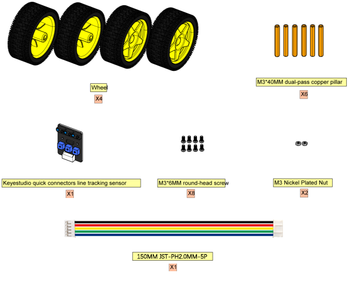

2.2. Installation Diagram.

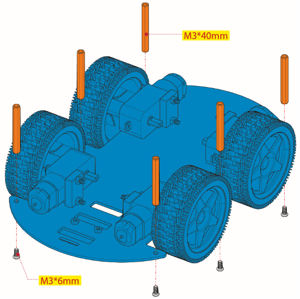

2.3. Prototype.

**part 3**

3.1. Components Needed.

3.2. Installation Diagram.

3.3. Plug Wire.

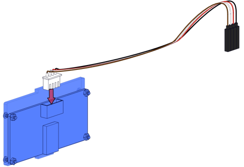

3.4. Prototype.

**part 4**

4.1. Components Needed.

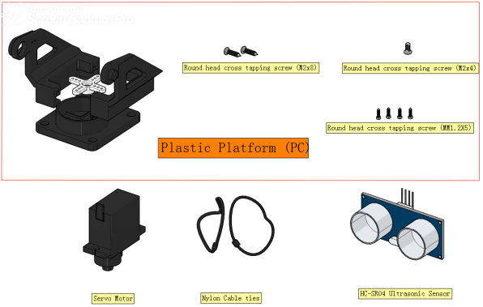

4.2. Rotate the servo to 90 degrees.

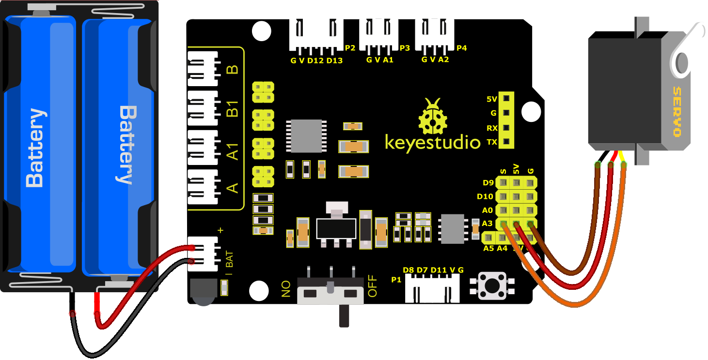

To adjust the code of the servo,please select it according to the course.

1.**Arduino:**Download the code file:[Arduino](./Arduino.7z)

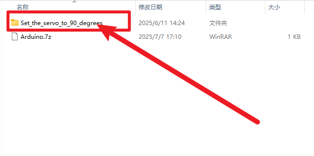

2.**Kidsblock:**Download the code file:[Kidsblock](./Kidsblock.7z)

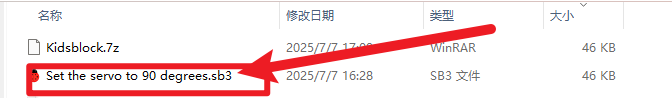

4.3. Installation Diagram.

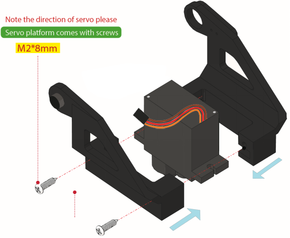

4.4. Prototype.

**part 5**

5.1. Components Needed.

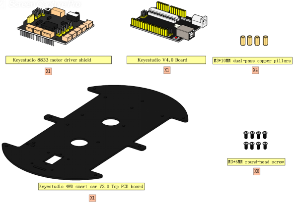

5.2. Installation Diagram.

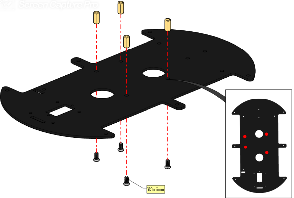

5.3. Prototype.

**part 6**

6.1. Components Needed.

6.2. Installation Diagram.

6.3. Prototype.

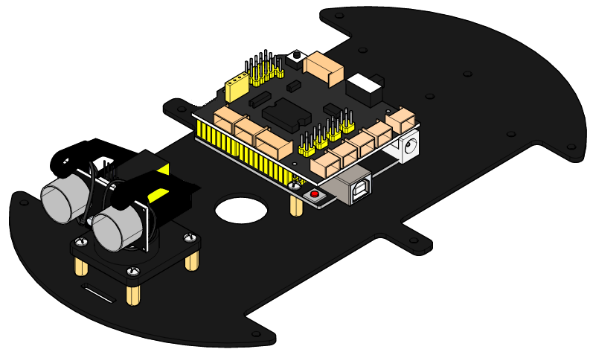

**part 7**

7.1. Components Needed.

7.2. Installation Diagram.

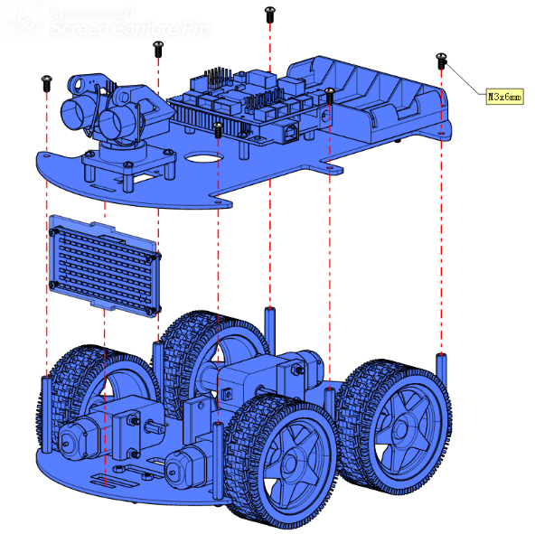

7.3. Prototype.

**part 8**

8.1. Wiring Diagram.

8.2. M2 Motor is connected to B interface,，M3 Motor is connected to A interface.

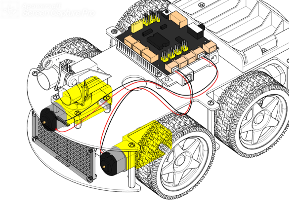

8.3. M1 Motor is connected to B1 interface，M4 Motor is connected to A1 interface.

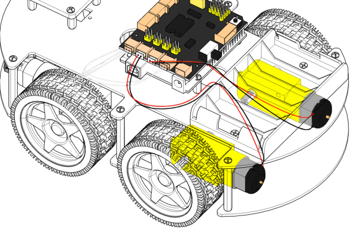

8.4. The wiring of the 3-channel line-tracking sensor.

8.5. The power supply is connected to BAT.

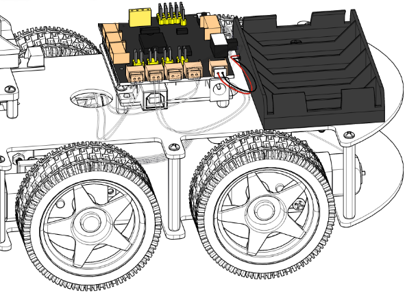

8.6. The wiring of the ultrasonic sensor.

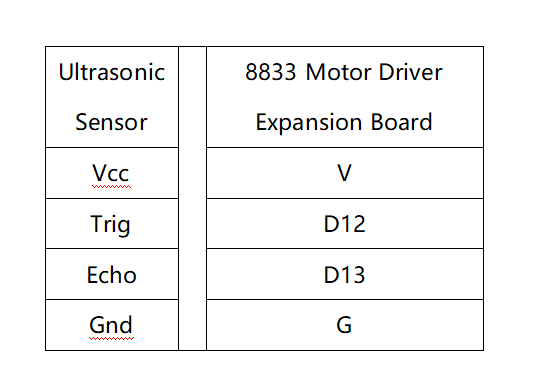

8.7. The wiring of the 8*16 LED Board.

8.8. The wiring of the servo.

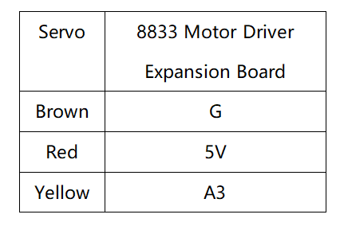

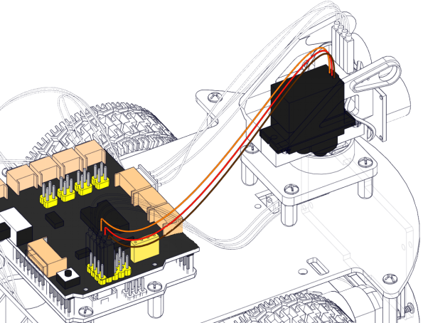

8.9. Plug in the Bluetooth module and jumper caps.

**Note:** Before uploading the test code, you need to remove the Bluetooth module, otherwise the code will fail to be uploaded.Connect the Bluetooth module after uploading the code successfully.

8.10. Complete Prototype.

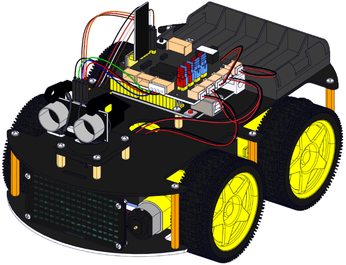