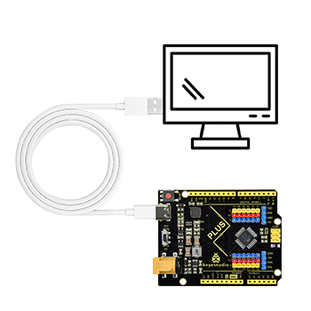

# 3. Driver installation

## 一、Windows System

### 1.1Checking the driver

1、Connect the motherboard to the computer.

2、Open Device Manager，Open the device manager, if the prompt **"Silicon Labs CP210x USB to UART Bridge (COMx)"** appears to prove that the driver has been installed, please skip the **"Driver installation"** part.

### 1.2 Manual driver installation

1、Driver download

- Windowns System:[Windowns System driver](./Windows.7z)

2、Connect the motherboard to the computer, open the device manager, if there is a yellow exclamation mark in front of the driver in the picture, it proves that the driver is not installed, please download the driver and install it manually.

## 二、MAC System

## 2.1Checking the driver

Connect the development board to the computer, according to [Tools] ---> [Port] to select the development board port (Note: If you can not confirm which port is the development board, please connect the motherboard to take pictures to record all the ports, and then unplug the development board to re-take pictures to record all the ports, and then compare to find the disappeared ports, and then unplug the motherboard after the disappeared ports is the port of the board, and then select the port on the line)If you can not recognize the port, please replace the computer USB port or around the phone cable to re-recognize the port, if it still does not work refer to the following steps to install the driver.

## 2.2 Manual driver installation

1、Driver download

Mac System:[Mac System driver](./Mac.7z)

2、double-click to decompress the downloaded driver zip package

3、After that keep **"Next ”** installing until the installation is complete

At this point, the port can be recognized by plugging in the board again.

4、Then go to the Arduino IDE, click on “Tools”, select the board Arduino Uno and the recognized development board port。

16.Clickto upload code and show “Done uploading”.

