# 5. Kidsblock Tutorial

## 5.1 Download code file

Click to download the code file required for the course：[Click to download](./Kidsblock.7z)

##  5.2 Getting started with kidsblock

**Instruction**

The Kidsblock, based on the Scratch graphical programming software, integrates multiple mainstream mainboards, sensors as well as modules. It can be programmed by dragging graphical blocks and using the C/C++ programming language, making programming easy and interesting for children to learn.

## 5.3 Software installation of Windows System

1.Download kidsblock:https://www.kidsblock.cn/Down/KidsBlock.exe 

2.Click “**KidsBlock.exe**”. Click “**More info**” and “**Run anyway**”。

3.Tick “**Anyone who uses this computer(all users)**”, and click “**Next**”。

4.Click “**Browse...**” to choose an installation path（Here we choose Disk C, you may choose at will. ）.
  Click“**Install**” and wait a few seconds.

5.Click “**Finish**” and open Kidsblock.

6.If it need to update, click “**Upgrade and restart**” for the latest version. 

7.Now open Kidsblock. If a warning window pops up, click “**Allow access**”.

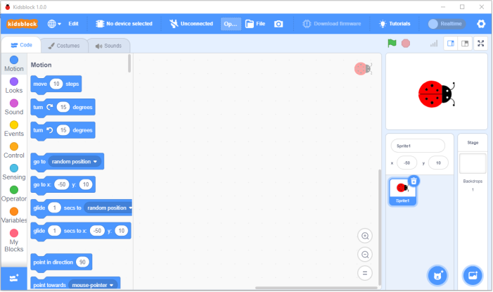

## 5.4 Software installation of Mac System

1.Download kidsblock: https://www.kidsblock.cn/Down/KidsBlock-MACOS.dmg Desktop .dmg.

2.Click KidsBlock, and  drag KidsBlock Desktop into Applications. 

3.Wait for installing. KidsBlock icon will show up in Launchpad if it is installed successfully.

## 5.5 How to use KidsBlock

We demonstrate how to use KidsBlock on Windows system

1.Interface

2.Clickto switch to different languages.

3.Click  to enter the main page, select the control board needed. In this project, we select the "**UNO development board**" mainboard and click **Connect,** then it is connected. Click **Go to Editor** to return the code editor.
Icon  will change into ，andwill change into . This means the Uno Plus mainboard and ports（COM)are connected.

4.If the Uno Plus mainboard is connected , but  icondoesn’t change into . You need to click to connect the COM port. Click  and then click **Connect**. Then you will find a page pop up, showing **Connected**.

To disconnect the port, just click  and**Disconnect**.

5.The Uno Plus mainboard and the COM port are connected, then click will change into .

Note: if you want to update libraries of KidsBlock, click then Clear cache and restart.

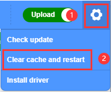

6.stands for extension libraries of sensors and modules. Click  to enter the page of extension libraries, click a sensor or module to add.

For example, if click the“passive buzzer”module,“**Not loaded**”will change into “**Loaded**”. Then the passive buzzer is added.

Click  to return the code editor. Then you can view the passive buzzer in the blocks area.

If you want to delete the passive buzzer, click  to select the passive buzzer. Then “**Loaded**” will change into “**Not loaded**”. Then the passive buzzer is deleted.

The way of deleting other sensors or modules is as same as the passive buzzer.

7.How to open SB3 type files：

1). Double-click SB3 type files to open them. For instance, open , then we need to double-click
.

2). Open Kidsblock，click **file and Load from your computer**，then select the SB3 type file on the computer.（for example: ).

Note：Please refer to the following link for MacOS：[https://kidsblocksite.readthedocs.io/en/latest/](https://kidsblocksite.readthedocs.io/en/latest/)

## 5.6 Projects

### Project 1 LED Blink

**1.Description**

For starters and enthusiasts, LED Blink is a fundamental program. LED, the abbreviation of light emitting diodes, consists of Ga, As, P, N chemical compounds and so on.

The LED can flash in diverse color by altering the delay time in the test code. When in control, power on GND and VCC, the LED will be on if S end is in high level, otherwise it will go off.

**2.Specification**

- Control interface: digital port

- Working voltage: DC 3.3-5V

- Pin spacing: 2.54mm

- LED display color: red

**3.Components**

| Development Board *1      | 8833 Motor Driver *1      | Red LED Module*1          |
| ------------------------- | ------------------------- | ------------------------- |
|  |  |  |
| 3P F-F Dupont Wire*1      | USB Cable*1               |                           |
|  |  |                           |

**4.Wiring Diagram**

As can be seen from the above figure, the Keyestudio 8833 motor driver expansion board is stacked on the Keyestudio 4.0 development board.

The pin G, V and S of the LED module are connected to G, 5V and D9 of the expansion board respectively.

**5.Test Code**

You can drag blocks to edit. Blocks listed below are for your reference.

(1).

(2).

(3).

**Complete Test Code**

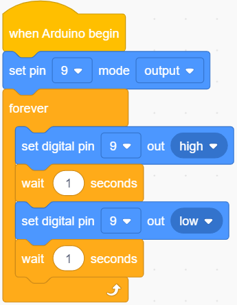

**6.Test Result**

After successfully uploading the code to the V4.0 board, connect the wirings according to the wiring diagram, and use a USB cable to connect the computer to power the board. After powering on, you will see the LED connected to the D9 will be on and off. 

**7.Extension Practice**

Next, we look to change the frequency of LED flicker by changing the wait time.

After successfully uploading the code to the V4.0 board, connect the wirings according to the wiring diagram, and use a USB cable to connect the computer to power the board. The test result shows that the LED flashes faster.

### Project 2: Adjust LED Brightness

**1.Description**

In previous lesson, we control LED on and off and make it blink.

In this project, we will control LED’s brightness through PWM simulating breathing effect.

PWM is a means of controlling the analog output via digital means. Digital control is used to generate square waves with different duty cycles (a signal that constantly switches between high and low levels) to control the analog output. In general, the input voltages of ports are 0V and 5V.

What if the 3V is required? Or a switch among 1V, 3V and 3.5V? We cannot change resistors constantly. For this reason, we resort to PWM.

For the Arduino digital port voltage output, there are only LOW and HIGH, which correspond to the voltage output of 0V and 5V. You can define LOW as 0 and HIGH as 1, and let the Arduino output five hundred 0 or 1 signals within 1s.

If all of the output five hundred are 1, that is 5V; if all of which are 0, that is 0V. If output 010101010101 in this way then the output port is 2.5V, which is like showing movie. The movie we watch are not completely continuous. It actually outputs 25 pictures per second. In this case, the human can’t see it, neither does PWM. If we want different voltage, we need to control the ratio of 0 and 1. The more 0,1 signals output per unit time, the more accurate the control.

PWM is a technology that uses digital methods to obtain analog quantities. Digital control enables to form a square wave, the square wave signal only has on and off two states (high and low).  A voltage ranging from 0 to 5V can be simulated by controlling the ratio of on to off duration.  The time spent on (technically called high level) is called pulse width, so PWM is also called pulse width modulation. 

The green vertical bars represent one period of the square wave.  The value written in each analogWrite(value) corresponds to a percentage,
which is also called Duty Cycle. This percentage refers to the ratio of time occupied by the high level in a cycle, that is, duty cycle = high level time/cycle time. 

 In the figure, from top to bottom, the duty cycle of the first square wave is 0%, and the corresponding value is 0, and the LED brightness is
the lowest, that is, off state.  The longer the high level lasts, the brighter it will be.  Therefore, the value of the last duty cycle of 100% is 255, and the LED is the brightest.  50% is the brightest half, and 25% is darker.  

PWM is more used to adjust the brightness of LED lights or the rotation speed of the motors, and the wheels speed driven by the motors can be easily controlled. When playing with some Arduino robots, the benefits of PWM can be better reflected. 

**2.Components**

| Development Board *1      | 8833 Motor Driver *1      | Red LED Module*1          |
| ------------------------- | ------------------------- | ------------------------- |
|  |  |  |
| 3P F-F Dupont Wire*1      | USB Cable*1               |                           |
|  |  |                           |

**3.Wiring Diagram** 

Keep the wiring-up unchanged.

**4.Test Code**

You can drag blocks to edit. Blocks listed below are for your reference.

(1).

(2).

(3).

(4).

(5).

(6).

**Complete Test Code**

**5.Test Result**

After successfully uploading the code to the V4.0 board, connect the wirings according to the wiring diagram, and use a USB cable to connect the computer to power the board. After powering on, you will see that the LED gradually changes from bright to dark, like human’s breath, rather than turning on and off immediately.

**6.Extension Practice**

Keep pins of the LED unchanged, then change code(values behind wait)

Upload the code to the development board, then the LED will blink more slowly.

### Project 3: Line Tracking Sensor

**1.Description** 

The tracking sensor is actually an infrared sensor. The component used here is the TCRT5000 infrared tube. Its working principle is to use different reflectivity of infrared light to colors, then convert the strength of the reflected signal into a current signal.

During the process of detection, black is active at HIGH level while white is active at LOW level. The detection height is 0-3 cm.

Keyestudio 3-channel line tracking module has integrated 3 sets of TCRT5000 infrared tubes on a board, which is more convenient for wiring and control.

By rotating the adjustable potentiometer on the sensor, it can adjust the detection sensitivity of the sensor.

**2.Specification**

- Operating Voltage: 3.3-5V (DC)

- Interface: 5PIN

- Output Signal: Digital signal

- Detection Height: 0-3 cm

Note: Before testing, rotate the potentiometer on the sensor to adjust the detection sensitivity. The sensitivity is best when adjusting the LED to a threshold between ON and OFF. 

**3.Components**

| Development Board *1     | 8833 Motor Driver *1     | Red LED Module*1         | Line Tracking Sensor*1   |
| ------------------------ | ------------------------ | ------------------------ | ------------------------ |
|  |  |  |  |
| 5P Dupont Wire*1         | USB Cable*1              | 3P  Dupont Wire*1        |                          |
|  |  |  |                          |

**4.Wiring Diagram**

G, V, S1, S2 and S3 of the line tracking sensor are connected to G（GND), V（VCC), D11, D7 and D8 of the sensor expansion board.

**5.Test Code**

You can drag blocks to edit. Blocks listed below are for your reference.

(1).

(2).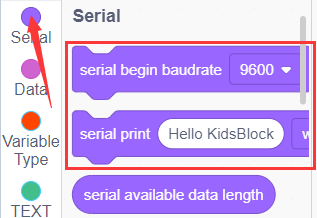

(3).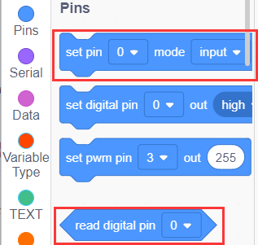

(4).

(5).

**Complete Test Code**

**6.Test Result**

After successfully uploading the code to the V4.0 board, connect the wirings according to the wiring diagram, and use a USB cable to connect the computer to power the board.

After powering on, clickto set the baud rate to 9600 and you will view status of three line tracking sensors. When no signals are received, the value is 1. If we cover the sensor with a white paper, the value will be 0.

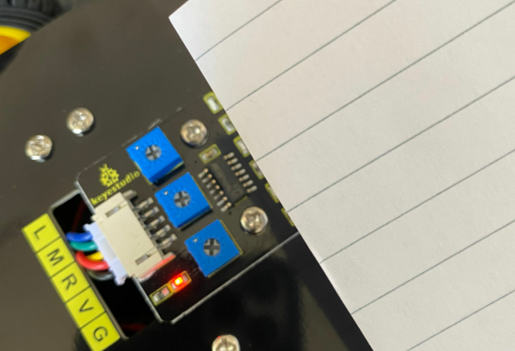

**7.Extension Practice**

After knowing its working principle, you can connect an LED to D9 so as to control LED by it.

You can drag blocks to edit. Blocks listed below are for your reference.

(1).

(2).

(3).

(4).

(5).

(6).

(7).

**Complete Test Code**

After successfully uploading the code to the V4.0 board, connect the wirings according to the wiring diagram, and use a USB cable to connect the computer to power the board.

After powering on, make a paper close to the sensor, then we can find the LED light up when covering the line tracking sensor.

### Project 4 Servo Control

**1.Description**

Servo motor is a position control rotary actuator. It mainly consists of a housing, a circuit board, a core-less motor, a gear and a position sensor. Its working principle is that the servo receives the signal sent by MCUs or receivers and produces a reference signal with a period of 20ms and width of 1.5ms, then compares the acquired DC bias voltage to the voltage of the potentiometer and obtain the voltage difference output.

In general, servo has three lines in brown, red and orange. The brown wire is grounded, the red one is a positive pole line and the orange one is a signal line.

The rotation angle of servo motor is controlled by regulating the duty cycle of PWM (Pulse-Width Modulation) signal. The standard cycle of PWM signal is 20ms (50Hz). Theoretically, the width is distributed between 1ms-2ms, but in fact, it's between 0.5ms-2.5ms. The width corresponds the rotation angle from 0° to 180°. But note that for different brand motors, the same signal may have different rotation angles. 

The corresponding servo angles are shown below:

**2.Specification**

- Working voltage: DC 4.8V \~ 6V

- Operating angle range: about 180 ° (at 500 → 2500 μsec)

- Pulse width range: 500 → 2500 μsec

- No-load speed: 0.12 ± 0.01 sec / 60 (DC 4.8V) 0.1 ± 0.01 sec / 60(DC 6V)
  
- No-load current: 200 ± 20mA (DC 4.8V) 220 ± 20mA (DC 6V)

- Stopping torque: 1.3 ± 0.01kg · cm (DC 4.8V) 1.5 ± 0.1kg · cm (DC6V)
  
- Stop current: ≦ 850mA (DC 4.8V) ≦ 1000mA (DC 6V)

- Standby current: 3 ± 1mA (DC 4.8V) 4 ± 1mA (DC 6V)

**3.Components**

| Development Board *1      | 8833 Motor Driver *1      | Servo*1                                     |
| ------------------------- | ------------------------- | ------------------------------------------- |
|   |   |                    |
| 18650 Battery Holder*1    | USB Cable*1               | 18650 Battery*2（self-provided）            |
|  |  |  |

**4.Wiring Diagram**

Wiring note: The servo is connected to G（GND）、V（VCC）and A3, the brown line of servo is linked with Gnd(G), the red one is connected to 5v(V) and the orange one is attached to A3.

The servo is obliged to connect to the external power due to its high demand for driving servo current. Generally, the current of development board is not big enough. If without connecting the external power, the development board could be burnt.

**5.Test Code**

Before writing the code, it is necessary to import the servo library file. The specific steps are as follows: 

Click to enter the extension library interface of sensors/modules/components, then look for "**Servo**".

component and click it. In this way, "**Not Loaded**" changes to "**loaded**", indicating that "**Servo**" component was added successfully. 

Click to go back to the code editor, and in the modules area you can see the "**Servo**" component directive block added. 

You can drag blocks to edit. Blocks listed below are for your reference.

(1).

(2).

(3).

**Complete Test Code**

**6.Test Result**

After successfully uploading the code to the V4.0 board, connect the wirings according to the wiring diagram, and power on the external power. After powering on, turn the dip switch to the "ON" end, then servo will swing in the range of 0° to 180°.

### Project 5 Ultrasonic Sensor

**1.Description**

The HC-SR04 ultrasonic sensor uses sonar to determine distance to an object like what bats do. It offers excellent non-contact range detection with high accuracy and stable readings in an easy-to-use package. It comes complete with an ultrasonic transmitter and receiver modules.

The HC-SR04 or the ultrasonic sensor is being used in a wide range of electronics projects for creating obstacle detection and distance measuring application as well as various other applications. Here we have brought the simple method to measure the distance with arduino and an ultrasonic sensor and how to use the ultrasonic sensor with Arduino.

**2.Specification**

- Working Voltage :+5V DC

- Quiescent Current : \<2mA

- Working Current: 15mA

- Effectual Angle: \<15°

- Distance Range : 2cm – 300 cm

- Precision : 0.3 cm

- Measuring Angle: 30 degree

- Trigger Input Pulse width: 10uS

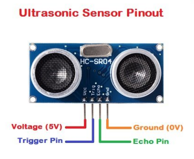

**3.Components**

| Development Board *1      | 8833 Motor Driver *1      | Red LED Module*1          | Ultrasonic Sensor*1       |
| ------------------------- | ------------------------- | ------------------------- | ------------------------- |
|  |  |  |  |
| 4P Dupont Wire*1          | USB Cable*1               | 3P Dupont Wire*1          |                           |
|  |  |  |                           |

**4.Working Principle**

As the above picture shown, it is like two eyes. One is transmitting end, the other is receiving end.

The ultrasonic module will emit the ultrasonic waves after triggering a signal. When the ultrasonic waves encounter the object and are reflected back, the module outputs an echo signal, so it can determine the distance of the object from the time difference between the trigger signal and the echo signal.

The t is the time that emitting signal meets obstacle and returns. And the propagation speed of sound in the air is about 343m/s, and distance = speed \* time. However, the ultrasonic wave emits and comes back, which is 2 times of distance. Therefore, it needs to be divided by 2, the distance measured by ultrasonic wave = (speed \* time)/2.

**Use method and chart of ultrasonic module:**

1).Use the GPIO pin to give a high level signal of at least 10μs to the Trig pin of SR04, which can trigger it to detect distance.

2).After triggering, the module will automatically send eight 40KHz ultrasonic pulses and detect whether there is a signal return. This step will be completed automatically by the module.

3).If the signal returns, the Echo pin will output a high level, and the duration of the high level is the time from the transmission of the ultrasonic wave to the return.

**Circuit diagram of ultrasonic sensor:**

**5.Wiring Diagram**

VCC, Trig, Echo and Gnd of the ultrasonic sensor are connected to 5V(V), D12, D13 and Gnd(G)

**6.Test Code**

Before writing the code, it is necessary to import the library file of the ultrasonic sensor. The specific steps are as follows: 

Click to enter the extension library interface of sensors/modules/components, then search for "**Ultrasonic**" sensor and click it. In this way, "**Not loaded**" changes to "**loaded**", indicating that "**Ultrasonic**" sensor was added successfully. 

Click to return to the code editor interface, the instruction block of the added "**Ultrasonic**" sensor can be seen in the module area. 

You can drag blocks to edit. Blocks listed below are for your reference.

（1).

(2).

(3).

(4).

(5).

(6).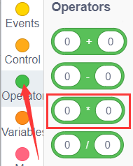

(7).

**Complete Test Code**

**7.Test Result**

After successfully uploading the code to the V4.0 board, connect the wirings according to the wiring diagram, then connect the computer via a USB cable to power the board. After powering on, click to set baud rate to 9600.

The detected distance will be displayed, and the unit is cm and inch. Hinder the ultrasonic sensor by hand, the displayed distance value gets smaller.

**8.Extension Practice**

We have just measured the distance displayed by the ultrasonic. How about controlling the LED with the measured distance? Let's try it and connect an LED light module to the D9 pin.

You can drag blocks to edit. Blocks listed below are for your reference.

(1).

(2).

(3).

(4).

(5).

(6).

(7).

**Complete Test Code**

After successfully uploading the code to the V4.0 board, connect the wirings according to the wiring diagram, then connect the computer via a USB cable to power the board. After powering on, block the ultrasonic sensor by hand(the distance is between 2-10cm), then check if the LED is on.

### Project 6 IR Reception

**1.Description** 

There is no doubt that infrared remote control is ubiquitous in daily life. It is used to control various household appliances, such as TVs, stereos, video recorders and satellite signal receivers. Infrared remote control is composed of infrared transmitting and infrared receiving systems, that is, an infrared remote control and infrared receiving module and a single-chip microcomputer capable of decoding.  

The 38K infrared carrier signal emitted by remote controller is encoded by the encoding chip in the remote controller. It is composed of a section of pilot code, user code, user inverse code, data code, and data inverse code. The time interval of the pulse is used to distinguish whether it is 0 or 1 signal and the encoding is made up of these 0, 1 signals.

The user code of the same remote control is constant while the data code can distinguish the key.

When the remote control button is pressed, the remote control sends out an infrared carrier signal. When the IR receiver receives the signal, the program will decode the carrier signal and determines which key is pressed. The MCU decodes the received 01 signal, thereby judging what key is pressed by the remote control.

Infrared receiver we use is an infrared receiver module. Mainly composed of an infrared receiver head, which is a device that integrates reception, amplification, and demodulation. Its internal IC has completed demodulation, and can achieve from infrared reception to output and be compatible with TTL signals.

Additionally, it is suitable for infrared remote control and infrared data transmission. The infrared receiving module made by the receiver has only three pins, signal line, VCC and GND. It is very convenient to communicate with Arduino and other microcontrollers.

**2.Specification**

- Operating Voltage: 3.3-5V（DC)

- Output Signal: Digital signal

- Receiving Angle: 90 degrees

- Frequency: 38khz

- Receiving Distance: 10m

The picture shows the real product and circuit diagram of the infrared receiver.

**3.Components**

| Development Board *1      | 8833 Motor Driver *1      | Red LED Module*1          |
| ------------------------- | ------------------------- | ------------------------- |
|  |  |  |
| 3P F-F Dupont Wire*1      | USB Cable*1               |                           |
|  |  |                           |

Since the 8833 board integrates with the IR receiver, it doesn’t need wiring up. Pins of IR receiver module are G(GND）, V（VCC）and D3.

**4.Test Code**

Before writing the code, it is necessary to import the library file of the IR receiver sensor. The specific steps are as follows: 

Click to enter the extension library interface of sensors/modules/components, then search for“**ir remote**” sensor and click it. In this way, "**Not loaded**" changes to "**loaded**", indicating that ir remote”sensor was added successfully. 

Click to return to the code editor interface, the instruction block of the added “**ir remote**”sensor can be seen in the module area. 

You can drag blocks to edit. Blocks listed below are for your reference.

(1).

(2).

(3).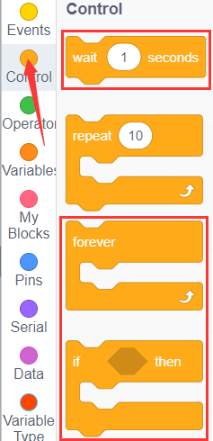

(4).

**Complete Test Code**

**5.Test Result**

After successfully uploading the code to the V4.0 board, connect the wirings according to the wiring diagram, then connect the computer via a USB cable to power the board. After powering on, click to set baud rate to 9600.

Take out the remote control, and send signal to the infrared receiver sensor. You can see the key value of the corresponding key, if the key time is too long, FFFFFFFF is prone to garbled characters.

The keys value of remote control are shown below.

**6.Extension Practice**

We have decoded the key value of the IR remote control. How about controlling LED by the measured value? We could design an experiment.

Attach an LED to D9, then press the keys of remote control to make LED light on and off.

You can drag blocks to edit. Blocks listed below are for your reference.

(1).

(2).

(3).

(4).

(5).

(6).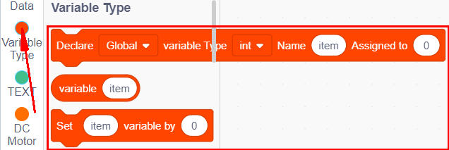

(7).

(8).

**Complete Test Code**

After successfully uploading the code to the V4.0 board, connect the wirings according to the wiring diagram, then connect the computer via a USB cable to power the board. After powering on, press the "**OK**" key on remote control can make the LED on and off.

### Project 7 Bluetooth Remote Control

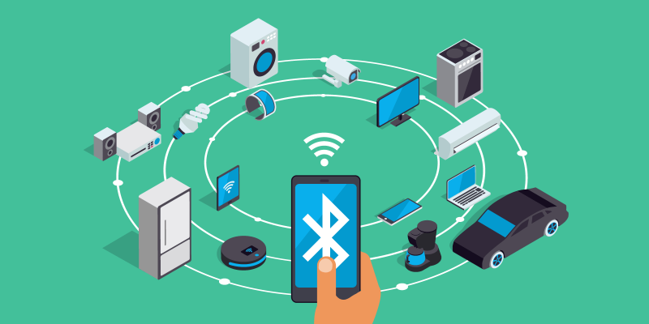

**1.Description**

There is a DX-BT24 5.1 Bluetooth module in this kit. This bluetooth module comes with 256Kb space and complies with V5.1BLE bluetooth specification, which supports AT commands. Users can change parameters such as the baud rate and device name of the serial port as required.

Furthermore, it supports UART interface and bluetooth serial port transparent transmission, which also contains the advantages of low cost, small size, low power consumption and high sensitivity for sending and receiving. Notably, it solely needs a few peripheral components to realize its powerful functions.  

**2.Specification**

- Bluetooth protocol: Bluetooth Specification V5.1 BLE

- Working distance: In an open environment, it can achieve 40m ultra-long distance communication
  
- Operating frequency: 2.4GHz ISM band

- Communication interface: UART

- Bluetooth certification: Accord with FCC CE ROHS REACH certification standard
  
- Serial port parameters: 9600, 8 data bits, 1 stop bit, invalid bit, no flow control
  
- Power: 5V DC

- Operating temperature: –10℃ to +65℃
  

**3.Application**

The DX-BT24 module also supports the BT5.1 BLE protocol, which can be directly connected to iOS devices with BLE Bluetooth function, and supports resident running of background programs. It is mainly used in the field of short-distance data wireless transmission. It enables to avoid cumbersome cable connections and can directly replace serial cables.

**Successful application areas of BT24 modules:**

※ Bluetooth wireless data transmission;

※ Mobile phone, computer peripheral equipment;

※ Handheld POS equipment;

※ Wireless data transmission of medical equipment;

※ Smart home control;

※ Bluetooth printer;

※ Bluetooth remote control toys;

※ Shared bicycles;

**Ports**

①STATE：Status pin

②RX：Receiving pin

③TX：sending pin

④GND：GND

⑤VCC：Power

⑥EN： Enable pin

Connect the BT module to the development board.

<table border="1">
<tbody>
<tr class="odd">
<td>Uno</td>
<td>BT24</td>
</tr>
<tr class="even">
<td>TX</td>
<td>RX</td>
</tr>
<tr class="odd">
<td>RX</td>
<td>TX</td>
</tr>
<tr class="even">
<td>VCC</td>
<td>5V</td>
</tr>
<tr class="odd">
<td>GND</td>
<td>GND</td>
</tr>
</tbody>
</table>

**4.Components**

| Development Board *1      | 8833 Motor Driver *1      | Red LED Module*1           |
| ------------------------- | ------------------------- | -------------------------- |
|  |  |   |
| 3P F-F Dupont Wire*1      | USB Cable*1               | DX-BT24 Bluetooth Module*1 |
|  |  |   |

**5.Wiring Diagram**

RXD, TXD, GND and VCC of the BT module are connected to TX, RX, G and 5V.

STATE and BRK of the BT module don’t need connection.

Note: the direction of the BT module when inserting it onto the 8833 board. And don’t insert it before uploading the code.

**6.Test Code**

You can drag blocks to edit. Blocks listed below are for your reference.

(1).

(2).

(3).

(4).

(5).

**Complete Test Code**

**Note:** Before uploading the test code, you need to remove the Bluetooth module, otherwise the code will fail to be uploaded.Connect the Bluetooth module after uploading the code successfully.

**7.Test Result**

After successfully uploading the code to the V4.0 board, connect the wirings according to the wiring diagram, then connect the computer via a USB cable to power the board. After powering on, insert the BT module and the LED will flash, then we need to download the BT app.

**8.Download Bluetooth APP**

**Apple system**

(1).Open the App Store on the iPhone.

(2).Search keyes BT car and download the APP to your phone.

    

(3).After installation, enter its interface.

    

(4).Click "**Connect**" button in the upper left corner to automatically search for Bluetooth. When **BT24** is found, click "**Connect**" to connect Bluetooth, and then click to enter the control interface of 4WD smart car. 

    
**Android System**
    

(1).Enter google play store to search for“**keyes 4wd**”.

(2).The app icon is shown below after installation.

(3).Click app to enter the following page.

(4).After connecting Bluetooth, plug in power and LED indicator of Bluetooth module will flicker. Tap“Connect”to search the Bluetooth.

(5).When **BT24** is found, click "**connect**" to connect Bluetooth. When "**connect**" turns into "**is connected**", it indicates that the Bluetooth connection is successful. As shown in the picture below, the Bluetooth LED becomes will stay on.

(6).After connecting Bluetooth module, click to set baud rate to 9600. Pressing the button of the Bluetooth APP, and the corresponding characters will be displayed, as shown below:

| Key                                          | Function                          |
| -------------------------------------------- | --------------------------------- |
|                   | Pair DX-BT24 5.1 Bluetooth module |
|  | Disconnect Bluetooth              |

|                                                              | Control character                                            | Function                                                     |
| ------------------------------------------------------------ | ------------------------------------------------------------ | ------------------------------------------------------------ |
|                  | Press: F   Release: S                                   | Press the button, the car  goes front;  release to stop |
|                  | Press: L   Release: S                                   | Press the button, the car turns left;  release to stop  |
|                  | Press: R   Release: S                                   | Press the button, the car turns right;  release to stop |
|                  | Press: B   Release: S                                   | Press the button, the car goes back;  release to stop   |
|                  | Press: “a”   Release: “S”                               | Click to speed up(maximum:255)                               |
|                  | Press: “d”   Release: “S”                               | Click to slow down(minimum:0)                                |
|                  | Click to start the gravity  sensing function of the  mobile phone: click again to  exit the gravity sensing control |                                                              |
|                  | Click to send“X”,  click again to send“S”               | Start line tracking function;  click again to exit      |
|                  | Click to send“Y”,  click again to send“S”               | Start ultrasonic avoiding function;  click again to exit |
|  | Click to send“U”,  click again to send“S”               | Start ultrasonic follow function;  click  again to exit |
|                  | Click to send“G”, click again to send“S”                | Start restricting function;  click  again to exit       |

**9.Extension Practice**

Here we look to use the command sent by the mobile phone to turn on or off an LED light. Looking at the wiring diagram, an LED is connected to the D9 pin.

You can drag blocks to edit. Blocks listed below are for your reference.

(1).

(2).

(3).

(4).

(5).

(6).

(7).

**Complete Test Code**

After successfully uploading the code to the V4.0 board, connect the wirings according to the wiring diagram, then connect the computer via a USB cable to power the board. After powering on, click<td></td> and <td></td> to control the LED turn on and turn off.

### Project 8 Motor Driving and Speed Control

**1.Description**

There are many ways to drive motors. Our car uses the most commonly used DRV8833 motor driver chip, which provides a two-channel bridge electric drive solution for toys, printers and other integrated motor applications.

When we stack the driver expansion board on the 4.0 development board and power on the BAT, then set the DIP switch to the ON end, the external power supply will power on the two boards at the same time. To facilitate wiring connections, the driver expansion board comes with an anti-reverse port (PH2.0-2P-3P-4P-5P). You can connect the motors, power supply, and sensor modules directly to the driver expansion board. 

The Bluetooth interface of the driver expansion board is fully compatible with the DX-BT24 5.1 Bluetooth module. When connecting the Bluetooth module, you solely need to plug it into the corresponding interface.  At the same time, 2.54 row pins are used to draw out some unused digital and analog ports on the driver expansion board, making it accessible for you to add other sensors and carry out extension experiments. 

The expansion board can be connected to four DC motors. When the jumper cap is connected by default, the motors of ports A and A1 and B and B1 are connected in parallel and have the same motion law.  8 jumper caps can be used to control the rotation direction of the 4 motor interfaces.

For example, when the 2 jumper caps in front of B1 of the M1 motor change from transverse connection to longitudinal connection, the rotation direction of M1 motor will be opposite to the original rotation direction. 

**2.Specification**

- Input voltage for logic：DC 5V

- Input voltage for driving：DC 6-9 V

- Working current for logic：\<36mA

- Working current for driving：\<2A

- Maximum power dissipation：25W（T=75℃）

- Input level for control signal： high level is 2.3V\<Vin\<5V ，low level is -0.3V\<Vin\<1.5V

- Working temperature：-25＋130℃

**3.Keyestudio 8833 motor driver expansion board**

**Working Principle**

We use the same side parallel connection mode for the four motors, which can be regarded as two groups of motors.  As shown in the wiring diagram, B and B1 are a group, and A and A1 are a group.

The motors in the same group should rotate in the same direction. If they are different, please adjust the corresponding jumper caps next to the terminal to change the direction.  

As shown below, if the directions of A and A1 are different, adjust the direction of jumper caps until the motor movement direction of the same group is consistent. 

From the above diagram, it is known that the direction pin of A motor is D4, the speed pin is D6; D2 is the direction pin of B motor; and D6 is speed pin.

PWM drives the robot car. The PWM value is in the range of 0-255. When we set the direction to HIGH, the smaller the PWM number, the faster the rotation of the motor.

<table border="1">
<tbody>
<tr class="odd">
<td></td>
<td>D2</td>
<td>D5（PWM）</td>
<td>B Motor（ left）</td>
<td>D4</td>
<td>D6（PWM）</td>
<td>A Motor（right）</td>
</tr>
<tr class="even">
<td>Go forward</td>
<td>HIGH</td>
<td>255-200</td>
<td>Rotate clockwise</td>
<td>HIGH</td>
<td>255-200</td>
<td>Rotate clockwise</td>
</tr>
<tr class="odd">
<td>Go back</td>
<td>LOW</td>
<td>200</td>
<td>Rotate anticlockwise</td>
<td>LOW</td>
<td>200</td>
<td>Rotate anticlockwise</td>
</tr>
<tr class="even">
<td>Turn left</td>
<td>HIGH</td>
<td>255-200</td>
<td>Rotate clockwise</td>
<td>LOW</td>
<td>200</td>
<td>Rotate anticlockwise</td>
</tr>
<tr class="odd">
<td>Turn right</td>
<td>LOW</td>
<td>200</td>
<td>Rotate anticlockwise</td>
<td>HIGH</td>
<td>255-200</td>
<td>Rotate clockwise</td>
</tr>
</tbody>
</table>

**4.Components**

| Development Board *1      | 8833 Motor Driver *1      | USB Cable*1                       |
| ------------------------- | ------------------------- | --------------------------------- |
|  |  |          |
| 18650 Battery Holder*1    | Motor*4                   | 18650 Battery *2（self-provided） |
|  |  |          |

**5.Wiring Diagram**

Connect the power supply to the BAT port.

**6.Test Code**

You can drag blocks to edit. Blocks listed below are for your reference

(1).

(2).

(3).

**Complete Test Code**

**7.Test Result**

After successfully uploading the code to the V4.0 board, connect the wirings according to the wiring diagram, then power on the external power and turn the DIP switch to ON, the car will go forward for 2s, back for 2s, turn left for 2s and right for 2s and stop for 2s.

**8.Code Explanation**

Adjust the speed that PWM controls the motor, hook up in the same way.

**Complete Test Code**

After successfully uploading the code to the V4.0 board, connect the wirings according to the wiring diagram, then power on the external power and turn the DIP switch to ON, then you find the speed of the motor is much slower.

Note: Low battery will lead to slow motor speed.

### Project 9 Facial Expression LED Board

**1.Description** 

How fun it is if a expression board is added to the robot. And the Keyestudio 8\*16 LED board can do the trick. With the help of it, you could design facial expressions, images, patterns and other displays by yourselves.

The 8\*16 LED board comes with 128 LEDs. The data of the microprocessor(Arduino) communicates with the AiP1640 through a two-wire bus interface. Therefore, it can control the on and off of 128 LEDs on the module, so as to make the dot matrix on the module to display the pattern you need. A HX-2.54 4Pin cable is provided for your convenience of wiring.

**2.Specification**

- Working voltage: DC 3.3-5V

- Power loss: 400mW

- Oscillation frequency: 450KHz

- Drive current: 200mA

- Working temperature: -40\~80℃

- Communication mode: I2C
  

**3.Circuit Diagram**

**4.Working Principle**

How to control each LED of the 8\*16 dot matrix? It is known that each byte has 8 bits and each bit is 0 or 1. when it is 0, LED is off while when it is 1 LED is on. One byte can control one column of the LED,and naturally 16 bytes can control 16 columns of LEDs, that’s the 8\*16 dot matrix.

**5.Pins description and communication protocol**

The data of the microprocessor (Arduino) communicates with the AiP1640 through a two-wire bus cable.

The communication protocol diagram is as follows (SCLK) is SCL, (DIN) is SDA.

①The starting condition for data input: SCL is high level and SDA changes from high to low.

②For data command setting, there are methods as shown in the figure below.

In our sample program, select the way to **add 1 to the address automatically**, the binary value is 0100 0000 and the corresponding hexadecimal value is 0x40.

③For address command setting, the address can be selected as shown below.

The first 00H is selected in our sample program, and the binary number 1100 0000 corresponds to the hexadecimal 0xc0.

④The requirement for data input is that when SCL is at high level when inputting data, the signal on SDA must remain unchanged. Only when the clock signal on SCL is at low level, can the signal on SDA be changed. The input of data is the low bit first, and the high bit later.

⑤The condition for the end of data transmission is that when SCL is at low level, SDA at low level and SCL at high level, the level of SDA becomes high.

⑥Display control, set different pulse width, pulse width can be selected as shown in the figure below.

In the example, the pulse width is 4/16, and the hexadecimal corresponding to 1000 1010 is 0x8A.

**Instructions for the use of modulus tool**

The dot matrix tool uses the online version, and the link is :[http://dotmatrixtool.com/\#](http://dotmatrixtool.com/\#)

①Enter the link and the page appears as shown below

②The dot matrix is 8\*16, so adjust the height to 8 and width to 16, as shown in the figure below.

③Generate hexadecimal data from the pattern

As shown in the figure below, press the left mouse button to select, right click to cancel; draw the pattern you want, click Generate, and the hexadecimal data we need will be generated.

**6.Components**

| Development Board *1      | 8833 Motor Driver *1            | 8x16 LED Panel*1          |
| ------------------------- | ------------------------------- | ------------------------- |
|  |        |  |
| USB Cable*1               | HX-2.54 4P Dupont Wire 200mm *1 |                           |
|  |        |                           |

**7.Wiring Diagram**

The GND, VCC, SDA, and SCL of the 8x16 LED light board are respectively connected to the keyestudio sensor expansion board-(GND), + (VCC), A4, A5 for two-wire serial communication.

(Note: Though it is connected with the IIC pin of Arduino, this module is not for IIC communication. And the IO port here is to simulate I2C communication and can be connected with any two pins ).

**8.Test Code**

Before writing the code, it is necessary to import the library file of the 8x16 LED board. The specific steps are as follows: 

Click to enter the extension library interface of sensors/modules/components, then search for“**Matrix 8\*16 Aip1640**”module  and click it. In this way, "**Not loaded**" changes to "**loaded**", indicating that“**Matrix 8\*16 Aip1640**”module was added successfully. 

Click to return to the code editor interface, the instruction block of the added “**Matrix 8\*16 Aip1640**”module can be seen in the module area. 

You can drag blocks to edit. Blocks listed below are for your reference.

(1).

(2).

**Complete Test Code**

**9.Test Result**

After successfully uploading the code to the V4.0 board, connect the wirings according to the wiring diagram, then turn the DIP switch to ON, a smile-shaped pattern will be displayed on the LED board.

**10.Code Explanation**

We use the modulus tool we just learned, [http://dotmatrixtool.com/\#](http://dotmatrixtool.com/\#), to make the dot matrix display the start pattern, going forward, and stop and then clear the pattern. The time interval is 2000 ms.

Instruction block for smiley face

Instruction block for expression：

Instruction block for heart 

Instruction block for going forward

Instruction block for **stepping back** 

Instruction block for **turning left** 

Instruction block for **turning right** 

Instruction block for **stop**

Instruction block for **clearing screen**

You can drag blocks to edit. Blocks listed below are for your reference.

（1).

（2).

(3).

**Complete Test Code**

After uploading test code, the facial expression board shows these patterns orderly and repeats this sequence.

### Project 10 Restricting Smart Car

**1.Description**

In this project, we look to combine the knowledge of a line tracking sensor and motor driver modules to make a restricting smart car.  In the experiment, we aim to use the line tracking sensor to detect whether there is a black line around the smart car, and then control the rotation of the two motors according to the detection results in a way that lock the smart car in a circle drawn in black line.

**2.Flow Chart**

The specific logic of the restricting 4WD smart car is shown in the table.

**3.Wiring Diagram**

G, V, S1, S2 and S3 of the line tracking sensor are connected to G（GND), V（VCC), D11, D7 and D8 of the sensor expansion board.

The power is connected to the BAT port

**4.Test Code**

You can drag blocks to edit. Blocks listed below are for your reference.

(1).

(2).

(3).

(4).

(5).

(6).

**Complete Test Code**

**5.Test Result**

After successfully uploading the code to the V4.0 board, connect the wirings according to the wiring diagram, power on the external power then turn the DIP switch to ON. Put the smart car in the black circle, then it will move solely in the circle.

### Project 11 Line Tracking Smart Car

**1.Description**

Based on the working principle of the line tracking sensor, we empower to make a line tracking smart car.

In this project, we detect whether there is a black line at the bottom of the smart car through a line tracking sensor, and then control the rotation of the two groups of motors according to the detection results in a way that controls the smart car to walk along the black line. 

**2.Flow Chart**

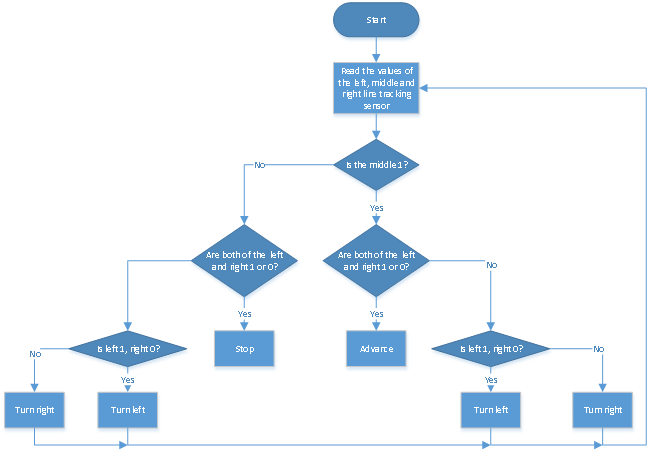

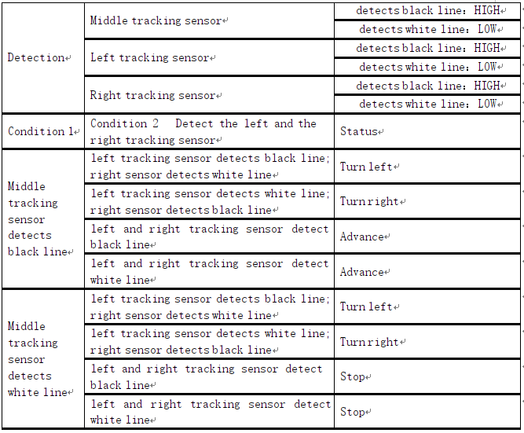

**3.Wiring Diagram**

G, V, S1, S2 and S3 of the line tracking sensor are connected to G（GND), V（VCC), D11, D7 and D8 of the sensor expansion board.

The power is connected to the BAT port

**4.Test Code**

You can drag blocks to edit. Blocks listed below are for your reference

(1).

(2).

(3).

(4).

(5).

**Complete Test Code**

**5.Test Resul**

After successfully uploading the code to the V4.0 board, connect the wirings according to the wiring diagram, power on the external power then turn the DIP switch to ON. Then the smart car will walk along the lines.

### Project 12 Ultrasonic Following Smart Car

**1.Description**

In this project, we will look to detect the distance between the 4WD smart car and the obstacles ahead through an ultrasonic sensor to drive two motors in a way that make the car move and make the 8\*8 LED board show a smile facial pattern.

**2.Flow Chart**

<table border="1">
<tbody>
<tr class="odd">
<td>Detection</td>
<td>Measured distance of front obstacles</td>
<td>distance（unit：cm）</td>
</tr>
<tr class="even">
<td>Setting</td>
<td>8*16 LED board shows a smile pattern.</td>
<td></td>
</tr>
<tr class="odd">
<td></td>
<td>Set servo to 90°</td>
<td></td>
</tr>
<tr class="even">
<td>Condition</td>
<td>distance≥20 and distance≤50</td>
<td></td>
</tr>
<tr class="odd">
<td>Status</td>
<td>Go forward</td>
<td></td>
</tr>
<tr class="even">
<td>Condition</td>
<td>distance＞10 and distance＜20</td>
<td></td>
</tr>
<tr class="odd">
<td></td>
<td>distance＞50</td>
<td></td>
</tr>
<tr class="even">
<td>Condition</td>
<td>stop</td>
<td></td>
</tr>
<tr class="odd">
<td>Condition</td>
<td>distance≤10</td>
<td></td>
</tr>
<tr class="even">
<td>Condition</td>
<td>Go back</td>
<td></td>
</tr>
</tbody>
</table>

**3.Wiring Diagram**

**Wiring up：**

1). GND, VCC, SDA and SCL of the 8\*8 LED board are connected to G（GND), V（VCC), A4 and A5 of the expansion board.

2). VCC, Trig, Echo and Gnd of the ultrasonic sensor are connected to 5V(V), D12(S), D13(S) and Gnd(G)

3). The servo is connected to G, V and A3. The brown wire is interfaced with Gnd(G), the red wire is interfaced with 5V(V) and the orange wire is interfaced with A3.

4). The power is connected to the BAT port

**4.Test Code**

Before writing the code, it is necessary to import the library files of the ultrasonic sensor, 8x16 LED board and the servo. The specific steps are as follows: 

Click to enter the extension library interface of sensors/modules/components, then search for“Ultrasonic”sensorand click it. 

In this way, "**Not loaded**" changes to "**loaded**", indicating that the“**Ultrasonic**”sensor was added successfully. 

The 8x16 LED board and servo library files are added in the same way as the ultrasonic sensor.

Click to return to the code editor interface, the instruction block of the added “**Ultrasonic**”sensor,“**Matrix 8\*16 Aip1640**”module and “**Servo**”component can be seen in the module area. 

You can drag blocks to edit. Blocks listed below are for your reference

(1).

(2).

(3).

(4).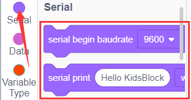

(5).

(6).

(7).

(8).

(9).

**Complete Test Code**

**5.Test Result**

After successfully uploading the code to the V4.0 board, connect the wirings according to the wiring diagram, power on the external power then turn the DIP switch to ON. Set the servo to 90°，the smart car will move with the obstacles and the 8X16 LED board will show“smile”.

### Project 13 Ultrasonic Obstacle Avoidance Smart Car

**1.Description**

In this project, we aim to make an ultrasonic obstacle avoidance smart car. We will use the ultrasonic to detect the distance from the obstacle, which can be used to control the servo to rotate so as to make the car move. Meanwhile, the 8X16 LED board will display the corresponding status pattern.

**2.Flow Chart**

**The specific logic of ultrasonic obstacle avoidance smart car is shown below:**

**3.Wiring Diagram**

1). GND, VCC, SDA and SCL of the 8\*8 LED board module are connected to G（GND), V（VCC), A4 and A5 of the expansion board.

2). VCC, Trig, Echo and Gnd of the ultrasonic sensor are connected to 5V(V), D12(S), D13(S) and Gnd(G).

3). The servo is connected to G, V and A3. The brown wire is interfaced with Gnd(G), the red wire is interfaced with 5V(V) and the orange wire is interfaced with A3.

4). The power is connected to the BAT port

**4.Test Code**

Before writing the code, it is necessary to import the library files of the ultrasonic sensor , 8x16 LED board and the servo. The specific steps are as follows: 

Click to enter the extension library interface of sensors/modules/components, then search for“Ultrasonic”sensor and click it. In this way, "**Not loaded**" changes to "**loaded**", indicating that the“**Ultrasonic**”sensor was added successfully. 

Click to return to the code editor interface, the instruction block of the added “**Ultrasonic”sensor**,“**Matrix 8\*16 Aip1640**”module and “**Servo**”component can be seen in the module area. 

You can drag blocks to edit. Blocks listed below are for your reference.

(1).

(2).

(3).

(4).

(5).

(6).

(7).

(8).

(9).

(10).

**Complete Test Code**

**5.Test Result**

After successfully uploading the code to the V4.0 board, connect the wirings according to the wiring diagram, power on the external power then turn the DIP switch to ON.

The smart car moves forward and automatically avoids obstacles. When there is no road ahead, the servo will drive the ultrasonic sensor to scan the left, middle and right distances, and the car will turn to the open side. Meanwhile, the 8X16 LED board will display the corresponding status pattern.

### Project 14 IR Remote Control Smart Car

**1.Description**

In this project, we will make an IR remote control smart car and press the button on the IR remote control to drive the car to move.

**2.Flow Chart**

**The specific logic of IR remote control smart car is shown below:**

| Initial setup                                               |           | LED board displays smile face                     |
| ----------------------------------------------------------- | --------- | ------------------------------------------------- |
| Remote control                                              | Key value | Key state                                         |
|  | FF629D    | Go front8*8 LED board shows front icon            |
|  | FFA857    | Back8*8 LED board shows back icon                 |
|                   | FF22DD    | Rotate to left8*8 LED board shows leftward icon   |
|                   | FFC23D    | Rotate to right8*8 LED board shows rightward icon |
|                                  | FF02FD    | Stop8*8 LED board shows“STOP”                     |

**3.Wiring Diagram**

1). GND, VCC, SDA and SCL of the 8\*8 LED board module are connected to G（GND), V（VCC), A4 and A5 of the expansion board.
    
2). As the IR receiver is integrated on the 8833 motor driver expansion board, there is no need for additional wiring. The pins of the IR receiver on the 8833 board are G (GND), V (VCC) and D3 respectively. 
    
3). The servo is connected to G, V and A3. The brown wire is interfaced with Gnd(G), the red wire is interfaced with 5V(V) and the orange wire is interfaced with A3.
    
4). The power is connected to the BAT port
    

**4.Test Code**

Before writing the code, it is necessary to import the library files of the ultrasonic sensor, 8x16 LED board and the servo. The specific steps are as follows: 
    
Click to enter the extension library interface of sensors/modules/components, then search for“ir remote”sensorand click it. In this way, "**Not loaded**" changes to "**loaded**", indicating that the“**ir remote**”sensor was added successfully. 

Click to return to the code editor interface, the instruction block of the added “**ir remote**”sensor,“**Matrix 8\*16 Aip1640**”module and “**Servo**”component can be seen in the module area. 

You can drag blocks to edit. Blocks listed below are for your reference

(1).

(2).

(3).

(4).

(5).

(6).

(7).

(8).

**Complete Test Code**

**5.Test Result**

After successfully uploading the code to the V4.0 board, connect the wirings according to the wiring diagram, power on the external power then turn the DIP switch to ON. Then we enable to use the IR remote control drive the car to move to and the 8X16 LED board will display the corresponding status pattern.

### Project 15 Bluetooth Control Smart Car

**1.Description**

We’ve learned the basic knowledge of Bluetooth. And in this lesson, we will make a Bluetooth control smart car. In this project, we aim to regard the mobile phone as the transmitter (host), and the smart car connected to the BT24 Bluetooth module (slave) as the receiver and use the mobile APP to control the smart car via the Bluetooth. 

**2.APP Control Button**

| Key                                          | Function                          |
| -------------------------------------------- | --------------------------------- |
|                   | Pair DX-BT24 5.1 Bluetooth module |
|  | Disconnect Bluetooth              |

|                                                              | Control character                                            | Function                                                     |
| ------------------------------------------------------------ | ------------------------------------------------------------ | ------------------------------------------------------------ |
|                  | Press: F   Release: S                                   | Press the button, the car  goes front;  release to stop |
|                  | Press: L   Release: S                                   | Press the button, the car turns left;  release to stop  |
|                  | Press: R   Release: S                                   | Press the button, the car turns right;  release to stop |
|                  | Press: B   Release: S                                   | Press the button, the car goes back;  release to stop   |
|                  | Press: “a”   Release: “S”                               | Click to speed up(maximum:255)                               |
|                  | Press: “d”   Release: “S”                               | Click to slow down(minimum:0)                                |
|                  | Click to start the gravity  sensing function of the  mobile phone: click again to  exit the gravity sensing control |                                                              |
|                  | Click to send“X”,  click again to send“S”               | Start line tracking function;  click again to exit      |
|                  | Click to send“Y”,  click again to send“S”               | Start ultrasonic avoiding function;  click again to exit |
|  | Click to send“U”,  click again to send“S”               | Start ultrasonic follow function;  click  again to exit |
|                  | Click to send“G”, click again to send“S”                | Start restricting function;  click  again to exit       |

**3.Flow Chart**

**4.Wiring Diagram**

1). GND, VCC, SDA and SCL of the 8\*8 LED board are connected to G（GND), V（VCC), A4 and A5 of the expansion board.
    
2). The RXD, TXD, GND and VCC of the Bluetooth module are respectively connected to TX, RX, G and 5V on the 8833 motor driver expansion board, while the STATE and BRK pins of the Bluetooth module do not need to be connected. 
    
3). The servo is connected to G, V and A3. The brown wire is interfaced with Gnd(G), the red wire is interfaced with 5V(V) and the orange wire is interfaced with A3.
    
4). The power is connected to the BAT port
    

**5.Test Code**

Before writing the code, it is necessary to import the library files of the 8x16 LED board and the servo. The specific steps are as follows: 
    
Click to enter the extension library interface of sensors/modules/components, then search for“**Matrix 8\*16 Aip1640**”moduleand click it. In this way, "**Not loaded**" changes to "**loaded**", indicating that the“**Matrix 8\*16 Aip1640**”module was added successfully. 

  

Click to return to the code editor interface, the instruction block of the added“**Matrix 8\*16 Aip1640**”module and “**Servo**”component can be seen in the module area. 

You can drag blocks to edit. Blocks listed below are for your reference.

(1).

(2).

(3).

(4).

(5).

(6).

(7).

(8).

(9).

**Complete Test Code**

**Note:** Before uploading the test code, you need to remove the Bluetooth module, otherwise the code will fail to be uploaded.Connect the Bluetooth module after uploading the code successfully.

**6.Test Result**

After successfully uploading the code to the V4.0 board, connect the wirings according to the wiring diagram, power on the external power then turn the DIP switch to ON.

Inset the BT module and open your cellphone to connect the Bluetooth to control the smart car. The can will move forward, backward, turn left and right and stop. Also the 8\*8 LED board will show the corresponding patterns.

### Project 16 Bluetooth Speed Control Smart Car

**1.Description**

In this project, we will use a Bluetooth to adjust the speed of the smart car. We empower to define a variable speeds and change it to change the speed of the smart car. 

**2.Flow Chart**

**3.Wiring Diagram**

1). GND, VCC, SDA and SCL of the 8\*8 LED board are connected to G（GND), V（VCC), A4 and A5 of the expansion board.

2). The RXD, TXD, GND and VCC of the Bluetooth module are respectively connected to TX, RX, G and 5V on the 8833 motor driver expansion board, while the STATE and BRK pins of the Bluetooth module do not need to be connected. 

3). The servo is connected to G, V and A3. The brown wire is interfaced with Gnd(G), the red wire is interfaced with 5V(V) and the orange wire is interfaced with A3.

4). The power is connected to the BAT port

 **4.Test Code**

Before writing the code, it is necessary to import the library files of the 8x16 LED board and the servo. The specific steps are as follows: 

Click to enter the extension library interface of sensors/modules/components, then search for“Matrix 8\*16 Aip1640”moduleand click it. In this way, "**Not loaded**" changes to "**loaded**", indicating that the“**Matrix 8\*16 Aip1640**”module was added successfully. 

Click to return to the code editor interface, the instruction block of the added “**Matrix 8\*16 Aip1640**”module and “**Servo**”component can be seen in the module area. 

You can drag blocks to edit. Blocks listed below are for your reference

(1).

(2).

(3).

(4).

(5).

(6).

(7).

(8).

(9).

(10).

**Complete Test Code**

**Note:** Before uploading the test code, you need to remove the Bluetooth module, otherwise the code will fail to be uploaded.Connect the Bluetooth module after uploading the code successfully.

**5.Test Result**

After successfully uploading the code to the V4.0 board, connect the wirings according to the wiring diagram, power on the external power then turn the DIP switch to ON. Pairing the APP with Bluetooth, the smart car can be controlled to move by the APP.

Press, the car will speed up, press , the car will slow down, and the 8\*16 LED board will display the corresponding status pattern of the smart car.

### Project 17 Multi-purpose Bluetooth Smart Car

**1.Description**

In previous projects, the car only performs a single function. However, in this lesson, we will integrate all of its functions via a Bluetooth.

**2.Flow Chart**

**3.Wiring Diagram**

1). GND, VCC, SDA and SCL of the 8\*8 LED board are connected to G（GND), V（VCC), A4 and A5 of the expansion board.

2). The RXD, TXD, GND and VCC of the Bluetooth module are respectively connected to TX, RX, G and 5V on the 8833 motor driver expansion board, while the STATE and BRK pins of the Bluetooth module do not need to be connected. 

3). The servo is connected to G, V and A3. The brown wire is interfaced with Gnd(G), the red wire is interfaced with 5V(V) and the orange wire is interfaced with A3.

4). G, V, S1, S2 and S3 of the line tracking sensor are connected to G（GND), V（VCC), D11, D7 and D8 of the sensor expansion board.

5). VCC, Trig, Echo and Gnd of the ultrasonic sensor are connected to 5V(V), D12(S), D13(S) and Gnd(G).

6). The power is connected to the BAT port

**4.Test Code**

Before writing the code, it is necessary to import the library files of the ultrasonic sensor, 8x16 LED board and the servo. The specific steps are as follows: 

Click to enter the extension library interface of sensors/modules/components, then search for“**Ultrasonic**”sensorand click it. In this way, "**Not loaded**" changes to "**loaded**", indicating that the“**Ultrasonic**”sensor was added successfully. 

Click to return to the code editor interface, the instruction block of the added “**Ultrasonic**”sensor,“**Matrix 8\*16 Aip1640**”module and “**Servo**”component can be seen in the module area. 

**Complete Test Code**

**Note:** Before uploading the test code, you need to remove the Bluetooth module, otherwise the code will fail to be uploaded.Connect the Bluetooth module after uploading the code successfully.

**5.Test Result**

After successfully uploading the code to the V4.0 board, connect the wirings according to the wiring diagram, power on the external power then turn the DIP switch to ON.

After the Bluetooth module is plugged into the APP and the mobile APP is successfully connected to the Bluetooth, the smart car can be controlled by the mobile APP.  We can achieve the corresponding functions by pressing the corresponding buttons on the mobile APP. 

