# Getting started with 4WD robot

**Download Profile：**[https://fs.keyestudio.com/KS0559](https://fs.keyestudio.com/KS0559)

## 1. Introduction

The newly upgraded 4WD Multi-purpose car is one of the most popular Arduino sets. It not only has a beautiful appearance but also powerful functions. In addition to the usual functions of line tracking, obstacle avoidance and remote control, it also uses facial expressions to make lovely expressions.  Furthermore, you empower to expand your own projects, or add other sensors to complete your exploration. 

Most of the components are connected via screws and copper pillars, thereby you can build your own robot through a few simple assembly steps.

What’s more, the basic knowledge such as line tracking, obstacle avoidance sensors, ultrasonic ranging, Bluetooth communication, motor drivers as well as IR remote controls are accessible for us to learn.   

This product boasts 17 learning projects, from simple to complex, which will guide you to make an Arduino robot. 

## 2. Features

- Multi-purpose function: Obstacle avoidance, following, IR remote control, Bluetooth control, confined with a circle, gravity control as well as facial emoticons display.
- Simple assembly: No soldering circuit required, simple assembly.
- Sturdy construction : 4WD construction, 4 premium motors and wheels.
- High extension: It can expand other sensors and modules via a motor driver expansion board.
- Multiple controls: IR remote control, App control(iOS and Android system)

- Basic programming：C language code of Arduino IDE.

## 3. Specification

- Working voltage: 5V

- Input voltage: 6-9V

- Maximum output current: 2A

- Maximum power dissipation: 25W (T=75℃)

- Motor speed: 5V 200 rpm

- Motor drive mode: DRV8833 motor driver

- Ultrasonic induction angle: \<15 degrees

- Ultrasonic detection distance: 2cm-400cm

- Infrared remote control distance: 10M (measured)

- Bluetooth remote control distance: 50M(measured)

- Bluetooth control: support Android and iOS system

## 4. Kit list

|#|Name|QTY|Picture|
|-|-|-|-|
|1|Keyestudio V4.0 Board(UNO compatible)|1|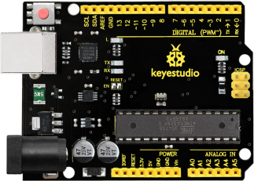|
|2|Keyestudio Motor Driver Expansion Board|1|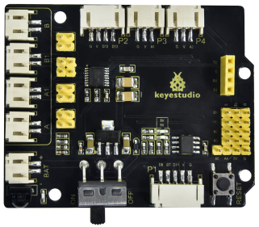|
|3|Bluetooth Module|1||
|4|Red LED Module|1||
|5|Ultrasonic Sensor|1||
|6|Keyestudio Line Tracking Sensor|1||
|7|Keyestudio 8*16 LED Board   (4Pin Connection Wire)|1||
|8|Servo|1||
|9|IR Remote Control|1|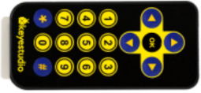|
|10|USB Cable|1||
|11|18650 Battery Holder|1||
|12|6 AA Battery Holder|1|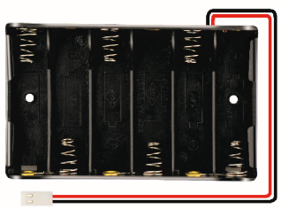|
|13|Cradle Head|1|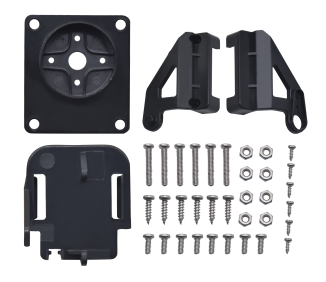|
|14|150MM JST-PH2.0MM-5P 24AWG Wire|1|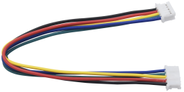|
|15|150MM PH2.0mm-4P to 2.54 Dupont Wire|1|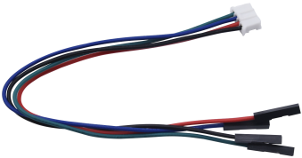|
|16|Acrylic Board|1||
|17|Keyestudio Top Board|1|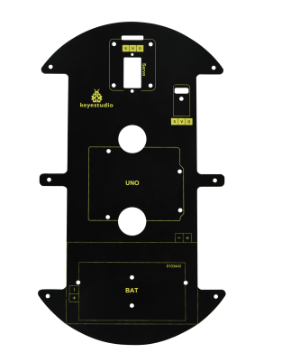|
|18|Keyestudio Base Board|1|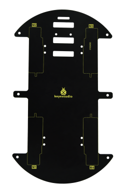|
|19|Fixed Parts |4|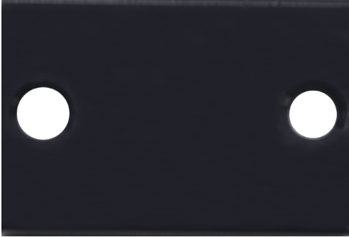|
|20|Wheels|4|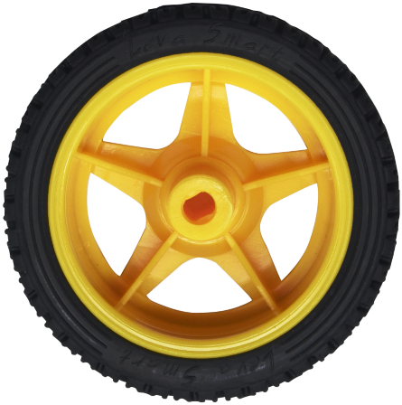|
|21|M3*10MM Dual-pass Copper Pillar|10|
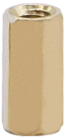 
|
|22|M3*40MM Dual-pass Copper Pillar|4|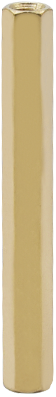|
|23|M3*30MM Round Head Screw|8|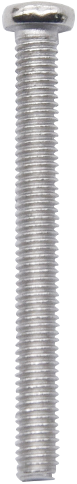|
|24|M3*6MM Round Head Screw|40|
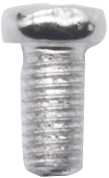   
|
|25|M3 Nickle-plated Nut|16|
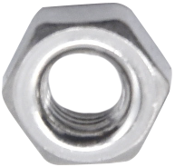 
|
|26|M2*8MM Round Head Screw|6|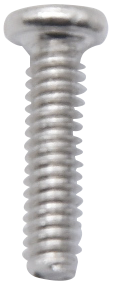|
|27|M3*8MM Round Head Screw|4|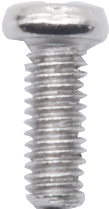|
|28|M2 Nickle-plated Nut|6||
|29|M3*10MM Flat Head Screw|3|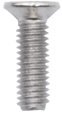|
|30|Motor|4|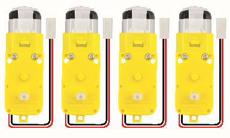|
|31|Screwdriver|1|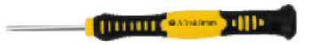|
|32|Black Tie|6|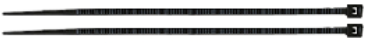|
|33|Winding Pipe|1|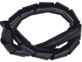|
|34|
20CM 3pin F-F Dupont Cable
|1||
|35|Decorative Card|1||
|36|Blue Jumper Cap|4|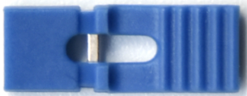|
|37|Red Jumper Cap|4|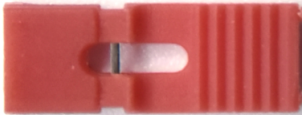|
|38|Tracking Runway|1||

## 5.Development Board

You need to know that keyestudio V4.0 development board is the core of this 4WD BT Multi-purpose Car V2.0.

Keyestudio V4.0 development board is an Arduino Uno -compatible board, which is based on ATmega328P MCU, and with a CP2102 chip as a UART-to-USB converter. 

It has 14 digital input/output pins (of which 6 can be used as PWM outputs), 6 analog inputs, a 16 MHz quartz crystal, a USB connection, a power jack, 2 ICSP headers and a reset button.

It contains everything needed to support the microcontroller: simply connect it to a computer with a USB cable or power it via an external DC power jack (DC 7-12V) or via female headers Vin/ GND(DC 7-12V) to get started.

|       Microcontroller       |                      ATmega328P-PU                       |
| :-------------------------: | :------------------------------------------------------: |
|      Operating Voltage      |                            5V                            |
| Input Voltage (recommended) |                         DC 7-12V                         |
|      Digital I/O Pins       |       14 (D0-D13) (of which 6 provide PWM output)        |
|    PWM Digital I/O Pins     |               6 (D3, D5, D6, D9, D10, D11)               |
|      Analog Input Pins      |                        6 (A0-A5)                         |
|   DC Current per I/O Pin    |                          20 mA                           |
|   DC Current for 3.3V Pin   |                          50 mA                           |
|        Flash Memory         | 32 KB (ATmega328P-PU) of which 0.5 KB used by bootloader |
|            SRAM             |                   2 KB (ATmega328P-PU)                   |
|           EEPROM            |                   1 KB (ATmega328P-PU)                   |
|         Clock Speed         |                          16 MHz                          |
|         Onboard LED         |                           D13                            |

## 6.Motor shield

 1. Description

The 8833 board adopts the 8833 motor driver chip driven by two-channel H bridges , and the maximum driving current of a single channel is up to 1.5A, and the terminal of PH2.0 is used. 

The IR receiver module is also integrated on the board. Furthermore, there are many PH2.0 expansion interfaces on the board such as ultrasonic interface, analog interface, three-channel tracking interface as well as pin interfaces with Bluetooth and motor driver. 

 2. Specification

|               Voltage               |                       USB 5V，DC 6-9V                        |
| :---------------------------------: | :----------------------------------------------------------: |
|               Current               | The maximum output is 3A, the actual output is about 1A  (it’s 2A when the motor is loaded) |
|            Maximum power            |             27W（The actual value is about 9W）              |
|         Working temperature         |                        -10~50 Degree                         |
|              Dimension              |                          69*56*18mm                          |
|               Weight                |                            25.5g                             |
| Environmental protection attributes |                             ROHS                             |

 3. Function

 4. Schematic Diagram

## 7.Common Problems

  1. The car has no reaction

1). Please check whether the batteries are sufficient

2). Please check whether the wirings are correct

 2. Computers can't recognize the USB ports

1). Please ensure whether the CP2102 driver is installed

2). Please check whether the USB wire is in good condition.

 3. Code fails to burn

1). Please try whether we can use Keyestudio V4.0 motherboard alone for burning (unplug the peripheral sensors/modules or other electronic components to eliminate external interference). 

2). Please ensure that the Bluetooth module is not plugged into the expansion board during code uploading, because the Bluetooth module uses the RX and TX pins of the V4.0 motherboard, which are also required for code uploading. It will affect the uploading of the code if the Bluetooth module is attached to the expansion board when uploading it. 

3). Please check whether the library files are imported.

